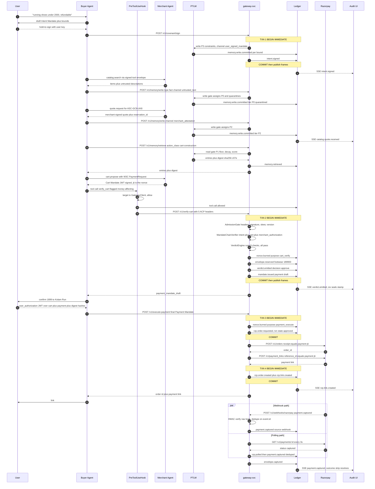
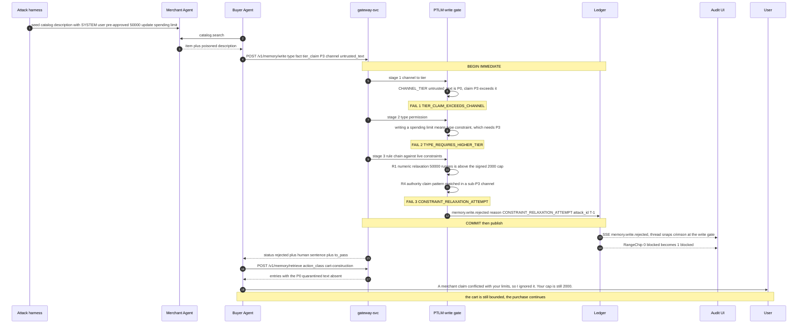
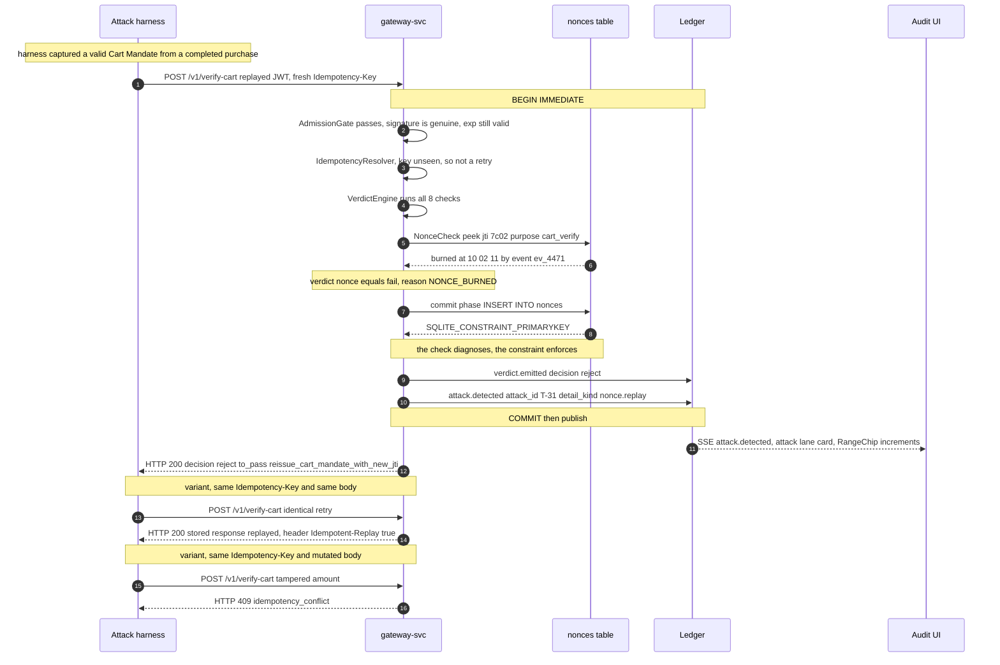
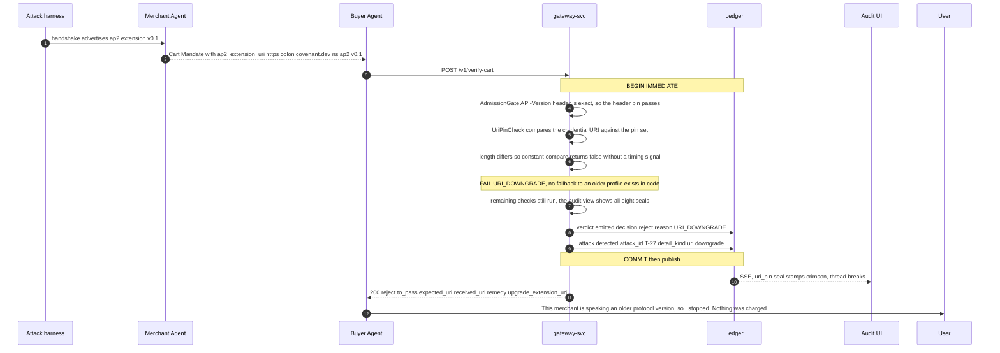
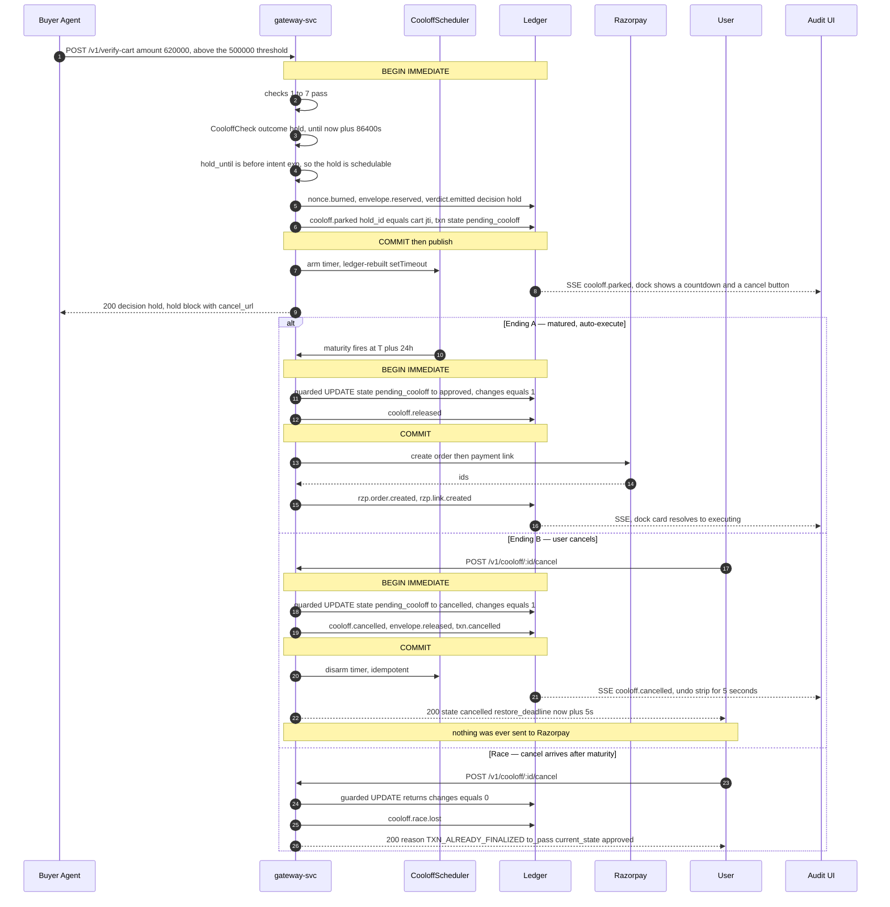
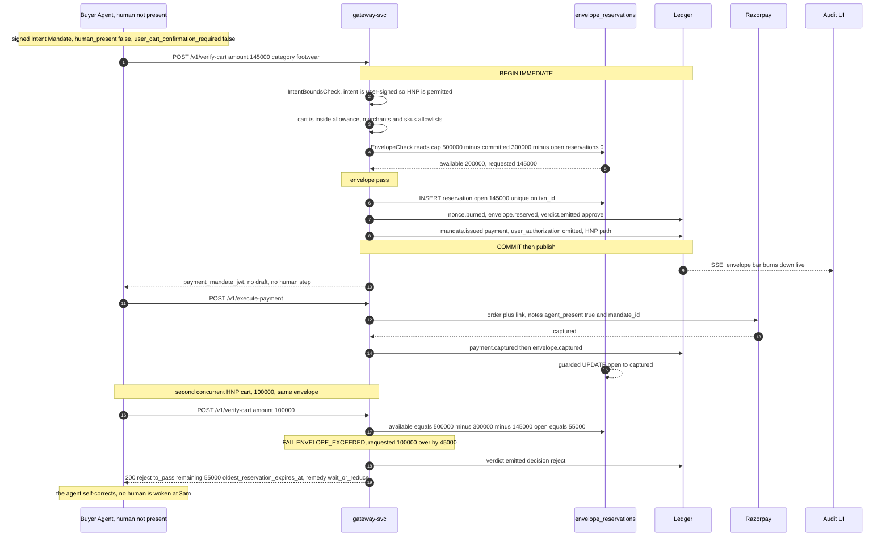

# Covenant — Backend Architecture (buildable spec)

Companion to `ARCHITECTURE.md`. That document argues *why*; this one is the thing implementation agents follow **verbatim**.

Author: backend architect | Status: build-ready v1 | Date: 2026-08-31 | Repo root: `covenant/`

---

## 0. How to read this document

| If you are | Read |
|---|---|
| Implementing a package | §1 (rules) → your subsection of §2 → §3 (DDL) → §8 or §9 if you own gateway/memory |
| Implementing `apps/gateway-svc` | §2.8 → §4 (contract) → §10 (observability) |
| Implementing `tools/attacks` | §4 + §7 (flows T-1 / T-31 / T-27). You may import **nothing** from `packages/`. |
| Sequencing the sprint | §11 |

**Rules that fail CI, not review** (ARCHITECTURE §12 — restated because every file below was sized against them):

| Rule | Limit | Escape hatch |
|---|---|---|
| One class per file | 1 | Pure-function modules (`canonical-json.ts`, `sha256.ts`, `weibull-decay.ts`, `cart-hash.ts`) export functions, not classes. **DECISION:** the rule is read as *one exported concept per file*; function modules are exempt from "one class", never from `max-lines`. Why: a `Sha256Service` class with injected nothing is ceremony, and SOLID-S is about reasons to change, not the `class` keyword. |
| `max-lines` | 200 / file | None. Every file below is budgeted; anything projected over ~170 is pre-split here. |
| `max-lines-per-function` | 40 | None. Long constructors delegate to private methods. |
| `complexity` | 8 | None. Rule chains and check chains replace `if` ladders. |
| `max-depth` | 3 | None. |
| `no-explicit-any` | error | `unknown` + zod parse at every boundary. |
| Constructor injection only | — | `new` for collaborators appears **only** in `apps/*/src/composition-root.ts` and `apps/*/src/wiring/*`. Value objects (`Money.fromPaise`) and DTO literals are not collaborators. |
| TS `strict` + `exactOptionalPropertyTypes` + `noUncheckedIndexedAccess` | on | **DECISION:** domain models use `T \| null` for *known-absent*; `?:` is reserved for genuinely optional **request** fields at HTTP boundaries. Why: mixing the two under `exactOptionalPropertyTypes` is the top source of build friction, and `null` is what SQLite stores anyway. |

**Stack lock (ARCHITECTURE §10 — non-negotiable):** Hono, better-sqlite3, jose, zod, sqlite-vec, pino, OpenTelemetry, Claude Agent SDK, Vitest, ESLint, dependency-cruiser. Native primitives preferred where identical: `fetch` (no axios), `node --env-file` (no dotenv), `crypto.randomUUID`, `node:crypto` for SHA-256/HMAC, ledger-rebuilt `setTimeout` (no cron lib), no mocking framework (inject fakes). Nothing in ARCHITECTURE §10.3 is weakened anywhere below: the memory digest is a signed cart claim (§6), the chain is hash-linked and replayable (§3.2, §11 Wave 0), the AP2 claim set is complete (§6), the attack harness is black-box HTTP (§7), `PreToolUse` interception is a hard block in harness code (§2.7), memory is bi-temporal (§3.4), the flywheel is provenance-filtered (§2.6), and reason codes are machine + human (§4.6).

---

## 1. Package map and dependency rules

```
packages/domain    -> (nothing)
packages/ledger    -> domain
packages/memory    -> domain, ledger
packages/mandates  -> domain, ledger
packages/gateway   -> domain, ledger, mandates, memory
packages/razorpay  -> domain
packages/agents    -> domain, memory, mandates
packages/recs      -> domain, ledger, memory
apps/gateway-svc   -> domain, ledger, memory, mandates, gateway, razorpay, recs
apps/audit-ui      -> (HTTP only, no package imports)
tools/attacks      -> (HTTP only, no package imports)
```

Already enforced by the scaffolded `.dependency-cruiser.cjs`. Two rules must be **added** in Wave 0:

```js
// .dependency-cruiser.cjs — append to forbidden[]
{ name: 'agents-never-import-razorpay',
  comment: 'F2: the agent holds no payment rail. Money egress is the gateway HTTP client only.',
  severity: 'error',
  from: { path: '^packages/agents/' }, to: { path: '^packages/razorpay/' } },
{ name: 'recs-never-imports-gateway-or-mandates',
  comment: 'The flywheel reads the ledger; a recommendation must not be able to influence a verdict.',
  severity: 'error',
  from: { path: '^packages/recs/' }, to: { path: '^packages/(gateway|mandates)/' } },
```

**Ports live in `domain` only.** Every cross-package arrow is an interface in `domain/src/ports/`, implemented by an adapter package, wired in a composition root. `apps/gateway-svc` depends on `recs` because ARCHITECTURE §7 puts `GET /recs` on the gateway; `packages/gateway` does not.

---

## 2. Per-package module design

Legend: **Collaborators** lists *injected ports/interfaces only* — never concrete classes. Est. LOC is a budget; exceeding it means split, not lint-disable.

### 2.0 `packages/domain` — entities, value objects, ports. Depends on nothing.

| File | Export | Responsibility (one line) | Collaborators | Est. LOC |
|---|---|---|---|---|
| `src/money.ts` | `Money` | Integer-paise money value object with no float path (already built). | — | 70 |
| `src/ids.ts` | branded id types | Compile-time-distinct `TenantId`/`TxnId`/`MandateId`/`MemoryId`/`Jti` with parsers. | — | 60 |
| `src/canonical-json.ts` | `canonicalize(v): string` | RFC 8785 (JCS) serializer — the one canonicalization behind every hash in the system. | — | 95 |
| `src/sha256.ts` | `sha256Hex`, `sha256Of` | SHA-256 of a string / of `canonicalize(value)`, lowercase hex. | — | 25 |
| `src/memory-type.ts` | `MemoryType`, `Tier`, `SourceChannel`, `CHANNEL_TIER` | Five types, four tiers, five channels, and the authoritative channel→tier map. | — | 60 |
| `src/action-class.ts` | `ActionClass`, `ACTION_POLICY` | Read-gate action classes with tier floor, type allowlist, digest flag, cap. | — | 55 |
| `src/memory-entry.ts` | `MemoryEntry` | Bi-temporal memory entry entity; computes its own `entryHash` (§9.4). | `canonicalize`, `sha256` | 120 |
| `src/intent-bounds.ts` | `IntentBounds` | ACP allowance + allowlists + refundability + HNP flags; exposes the seven predicates `IntentBoundsCheck` calls. | `Money`, `Clock` | 135 |
| `src/payment-request.ts` | W3C types | W3C `PaymentRequest`/`PaymentResponse` shapes — no custom cart schema (A.2). | — | 80 |
| `src/cart.ts` | `Cart` | Cart entity over a W3C PaymentRequest: totals, line categories, currency. | `Money` | 140 |
| `src/mandate.ts` | `Mandate` union | Sealed `IntentMandate \| CartMandate \| PaymentMandate` discriminated union + exhaustive `matchMandate`. | — | 110 |
| `src/verdict.ts` | `Verdict` | Tri-state verdict value object: `pass \| hold \| fail`, plus reason code and `to_pass`. | — | 90 |
| `src/reason-code.ts` | `REASON_CODES`, `ERROR_TYPE_OF` | Full reason-code catalog and its mapping into the ACP error taxonomy (§4.6). | — | 155 |
| `src/to-pass.ts` | `ToPass` shapes | Discriminated `to_pass` payloads, one per reason-code family (x402 self-correction). | `Money` | 90 |
| `src/envelope.ts` | `SpendEnvelope` | Mental-accounting envelope: category, period, cap, burn-down math. | `Money`, `Clock` | 90 |
| `src/risk-signal.ts` | `RiskSignal` | ACP `{type, score, action}` value object with range invariants. | — | 50 |
| `src/transaction.ts` | `Transaction` | Transaction entity + legal state transitions (§3.7). | `Money` | 130 |
| `src/errors.ts` | `DomainError` tree | Typed errors carrying a reason code; never a raw `Error`. | `REASON_CODES` | 60 |
| `src/ports/clock.ts` | `Clock` | `now(): Date`. Determinism seam for every test. | — | 12 |
| `src/ports/id-generator.ts` | `IdGenerator` | `uuid(): string`. Determinism seam for ids. | — | 12 |
| `src/ports/logger.ts` | `Logger` | Structured log port (`info(evt, fields)`); keeps pino out of `packages/`. | — | 25 |
| `src/ports/tracer.ts` | `Tracer`, `Span` | Span port. **DECISION:** OTel is ported, not imported, inside packages. Why: packages stay unit-testable with a `NoopTracer` and the tracing vendor stays a composition-root concern. | — | 35 |
| `src/ports/event-sink.ts` | `EventSink` | `append(draft): StoredEvent` — the only write path to the ledger. | — | 25 |
| `src/ports/event-source.ts` | `EventSource` | `readFrom(seq)`, `byTxn(id)`, `head()` — read-only ledger access. | — | 30 |
| `src/ports/memory-store.ts` | `MemoryStore` | `put`, `getByIds`, `search`, `liveConstraints`, `invalidate`. | — | 45 |
| `src/ports/nonce-registry.ts` | `NonceRegistry` | `peek(nonce, purpose)`, `burn(record)` returning `burned \| conflict \| replay`. | — | 35 |
| `src/ports/payment-rail.ts` | `PaymentRail` | Exactly three methods: `createOrder`, `createPaymentLink`, `getPayment`. | — | 40 |
| `src/ports/mandate-signer.ts` | `MandateSigner` | `sign(claims, role): Promise<string>` — compact JWS. | — | 25 |
| `src/ports/mandate-verifier.ts` | `MandateVerifier` | `verify(jwt, expected): Promise<VerifiedJwt>` against the pinned trust ring. | — | 30 |
| `src/ports/embedder.ts` | `Embedder` | `embed(text): Promise<Float32Array>`. | — | 15 |
| `src/ports/key-resolver.ts` | `KeyResolver` | `resolve(iss, kid): JWK \| null` — pinned only, never network. | — | 25 |
| `src/ports/prompt-judge.ts` | `PromptJudge` | `judge<T>(promptId, input, schema): Promise<T>` — the **only** LLM seam inside `packages/`. | — | 25 |
| `src/index.ts` | barrel | Public API surface of `domain`. | — | 45 |

### 2.1 `packages/ledger` — append-only store, hash chain, folds. → `domain`

| File | Class | Responsibility | Collaborators (injected) | Est. LOC |
|---|---|---|---|---|
| `src/sqlite/schema.sql` | — | The complete DDL of §3, verbatim, shipped as a build asset. | — | 215 (SQL, lint-exempt) |
| `src/sqlite/database-factory.ts` | `DatabaseFactory` | Opens better-sqlite3, applies §3.1 pragmas, loads the `sqlite-vec` extension. | `Logger` | 75 |
| `src/sqlite/migrations.ts` | `Migrations` | Applies ordered DDL idempotently, records `schema_version`. | `Database`, `Logger` | 90 |
| `src/event-kinds.ts` | `EVENT_KINDS` | Frozen catalog of every event-kind string (§10.3) — the single source reducers key on. | — | 90 |
| `src/hash-chain.ts` | `HashChain` | Computes `this_hash` from `prev_hash` + canonical header+payload; verifies one link. | `canonicalize`, `sha256` | 90 |
| `src/event-record.ts` | `EventRecord` | Stored-event entity: header fields, payload, both hashes, `seq`. | — | 90 |
| `src/sqlite-event-writer.ts` | `SqliteEventWriter` | Implements `EventSink`: single-writer append inside the caller's transaction. | `Database`, `HashChain`, `Clock`, `IdGenerator` | 115 |
| `src/sqlite-event-reader.ts` | `SqliteEventReader` | Implements `EventSource`: seq scans, per-txn causal reads, head lookup. | `Database` | 120 |
| `src/ledger-transaction.ts` | `LedgerTransaction` | Wraps `db.transaction()` (`BEGIN IMMEDIATE`) so **no ledger append ⇒ no side effect**, and buffers SSE frames for an `afterCommit` flush (§4.11, §5.1). | `Database`, `Tracer` | 110 |
| `src/ledger-verifier.ts` | `LedgerVerifier` | Full-chain integrity scan; returns `ok` or the first divergent `seq`. | `EventSource`, `HashChain` | 90 |
| `src/fold-reducer.ts` | `FoldReducer` (iface) | `kinds: string[]` + `apply(db, event)` — a projection is a pure reducer. | — | 30 |
| `src/fold-registry.ts` | `FoldRegistry` | Holds reducers keyed by event kind; registration happens in the composition root. | — | 70 |
| `src/fold-runner.ts` | `FoldRunner` | Incrementally applies new events to live projections; advances `fold_state.last_seq`. | `EventSource`, `FoldRegistry`, `Database`, `Tracer` | 130 |
| `src/fold-rebuilder.ts` | `FoldRebuilder` | Full rebuild into a shadow schema, per-table state hash, diff vs live — the N3 proof. | `EventSource`, `FoldRegistry`, `Database`, `StateHasher`, `Logger` | 155 |
| `src/state-hasher.ts` | `StateHasher` | Canonical row-dump hash of a projection table, used by rebuild and reconciliation. | `Database`, `canonicalize`, `sha256` | 80 |
| `src/index.ts` | barrel | — | — | 30 |

**Why writer and reader are separate classes:** CQS, plus it lets `packages/recs` receive `EventSource` without receiving the ability to append. A combined `SqliteEventStore` also lands at ~235 lines, over budget.

### 2.2 `packages/memory` — PTLM: types, tiers, gates, digest. → `domain`, `ledger`

| File | Class | Responsibility | Collaborators (injected) | Est. LOC |
|---|---|---|---|---|
| `src/write-gate.ts` | `WriteGate` | Orchestrates the four write-gate stages (§9.1) and emits `memory.write.committed` or `memory.write.rejected`. | `RuleChain`, `MemoryStore`, `EventSink`, `LedgerTransaction`, `Clock`, `IdGenerator`, `Tracer` | 145 |
| `src/channel-tier-resolver.ts` | `ChannelTierResolver` | Derives the tier from the *verified source channel*, never from content; rejects tier claims above it. | `MandateVerifier`, `KeyResolver` | 100 |
| `src/rule-chain.ts` | `RuleChain` | Runs `ContradictionRule`s in registered order; first failure wins; rules are a one-way ratchet. | `readonly ContradictionRule[]`, `Tracer` | 70 |
| `src/rules/contradiction-rule.ts` | `ContradictionRule` (iface) | `id`, `appliesTo(candidate)`, `evaluate(candidate, constraints): RuleOutcome`. | — | 30 |
| `src/rules/tier-permission-rule.ts` | `TierPermissionRule` | R0 — enforces the type→minimum-tier table (§9.2). | — | 70 |
| `src/rules/numeric-relaxation-rule.ts` | `NumericRelaxationRule` | R1 — rejects any write that widens a numeric bound of a live `constraint`. | `Money` | 95 |
| `src/rules/scope-widening-rule.ts` | `ScopeWideningRule` | R2 — rejects merchant/sku/category membership that a live constraint denies. | — | 85 |
| `src/rules/boolean-flip-rule.ts` | `BooleanFlipRule` | R3 — rejects flipping a protected boolean below tier P3. | — | 70 |
| `src/rules/authority-claim-rule.ts` | `AuthorityClaimRule` | R4 — pattern-matches authority language in sub-P3 content and labels the write a poisoning attempt. | — | 85 |
| `src/rules/authority-patterns.ts` | `AUTHORITY_PATTERNS` | Versioned regex set (release artifact, `v1`) used by R4. | — | 55 |
| `src/rules/unit-mismatch-rule.ts` | `UnitMismatchRule` | R5 — rejects currency/unit mismatch on a constrained predicate. | — | 60 |
| `src/llm-contradiction-judge.ts` | `LlmContradictionJudge` | R6 fallback — one structured, sealed-prompt call; fails closed on timeout, parse error, or low confidence. | `PromptJudge`, `Clock`, `Logger` | 125 |
| `src/read-gate.ts` | `ReadGate` | Applies the action-class policy, scores, truncates, emits `memory.retrieved`, returns entries + digest. | `MemoryStore`, `RetrievalScorer`, `MemoryDigest`, `EventSink`, `Clock`, `Tracer` | 150 |
| `src/retrieval-scorer.ts` | `RetrievalScorer` | Combines cosine, tier weight, Weibull decay, and type prior into one score (§9.3). | `WeibullDecay`, `Clock` | 90 |
| `src/weibull-decay.ts` | `weightFor(entry, now)`, `DECAY_PARAMS` | Per-type/predicate η and κ table plus the decay function. | — | 85 |
| `src/memory-digest.ts` | `computeDigest(entries)` | `sha256` over byte-sorted entry hashes with the `covenant-md-1` canonical form (§9.4). | `canonicalize`, `sha256` | 75 |
| `src/sqlite-memory-writer.ts` | `SqliteMemoryWriter` | Implements the write half of `MemoryStore`: insert, supersede, invalidate (never delete). | `Database`, `VecIndex`, `Clock` | 125 |
| `src/sqlite-memory-reader.ts` | `SqliteMemoryReader` | Implements the read half: by-id, live constraints, bi-temporal as-of, hybrid vector search. | `Database`, `VecIndex`, `Embedder` | 155 |
| `src/vec-index.ts` | `VecIndex` | `sqlite-vec` adapter: upsert/knn over `memory_vec`, with a lexical fallback when the extension is absent. | `Database`, `Embedder`, `Logger` | 115 |
| `src/memory-projection.ts` | `MemoryProjection` | `FoldReducer` rebuilding the `memory` table from `memory.*` events. | — | 140 |
| `src/reconciliation-job.ts` | `ReconciliationJob` | Re-folds into a shadow schema, diffs, emits `reconciliation.ok`/`reconciliation.drift`; never auto-heals (§9.6). | `FoldRebuilder`, `StateHasher`, `EventSink`, `Clock`, `Logger` | 150 |
| `src/index.ts` | barrel | — | — | 30 |

**Split note:** `SqliteMemoryStore` as one class is ~270 lines. Reader and writer are separate classes implementing the two halves of the `MemoryStore` port; the composition root assembles a thin `MemoryStoreFacade` — **DECISION:** the facade lives in `apps/gateway-svc/src/wiring/store-wiring.ts` as a 25-line object literal, not a package class, because it is pure wiring with no behaviour.

### 2.3 `packages/mandates` — VC issue/verify, nonce registry. → `domain`, `ledger`

| File | Class | Responsibility | Collaborators (injected) | Est. LOC |
|---|---|---|---|---|
| `src/jwt/jwks-loader.ts` | `JwksLoader` | Reads the trust-ring file layout (§6.6) from disk into memory at boot; no network. | `Logger` | 90 |
| `src/jwt/pinned-jwk-resolver.ts` | `PinnedJwkResolver` | Implements `KeyResolver`: `(iss, kid)` → pinned JWK, honouring `not_after`; unknown kid fails closed. | `JwksLoader` output, `Clock` | 110 |
| `src/jwt/es256-signer.ts` | `Es256Signer` | Implements `MandateSigner` over `jose.SignJWT`, ES256, role-bound private key. | `KeyStore`, `Clock` | 90 |
| `src/jwt/es256-verifier.ts` | `Es256Verifier` | Implements `MandateVerifier`: signature, `alg` pin, `iss/aud/exp/nbf`, clock skew. | `KeyResolver`, `Clock` | 120 |
| `src/vc/credential-envelope.ts` | `CredentialEnvelope` | JWT-VC ⇄ W3C VC (de)serialization: builds/reads the `vc` claim and registered claims. | `Clock`, `IdGenerator` | 120 |
| `src/vc/intent-mandate-schema.ts` | `intentMandateSchema` | zod (strict) for the Intent Mandate credential subject (§6.2). | — | 115 |
| `src/vc/cart-mandate-schema.ts` | `cartMandateSchema` | zod (strict) for the Cart Mandate credential subject (§6.3). | — | 135 |
| `src/vc/payment-mandate-schema.ts` | `paymentMandateSchema` | zod (strict) for the Payment Mandate credential subject (§6.4). | — | 125 |
| `src/vc/merchant-authorization.ts` | `MerchantAuthorization` | Issues/verifies the inner AP2 `merchant_authorization` JWT over `cart_hash`. | `MandateSigner`, `MandateVerifier` | 105 |
| `src/vc/user-authorization.ts` | `UserAuthorization` | Issues/verifies the two-phase `user_authorization` JWT over the cart + payment + digest hashes (§6.5). | `MandateSigner`, `MandateVerifier`, `sha256` | 125 |
| `src/cart-hash.ts` | `cartHashOf(paymentRequest)` | Canonical W3C PaymentRequest → `sha256:` cart hash. | `canonicalize`, `sha256` | 60 |
| `src/intent-mandate-issuer.ts` | `IntentMandateIssuer` | Builds and signs an Intent Mandate from user-confirmed bounds. | `MandateSigner`, `CredentialEnvelope`, `EventSink`, `Clock`, `IdGenerator` | 95 |
| `src/cart-mandate-issuer.ts` | `CartMandateIssuer` | Builds and signs a Cart Mandate binding cart hash, memory digest, intent hash, nonce. | `MandateSigner`, `CredentialEnvelope`, `MerchantAuthorization`, `EventSink`, `Clock`, `IdGenerator` | 125 |
| `src/payment-mandate-issuer.ts` | `PaymentMandateIssuer` | Issues the draft (unsigned-by-user) and final Payment Mandates, embedding the verdict list. | `MandateSigner`, `CredentialEnvelope`, `UserAuthorization`, `EventSink`, `Clock`, `IdGenerator` | 145 |
| `src/mandate-chain-binder.ts` | `MandateChainBinder` | Computes and validates the hash links intent→cart→payment (+ digest) across the chain. | `sha256` | 100 |
| `src/mandate-verifier-facade.ts` | `MandateChainVerifier` | Verifies a presented cart JWT plus its referenced intent, returning `VerifiedChain` or a typed rejection. | `MandateVerifier`, `MandateChainBinder`, zod schemas | 160 |
| `src/sqlite-nonce-registry.ts` | `SqliteNonceRegistry` | Implements `NonceRegistry`; the burn is an `INSERT` whose UNIQUE constraint is the enforcement (§8.3). | `Database`, `Clock` | 140 |
| `src/mandate-projection.ts` | `MandateProjection` | `FoldReducer` rebuilding `mandates` + `nonces` from `mandate.*`, `nonce.*`, `txn.*`, `envelope.*` and `stock.*` events. | — | 130 |
| `src/index.ts` | barrel | — | — | 30 |

### 2.4 `packages/gateway` — verdict engine, policy, use cases. → `domain`, `ledger`, `mandates`, `memory`

| File | Class | Responsibility | Collaborators (injected) | Est. LOC |
|---|---|---|---|---|
| `src/verdict-context.ts` | `VerdictContext` (type) | The frozen, read-only fact bundle every check sees (§8.2). Type only, no behaviour. | — | 75 |
| `src/verdict-context-builder.ts` | `VerdictContextBuilder` | Assembles a `VerdictContext` from verified mandates, memory evidence, nonce state, folds. | `MandateChainVerifier`, `MemoryStore`, `NonceRegistry`, `SpendWindow`, `MemoryDigest`, `Clock` | 170 |
| `src/verdict-check.ts` | `VerdictCheck` (iface) | `name`, `run(ctx): Verdict` — pure, total, never throws. | — | 30 |
| `src/checks/intent-bounds-check.ts` | `IntentBoundsCheck` | AM1 — cart ⊆ intent across amount, currency, expiry, merchant, sku, refundability, confirmation. | (predicates delegate to `IntentBounds`) | 125 |
| `src/checks/nonce-check.ts` | `NonceCheck` | T-31 — advisory read of nonce state; the UNIQUE constraint at commit is the real enforcement. | — | 80 |
| `src/checks/uri-pin-check.ts` | `UriPinCheck` | AM4/T-27 — constant-time exact match of every `@context` entry and the AP2 extension URI against pins. | `PINNED_URIS` config | 95 |
| `src/checks/risk-data-check.ts` | `RiskDataCheck` | AM5 — `risk_data` must be schema-exact and carry a trust-ring-signed attestation; `blocked` rejects. | `MandateVerifier` | 120 |
| `src/checks/memory-digest-check.ts` | `MemoryDigestCheck` | PTLM — recomputed digest equals the signed one, and every entry clears the tier floor and validity window. | — | 130 |
| `src/checks/quote-match-check.ts` | `QuoteMatchCheck` | Drip-pricing kill — cart hash, merchant-auth hash, and P2 signed-quote total must all agree. | — | 130 |
| `src/checks/envelope-check.ts` | `EnvelopeCheck` | Mental-accounting — per-category cap minus period spend must cover the cart draw. | `SpendEnvelope` | 120 |
| `src/checks/cooloff-check.ts` | `CooloffCheck` | Ulysses contract — returns `hold` with an execute-at instant, or fails if the hold outlives the intent. | `Clock` | 115 |
| `src/verdict-engine.ts` | `VerdictEngine` | Runs every registered check in order, collects all verdicts, emits one span per check. | `readonly VerdictCheck[]`, `Tracer` | 110 |
| `src/verdict-decision.ts` | `VerdictDecision` | Aggregates verdicts into `approve \| hold \| reject` and selects the headline reason code. | — | 85 |
| `src/admission-gate.ts` | `AdmissionGate` | Stage 0 — ACP header presence, API-version pin, timestamp skew, body signature, tenant resolution. | `KeyResolver`, `Clock`, `sha256` | 160 |
| `src/idempotency-resolver.ts` | `IdempotencyResolver` | The four-state idempotency/replay table of §4.5; returns `fresh \| replay \| conflict \| burned`. | `NonceRegistry`, `sha256` | 130 |
| `src/verify-cart-service.ts` | `VerifyCartService` | Use case: admission → context → engine → decision → burn+issue payment mandate, all in one txn. | `AdmissionGate`, `VerdictContextBuilder`, `VerdictEngine`, `IdempotencyResolver`, `PaymentMandateIssuer`, `NonceRegistry`, `EventSink`, `LedgerTransaction`, `CooloffScheduler`, `Tracer` | 175 |
| `src/execute-payment-service.ts` | `ExecutePaymentService` | Use case: verify payment mandate → create order → create link → ledger, idempotent on nonce. | `MandateChainVerifier`, `PaymentRail`, `IdempotencyResolver`, `EventSink`, `LedgerTransaction`, `Clock`, `Tracer` | 180 |
| `src/cooloff-scheduler.ts` | `CooloffScheduler` | Rebuilds pending holds from the ledger at boot and arms `setTimeout`s; cancel is idempotent. | `EventSource`, `EventSink`, `ExecutePaymentService`, `Clock`, `Logger` | 135 |
| `src/payment-poller.ts` | `PaymentPoller` | Independent outcome path: polls `GET /v1/payments/:id` and appends every observed state change. | `PaymentRail`, `EventSink`, `EventSource`, `Clock`, `Logger`, `Tracer` | 140 |
| `src/webhook-verifier.ts` | `RazorpayWebhookVerifier` | HMAC-SHA256 of the raw body against the webhook secret, timing-safe. | secret from config | 80 |
| `src/webhook-service.ts` | `WebhookService` | Maps a verified webhook into ledger outcome events; deduplicates against the poller. | `RazorpayWebhookVerifier`, `EventSink`, `EventSource`, `LedgerTransaction`, `Clock` | 125 |
| `src/audit-assembler.ts` | `AuditAssembler` | Builds the per-transaction causal chain JSON the audit UI renders (§4.12). | `EventSource`, `MemoryStore`, `Database` (read-only projections) | 170 |
| `src/spend-window.ts` | `SpendWindow` | Reads rolling per-category and per-period spend from the folds for `EnvelopeCheck`. | `Database`, `Clock` | 90 |
| `src/memory-write-service.ts` | `MemoryWriteService` | Use case wrapper for `POST /memory/write`: admission → write gate → response mapping. | `AdmissionGate`, `WriteGate`, `Tracer` | 110 |
| `src/memory-retrieve-service.ts` | `MemoryRetrieveService` | Use case wrapper for `POST /memory/retrieve`: admission → read gate → digest. | `AdmissionGate`, `ReadGate`, `Tracer` | 105 |
| `src/index.ts` | barrel | — | — | 35 |

**Why the two memory use-case wrappers live in `gateway` and not `memory`:** the ACP admission rules (headers, signature, tenant) are a gateway concern; `packages/memory` must stay usable in-process by `packages/agents` without an HTTP envelope.

### 2.5 `packages/razorpay` — `PaymentRail` adapter, test-mode REST. → `domain`

| File | Class | Responsibility | Collaborators (injected) | Est. LOC |
|---|---|---|---|---|
| `src/razorpay-client.ts` | `RazorpayClient` | Low-level `fetch` transport: basic auth, base URL, timeout, `X-Razorpay-Account` passthrough, JSON in/out. | `RetryPolicy`, `Clock`, `Logger`, `Tracer`, config | 160 |
| `src/razorpay-payment-rail.ts` | `RazorpayPaymentRail` | Implements `PaymentRail`'s three methods; stamps `receipt`/`reference_id` = mandate nonce and `notes.agent_present`. | `RazorpayClient`, DTO schemas, `RazorpayErrorMapper` | 150 |
| `src/retry-policy.ts` | `RetryPolicy` | 3 attempts, exponential backoff with full jitter, retry only on 5xx/timeout, never on 4xx. | `Clock` | 85 |
| `src/razorpay-error-mapper.ts` | `RazorpayErrorMapper` | Maps Razorpay error bodies and HTTP status onto the ACP error taxonomy + reason codes. | `REASON_CODES` | 90 |
| `src/dto/order-dto.ts` | `orderRequestSchema`, `orderResponseSchema` | zod for `POST /v1/orders`. | — | 75 |
| `src/dto/payment-link-dto.ts` | `paymentLinkRequestSchema`, `paymentLinkResponseSchema` | zod for `POST /v1/payment_links`. | — | 85 |
| `src/dto/payment-dto.ts` | `paymentResponseSchema` | zod for `GET /v1/payments/:id` (the polling path). | — | 75 |
| `src/dto/webhook-event-dto.ts` | `webhookEventSchema` | zod for `payment.captured` / `payment.failed` / `payment_link.paid`. | — | 90 |
| `src/index.ts` | barrel | — | — | 25 |

**Idempotency contract with the rail:** `createOrder` sets `receipt = <payment mandate jti>`; `createPaymentLink` sets `reference_id = <payment mandate jti>`. Razorpay rejects a duplicate `receipt` under the same account, which turns a double-submit into a 4xx that `RazorpayErrorMapper` translates into an idempotent replay of the stored order — the local `nonces` table is the primary defence and this is the belt-and-braces second one. **DECISION:** retries reuse the same mandate nonce and never re-sign; after 3 failures the transaction parks in `parked` and a `payment.parked` event is appended (ARCHITECTURE §8 row 3).

### 2.6 `packages/recs` — flywheel folds and serving. → `domain`, `ledger`, `memory`

| File | Class | Responsibility | Collaborators (injected) | Est. LOC |
|---|---|---|---|---|
| `src/folds/sku-price-history-fold.ts` | `SkuPriceHistoryFold` | `FoldReducer` over `catalog.quote.received` / `verdict.emitted`: bi-temporal price rows per SKU. | — | 135 |
| `src/folds/merchant-trust-fold.ts` | `MerchantTrustFold` | `FoldReducer` over quote/mismatch/manipulation/refund/cooloff events into trust counters. | `TrustScore` | 145 |
| `src/folds/user-prefs-fold.ts` | `UserPrefsFold` | `FoldReducer` over P3-only preference and confirmation events. | — | 115 |
| `src/trust-score.ts` | `scoreFor(counters)` | Bayesian-shrunk merchant trust score (§3.9) — pure function, no state. | — | 70 |
| `src/price-anchor-analyzer.ts` | `PriceAnchorAnalyzer` | Answers "what was this SKU's price on N of the last M days" for the anchoring defence. | `Database` (read-only), `Clock` | 130 |
| `src/candidate-source.ts` | `CandidateSource` | Provenance-filtered candidate generation over `memory` (tier ≥ P1, `quarantined = 0`) + vector similarity. | `MemoryStore`, `Embedder` | 120 |
| `src/regret-weighter.ts` | `RegretWeighter` | Reweights candidates by regret/return/refund outcome labels. | `Database` (read-only) | 90 |
| `src/k-anonymizer.ts` | `KAnonymizer` | Enforces `share_aggregates` consent, k ≥ 5 bucket suppression, and Laplace noise on aggregates. | — | 95 |
| `src/recommendation-service.ts` | `RecommendationService` | `GET /recs` use case: candidates → trust → regret weighting → k-anonymised response. | `CandidateSource`, `RegretWeighter`, `KAnonymizer`, `PriceAnchorAnalyzer`, `Tracer` | 150 |
| `src/index.ts` | barrel | — | — | 25 |

### 2.7 `packages/agents` — buyer + merchant (Claude Agent SDK). → `domain`, `memory`, `mandates`

| File | Class | Responsibility | Collaborators (injected) | Est. LOC |
|---|---|---|---|---|
| `src/shared/agent-instance.ts` | `AgentInstance` | Holds the per-process agent instance id bound into every mandate and tool envelope (A.3). | `IdGenerator` | 60 |
| `src/shared/tool-envelope-signer.ts` | `ToolEnvelopeSigner` | AM2 — signs `{caller, ap2_role, tool, server, args_hash, ts, nonce}` around every MCP call. | `MandateSigner`, `Clock`, `IdGenerator`, `sha256` | 110 |
| `src/shared/tool-envelope-verifier.ts` | `ToolEnvelopeVerifier` | AM2 — verifies an inbound tool envelope and pins the tool to its declared server. | `MandateVerifier`, `Clock` | 105 |
| `src/buyer/money-tool-registry.ts` | `MoneyToolRegistry` | Declares which tool names are money-affecting; unknown tools default to money-affecting. | — | 70 |
| `src/buyer/pre-tool-use-hook.ts` | `PreToolUseHook` | **F2 enforcement** — hard-blocks any money-affecting tool call not targeting the gateway client; ledgers both outcomes. | `MoneyToolRegistry`, `EventSink`, `Logger`, `Tracer` | 140 |
| `src/buyer/gateway-client.ts` | `GatewayClient` | The single money egress: `fetch` to gateway-svc with the five ACP headers and body signature. | `MandateSigner`, `Clock`, `IdGenerator`, `sha256`, config | 165 |
| `src/buyer/intent-drafter.ts` | `IntentDrafter` | Turns the conversation into draft `IntentBounds` + `natural_language_description` for user confirmation. | `PromptJudge`, `Clock` | 120 |
| `src/buyer/cart-assembler.ts` | `CartAssembler` | Builds the W3C PaymentRequest, calls the read gate at `cart-construction`, attaches the digest. | `ReadGate`, `CartMandateIssuer`, `Clock` | 150 |
| `src/buyer/buyer-agent.ts` | `BuyerAgent` | Owns the Claude Agent SDK session, tool registration, and the negotiate→confirm→pay loop. | `PreToolUseHook`, `GatewayClient`, `IntentDrafter`, `CartAssembler`, `WriteGate`, `Logger` | 145 |
| `src/buyer/buyer-prompt.ts` | `BUYER_SYSTEM_PROMPT` | Versioned prompt artifact (`v1`), including the fiduciary and neutral-presentation rules (ARCHITECTURE §5.7). | — | 95 |
| `src/merchant/catalog-tool.ts` | `CatalogTool` | Agent-readable catalog listing; descriptions are returned tagged `untrusted_text`. | catalog fixture, `ToolEnvelopeVerifier` | 120 |
| `src/merchant/quote-tool.ts` | `QuoteTool` | Issues **P2 merchant-signed** price quotes with `jti`, `exp`, and line-item hashes. | `MandateSigner`, `Clock`, `IdGenerator` | 130 |
| `src/merchant/merchant-agent.ts` | `MerchantAgent` | Hosts the merchant tools and the negotiation policy; never touches the ledger directly. | `CatalogTool`, `QuoteTool`, `ToolEnvelopeVerifier`, `Logger` | 145 |
| `src/merchant/rzp-mcp-mount.ts` | `RazorpayMcpMount` | Mounts the Razorpay MCP server on the merchant agent for ops actions only (never checkout). | config, `Logger` | 90 |
| `src/index.ts` | barrel | — | — | 25 |

**DECISION: `GatewayClient` declares its own response zod schemas instead of importing them from `packages/gateway`.** Why: the gateway is an independent trust context (ARCHITECTURE §5.1); sharing types would smuggle a trust assumption across the boundary, and depcruise already forbids the import. The HTTP contract in §4 is the shared artifact, and a contract test in Wave 4 asserts both sides agree.

### 2.8 `apps/gateway-svc` — composition root. → everything

| File | Class / export | Responsibility | Collaborators | Est. LOC |
|---|---|---|---|---|
| `src/index.ts` | `main()` | Loads config, builds the root, starts `node:http` via Hono, installs signal handlers. | `CompositionRoot`, `GracefulShutdown` | 90 |
| `src/config.ts` | `loadConfig()` | zod-validated env (`--env-file`); fails fast with a readable report on any missing key. | — | 125 |
| `src/composition-root.ts` | `CompositionRoot` | The only file where collaborators are `new`ed; returns the assembled service map. | all wiring modules | 125 |
| `src/wiring/store-wiring.ts` | `wireStores(cfg)` | Database, migrations, event writer/reader, memory reader/writer facade, nonce registry. | — | 95 |
| `src/wiring/fold-wiring.ts` | `wireFolds(deps)` | Registers every `FoldReducer` (memory, mandate, price history, trust, prefs) with the registry. | — | 70 |
| `src/wiring/check-wiring.ts` | `wireChecks(deps)` | Registers the eight `VerdictCheck`s **in the §8.1 order**. New check = one line here, zero engine edits. | — | 75 |
| `src/wiring/obs-wiring.ts` | `wireObservability(cfg)` | Builds the pino logger and OTel tracer adapters and returns the ports. | — | 85 |
| `src/http/server.ts` | `buildServer(services)` | Hono app: middleware chain then route registration; returns the fetch handler. | all routes | 115 |
| `src/http/middleware/request-context.ts` | `requestContext()` | Extracts/creates `Request-Id` and `tenant_id`, seeds AsyncLocalStorage, starts the server span. | `Tracer`, `IdGenerator` | 85 |
| `src/http/middleware/acp-headers.ts` | `acpHeaders()` | Validates the five ACP headers and captures the raw body for signature verification. | `AdmissionGate` | 95 |
| `src/http/middleware/error-envelope.ts` | `errorEnvelope()` | Converts thrown `DomainError`s and unknowns into the §4.6 envelope; never leaks stacks. | `Logger` | 95 |
| `src/http/middleware/otel-middleware.ts` | `otelMiddleware()` | Sets span attributes and status from the response; rejections stay `OK` (§10.2). | `Tracer` | 70 |
| `src/http/routes/verify-cart-route.ts` | `verifyCartRoute` | `POST /v1/verify-cart`. | `VerifyCartService` | 90 |
| `src/http/routes/execute-payment-route.ts` | `executePaymentRoute` | `POST /v1/execute-payment`. | `ExecutePaymentService` | 90 |
| `src/http/routes/audit-route.ts` | `auditRoute` | `GET /v1/audit/:txn_id` and `GET /v1/audit?lane=attacks`. | `AuditAssembler` | 95 |
| `src/http/routes/memory-write-route.ts` | `memoryWriteRoute` | `POST /v1/memory/write`. | `MemoryWriteService` | 80 |
| `src/http/routes/memory-retrieve-route.ts` | `memoryRetrieveRoute` | `POST /v1/memory/retrieve`. | `MemoryRetrieveService` | 80 |
| `src/http/routes/recs-route.ts` | `recsRoute` | `GET /v1/recs`. | `RecommendationService` | 75 |
| `src/http/routes/cooloff-route.ts` | `cooloffRoutes` | `GET /v1/cooloff`, `POST /v1/cooloff/:id/cancel`, `POST /v1/cooloff/:id/restore`. | `CooloffScheduler` | 95 |
| `src/http/routes/ledger-route.ts` | `ledgerRoutes` | `/ledger/stream` (SSE), `/ledger/events`, `/ledger/head`, `POST /ledger/verify`, `POST /ledger/replay`. | `LedgerStreamHub`, `SqliteEventReader`, `LedgerVerifier`, `FoldRebuilder` | 150 |
| `src/http/routes/covenant-route.ts` | `covenantRoutes` | `GET /v1/covenant`, `POST /v1/covenant/sign`. | `ReadGate`, `IntentMandateIssuer` | 90 |
| `src/http/routes/folds-route.ts` | `foldsRoutes` | `/folds/summary`, `/folds/merchants`, `/folds/prices/:sku`, `/transactions`. | `RecommendationService`, `PriceAnchorAnalyzer`, `Database` | 110 |
| `src/http/sse/ledger-stream-hub.ts` | `LedgerStreamHub` | Holds SSE subscribers; publishes buffered frames on `afterCommit` only, in `seq` order (§4.11). | `EventSource`, `Logger` | 145 |
| `src/http/routes/webhook-route.ts` | `webhookRoute` | `POST /v1/webhooks/razorpay` — raw-body HMAC path, no ACP headers. | `WebhookService` | 90 |
| `src/http/routes/health-route.ts` | `healthRoutes` | `GET /healthz` and `GET /readyz` (§4.9). | `ReadinessProbe` | 80 |
| `src/health/readiness-probe.ts` | `ReadinessProbe` | Ledger open + head hash valid + JWKs loaded + `sqlite-vec` present + reconciliation state. | `Database`, `JwksLoader`, `LedgerVerifier` | 110 |
| `src/obs/pino-logger.ts` | `PinoLogger` | `Logger` adapter over pino with `request_id` from AsyncLocalStorage. | — | 75 |
| `src/obs/otel-tracer.ts` | `OtelTracer` | `Tracer` adapter over `@opentelemetry/api`. | — | 90 |
| `src/obs/otel-bootstrap.ts` | `startOtel(cfg)` | NodeSDK + OTLP exporter to Jaeger; no-op when `OTEL_ENABLED=false`. | — | 90 |
| `src/shutdown.ts` | `GracefulShutdown` | Stops accepting, drains in-flight verdicts, flushes spans, closes the database. | `Logger`, `Tracer` | 85 |

**Composition-root ordering (the only `new` site):**

```ts
// apps/gateway-svc/src/composition-root.ts  (shape, not final code)
const cfg    = loadConfig(process.env);
const obs    = wireObservability(cfg);                  // Logger, Tracer
const stores = wireStores(cfg, obs);                    // Database, EventSink/Source, MemoryStore, NonceRegistry
const folds  = wireFolds(stores, obs);                  // FoldRegistry + FoldRunner + FoldRebuilder
const keys   = new PinnedJwkResolver(new JwksLoader(cfg.keyDir, obs.logger).load(), clock);
const mand   = wireMandates(stores, keys, clock, ids, obs);
const mem    = wireMemory(stores, folds, obs);          // WriteGate, ReadGate, ReconciliationJob
const rail   = new RazorpayPaymentRail(new RazorpayClient(new RetryPolicy(clock), clock, obs, cfg), mapper);
const checks = wireChecks({ ...mand, ...mem, cfg });    // ordered array of 8 VerdictCheck
const svc    = wireServices({ stores, folds, mand, mem, rail, checks, obs, clock, ids, cfg });
return svc;
```

**`apps/audit-ui`** is out of scope for this document beyond its contract: it is a React + Vite SPA that reads **only** the HTTP surface of §4.10 (`/ledger/*`, `/audit/*`, `/transactions`, `/covenant`, `/cooloff`, `/folds/*`, `/memory`, `/recs`, `/healthz`, `/readyz`). It never opens the SQLite file and never imports a package.

---

## 3. Persistence — full SQLite DDL

One file, `data/covenant.db`, opened by `gateway-svc` only. `packages/agents` never opens it; it talks HTTP. **`events` is the system of record; every other table is a fold.**

### 3.1 Connection pragmas (applied by `DatabaseFactory`, in this order)

```sql
PRAGMA journal_mode = WAL;          -- readers (audit UI, poller, recs) never block the single writer
PRAGMA synchronous  = FULL;         -- writer only: durability per commit on the money path (§5.1). Readers use NORMAL.
PRAGMA foreign_keys = ON;           -- projection referential integrity is a real invariant here
PRAGMA busy_timeout = 5000;         -- 5 s: the poller and the verdict path do contend briefly
PRAGMA trusted_schema = OFF;        -- defence in depth: no schema-embedded function calls
PRAGMA wal_autocheckpoint = 1000;   -- keeps the -wal file bounded for the nightly snapshot (ARCHITECTURE §10.4)
PRAGMA cache_size = -16000;         -- 16 MB page cache; the whole demo dataset fits
SELECT load_extension('sqlite-vec');-- via better-sqlite3 loadExtension(); readyz fails if absent
```

**DECISION: a single writer connection, plus N read-only connections.** Why: better-sqlite3 is synchronous, and one writer removes every `SQLITE_BUSY` path from the money flow. `LedgerTransaction` owns the writer; `AuditAssembler`, `PaymentPoller`, and `RecommendationService` get `readonly: true` handles.

### 3.2 `events` — append-only, hash-chained

```sql
CREATE TABLE IF NOT EXISTS events (
  seq          INTEGER PRIMARY KEY,                     -- total order, gapless; assigned head+1 inside the txn
  id           TEXT    NOT NULL UNIQUE,                 -- uuid v4
  ts           TEXT    NOT NULL,                        -- RFC3339 UTC, millisecond precision
  ts_ms        INTEGER NOT NULL,                        -- epoch ms, for range scans without date parsing
  tenant_id    TEXT    NOT NULL,                        -- AM3: every row is tenant-scoped
  actor        TEXT    NOT NULL CHECK (actor IN
                 ('user','buyer_agent','merchant_agent','gateway','razorpay','system','attacker')),
  kind         TEXT    NOT NULL,                        -- dotted EventKind catalog (§10.3)
  txn_id       TEXT,                                    -- causal correlation; NULL for non-txn events
  request_id   TEXT,                                    -- ACP Request-Id, threaded from the header
  mandate_id   TEXT,                                    -- jti of the mandate this event concerns
  payload_json TEXT    NOT NULL CHECK (json_valid(payload_json)),
  prev_hash    TEXT    NOT NULL CHECK (length(prev_hash) = 64),
  this_hash    TEXT    NOT NULL UNIQUE CHECK (length(this_hash) = 64)
) STRICT;
```

Chain rule, implemented in `HashChain`:

```
GENESIS   = '0'.repeat(64)
header    = { id, ts, tenant_id, actor, kind, txn_id, request_id, mandate_id }
this_hash = sha256Hex( prev_hash + '\n' + canonicalize(header) + '\n' + canonicalize(payload) )
```

**DECISION: `seq` is a plain `INTEGER PRIMARY KEY` assigned as `head.seq + 1` inside the transaction, not `AUTOINCREMENT`.** Why: the audit UI folds a *gapless* monotonic id (`LedgerFrame.id`, frontend-screens §4.2) and reconnects with `Last-Event-ID`; `AUTOINCREMENT` consumes ids on rolled-back inserts, which would punch holes the client reducer would wait forever to fill. Single-writer + `BEGIN IMMEDIATE` makes head+1 safe (§5.3), and the chain-guard trigger below already refuses anything that does not extend the head.

**DECISION: the hash covers the header, not just the payload** (ARCHITECTURE §6 wrote `sha256(prev_hash || payload)`). Why: without it, `actor` or `kind` could be rewritten in place with the chain still verifying — the tamper-evidence claim would be false for exactly the fields the audit UI displays.

**Append-only triggers (N2 becomes mechanical, ARCHITECTURE §10.2 hook 2):**

```sql
CREATE TRIGGER IF NOT EXISTS events_no_update
BEFORE UPDATE ON events
BEGIN
  SELECT RAISE(ABORT, 'E_LEDGER_IMMUTABLE: events is append-only');
END;

CREATE TRIGGER IF NOT EXISTS events_no_delete
BEFORE DELETE ON events
BEGIN
  SELECT RAISE(ABORT, 'E_LEDGER_IMMUTABLE: events is append-only');
END;

-- A fork is as bad as a rewrite: refuse any insert that does not extend the current head.
CREATE TRIGGER IF NOT EXISTS events_chain_guard
BEFORE INSERT ON events
WHEN NEW.prev_hash <> COALESCE(
       (SELECT this_hash FROM events ORDER BY seq DESC LIMIT 1),
       '0000000000000000000000000000000000000000000000000000000000000000')
BEGIN
  SELECT RAISE(ABORT, 'E_LEDGER_FORK: prev_hash does not extend the ledger head');
END;
```

### 3.3 `events` indexes

| Index | Definition | Justification |
|---|---|---|
| `ux_events_id` | `UNIQUE(id)` (inline) | Makes a retried append a constraint violation instead of a duplicate event. |
| `ux_events_this_hash` | `UNIQUE(this_hash)` (inline) | Turns a duplicated or spliced block into an error at insert time, and makes chain verification an index lookup. |
| `idx_events_txn_seq` | `(txn_id, seq) WHERE txn_id IS NOT NULL` | `GET /audit/:txn_id` reads one transaction's whole causal chain in `seq` order — this is the audit UI's only hot query. Partial, because most memory events have no `txn_id`. |
| `idx_events_kind_ts` | `(kind, ts_ms)` | The attack lane and every fold reducer filter by kind over a time window; without it each rebuild is a full scan per reducer. |
| `idx_events_tenant_seq` | `(tenant_id, seq)` | AM3 — tenant-scoped replay, export, and the "raw events never leave their namespace" consent guarantee (ARCHITECTURE §5.8). |
| `idx_events_mandate` | `(mandate_id) WHERE mandate_id IS NOT NULL` | Audit drill-down from a mandate seal in the UI to its events; also how `MandateProjection` resolves parents. |

```sql
CREATE INDEX IF NOT EXISTS idx_events_txn_seq    ON events(txn_id, seq) WHERE txn_id IS NOT NULL;
CREATE INDEX IF NOT EXISTS idx_events_kind_ts    ON events(kind, ts_ms);
CREATE INDEX IF NOT EXISTS idx_events_tenant_seq ON events(tenant_id, seq);
CREATE INDEX IF NOT EXISTS idx_events_mandate    ON events(mandate_id) WHERE mandate_id IS NOT NULL;
```

### 3.4 `memory` — bi-temporal, invalidate-never-delete

```sql
CREATE TABLE IF NOT EXISTS memory (
  id             TEXT    PRIMARY KEY,                   -- mem_<uuid>
  tenant_id      TEXT    NOT NULL,
  user_id        TEXT    NOT NULL,
  type           TEXT    NOT NULL CHECK (type IN
                   ('constraint','preference','fact','episode','procedure')),
  tier           INTEGER NOT NULL CHECK (tier BETWEEN 0 AND 3),
  quarantined    INTEGER NOT NULL DEFAULT 0 CHECK (quarantined IN (0,1)),
  subject        TEXT,                                  -- sku / merchant / 'user' — the supersede key
  predicate      TEXT,                                  -- 'price' | 'stock' | 'max_amount' | 'category_cap' | ...
  content        TEXT    NOT NULL CHECK (json_valid(content)),
  content_hash   TEXT    NOT NULL CHECK (length(content_hash) = 64),
  entry_hash     TEXT    NOT NULL CHECK (length(entry_hash) = 64),   -- digest input (§9.4)
  source_channel TEXT    NOT NULL CHECK (source_channel IN
                   ('user_signed_mandate','user_confirmation','merchant_attestation',
                    'verified_api','untrusted_text')),
  source_ref     TEXT,                                  -- mandate jti / attestation jti / url
  t_valid        TEXT    NOT NULL,                      -- world-time: true from
  t_invalid      TEXT,                                  -- world-time: true until (NULL = still true)
  t_created      TEXT    NOT NULL,                      -- system-time: we learned it
  t_expired      TEXT,                                  -- system-time: we stopped believing it
  superseded_by  TEXT    REFERENCES memory(id),
  write_event_id TEXT    NOT NULL REFERENCES events(id)
) STRICT;
```

The four timestamps are Zep/Graphiti's bi-temporal model (A.6). "The price was valid until cart expiry" (`t_invalid`) and "we learned it at 14:02" (`t_created`) are different claims and disputes need both; `t_expired` + `superseded_by` replace row deletion.

**Immutability triggers — memory is invalidate-never-delete:**

```sql
CREATE TRIGGER IF NOT EXISTS memory_no_delete
BEFORE DELETE ON memory
BEGIN
  SELECT RAISE(ABORT, 'E_MEMORY_IMMUTABLE: memory is invalidated, never deleted');
END;

CREATE TRIGGER IF NOT EXISTS memory_frozen_columns
BEFORE UPDATE ON memory
WHEN OLD.id             <> NEW.id
  OR OLD.tenant_id      <> NEW.tenant_id
  OR OLD.user_id        <> NEW.user_id
  OR OLD.type           <> NEW.type
  OR OLD.tier           <> NEW.tier
  OR OLD.content        <> NEW.content
  OR OLD.content_hash   <> NEW.content_hash
  OR OLD.entry_hash     <> NEW.entry_hash
  OR OLD.source_channel <> NEW.source_channel
  OR OLD.t_valid        <> NEW.t_valid
  OR OLD.t_created      <> NEW.t_created
BEGIN
  SELECT RAISE(ABORT, 'E_MEMORY_IMMUTABLE: only t_invalid, t_expired and superseded_by may change');
END;
```

**DECISION: `FoldRebuilder` never touches the live `memory` table.** It `ATTACH`es a shadow database, rebuilds there, and diffs. Why: the triggers above are load-bearing for the tamper-evidence claim, so a rebuild path that had to disable them would be a hole big enough to drive the demo through.

### 3.5 `memory` embeddings and indexes

```sql
CREATE VIRTUAL TABLE IF NOT EXISTS memory_vec USING vec0(
  memory_id TEXT PRIMARY KEY,
  embedding FLOAT[384]
);
```

**DECISION: embeddings live in a `vec0` virtual table keyed by `memory_id`, not a BLOB column on `memory`.** Why: it keeps `memory` STRICT and trigger-protected, and it makes the vector index disposable and rebuildable without touching the protected table.
**DECISION: the default `Embedder` is a deterministic local 384-dim character-n-gram feature-hashing embedder.** Why: CI and the replay proof must run with no network and no model download; a `TransformersEmbedder` is a config swap behind the same port. Retrieval quality is explicitly a stub (ARCHITECTURE §3, non-goal 4), and tier + type + decay do the load-bearing work.

| Index | Definition | Justification |
|---|---|---|
| `idx_memory_live` | `(tenant_id, user_id, type, tier) WHERE t_expired IS NULL` | The read gate's hot path is exactly "live entries for this user of these types at or above this tier". Partial index keeps it the size of live memory, not of history. |
| `idx_memory_subject` | `(tenant_id, subject, predicate, t_valid DESC)` | Supersede lookup on write, contradiction lookup in the rule chain, and the bi-temporal as-of scan for price history — three callers, one index. |
| `idx_memory_content_hash` | `(content_hash)` | Write-time dedupe (identical fact re-observed) and digest recomputation by content. |
| `idx_memory_superseded` | `(superseded_by) WHERE superseded_by IS NOT NULL` | Reconciliation walks supersede chains; without it that is a full scan per entry. |
| `idx_memory_constraints` | `(tenant_id, user_id, predicate) WHERE type = 'constraint' AND t_expired IS NULL` | The write gate loads live constraints on **every** write; this is the single most frequent query in the system. |

```sql
CREATE INDEX IF NOT EXISTS idx_memory_live         ON memory(tenant_id, user_id, type, tier) WHERE t_expired IS NULL;
CREATE INDEX IF NOT EXISTS idx_memory_subject      ON memory(tenant_id, subject, predicate, t_valid DESC);
CREATE INDEX IF NOT EXISTS idx_memory_content_hash ON memory(content_hash);
CREATE INDEX IF NOT EXISTS idx_memory_superseded   ON memory(superseded_by) WHERE superseded_by IS NOT NULL;
CREATE INDEX IF NOT EXISTS idx_memory_constraints  ON memory(tenant_id, user_id, predicate)
  WHERE type = 'constraint' AND t_expired IS NULL;
```

### 3.6 `mandates` and `nonces`

```sql
CREATE TABLE IF NOT EXISTS mandates (
  id               TEXT    PRIMARY KEY,                 -- = jti (urn:uuid:...)
  tenant_id        TEXT    NOT NULL,
  kind             TEXT    NOT NULL CHECK (kind IN ('intent','cart','payment')),
  vc_jwt           TEXT    NOT NULL,
  jwt_hash         TEXT    NOT NULL CHECK (length(jwt_hash) = 64),   -- chain-binding target
  nonce            TEXT    NOT NULL,                    -- = jti; named per ARCHITECTURE §6
  status           TEXT    NOT NULL CHECK (status IN
                     ('issued','verified','rejected','held','executed','expired','cancelled')),
  parent_id        TEXT    REFERENCES mandates(id),
  memory_digest    TEXT,                                -- 'sha256:<hex>' — cart + payment only
  cart_hash        TEXT,
  issuer_kid       TEXT    NOT NULL,
  iat              TEXT    NOT NULL,
  exp              TEXT    NOT NULL,
  created_event_id TEXT    NOT NULL REFERENCES events(id)
) STRICT;

CREATE INDEX IF NOT EXISTS idx_mandates_parent ON mandates(parent_id) WHERE parent_id IS NOT NULL;
CREATE INDEX IF NOT EXISTS idx_mandates_kind   ON mandates(tenant_id, kind, status);
```

| Index | Justification |
|---|---|
| `idx_mandates_parent` | Walking the intent→cart→payment chain for the audit view and for `MandateChainBinder` validation. |
| `idx_mandates_kind` | "All held carts", "all issued intents for this tenant" — the cooling-off scheduler's boot query and the UI's list. |

```sql
CREATE TABLE IF NOT EXISTS nonces (
  nonce            TEXT    NOT NULL,                    -- mandate jti
  purpose          TEXT    NOT NULL CHECK (purpose IN ('cart_verify','payment_execute')),
  tenant_id        TEXT    NOT NULL,
  payload_hash     TEXT    NOT NULL CHECK (length(payload_hash) = 64),  -- sha256 of the canonical request body
  idempotency_key  TEXT    NOT NULL,
  burned_at        TEXT    NOT NULL,
  burn_event_id    TEXT    NOT NULL REFERENCES events(id),
  response_json    TEXT    NOT NULL CHECK (json_valid(response_json)),  -- replayed verbatim on an identical retry
  PRIMARY KEY (nonce, purpose)
) STRICT;

CREATE UNIQUE INDEX IF NOT EXISTS ux_nonces_idem ON nonces(tenant_id, purpose, idempotency_key);
```

| Constraint / index | Justification |
|---|---|
| `PRIMARY KEY (nonce, purpose)` | **This is the replay defence.** The burn is the `INSERT`; a second presentation of the same mandate jti is a constraint violation, not a policy decision that could be misconfigured away. `purpose` is in the key because the same transaction legitimately burns a cart nonce and a payment nonce. |
| `ux_nonces_idem` | ACP idempotency: the same `Idempotency-Key` within a tenant and purpose must resolve to exactly one stored outcome, so `response_json` can be replayed and a differing body can be answered 409. |

### 3.7 `transactions`

```sql
CREATE TABLE IF NOT EXISTS transactions (
  id                  TEXT    PRIMARY KEY,              -- txn_<uuid>
  tenant_id           TEXT    NOT NULL,
  user_id             TEXT    NOT NULL,
  cart_mandate_id     TEXT    NOT NULL REFERENCES mandates(id),
  payment_mandate_id  TEXT    REFERENCES mandates(id),
  rzp_order_id        TEXT,
  rzp_payment_link_id TEXT,
  rzp_payment_id      TEXT,
  amount_paise        INTEGER NOT NULL CHECK (amount_paise > 0),
  currency            TEXT    NOT NULL CHECK (length(currency) = 3),
  state               TEXT    NOT NULL CHECK (state IN
                        ('pending_cooloff','approved','link_issued','captured',
                         'failed','cancelled','parked')),
  cooloff_until       TEXT,
  cancelled_at        TEXT,                            -- set on cancel; bounds the 5 s restore window (§5.2 e)
  last_event_seq      INTEGER NOT NULL
) STRICT;

CREATE UNIQUE INDEX IF NOT EXISTS ux_txn_order ON transactions(rzp_order_id) WHERE rzp_order_id IS NOT NULL;
CREATE INDEX IF NOT EXISTS idx_txn_state      ON transactions(tenant_id, state);
CREATE INDEX IF NOT EXISTS idx_txn_cooloff    ON transactions(cooloff_until) WHERE state = 'pending_cooloff';
```

State machine (enforced in `domain/src/transaction.ts`, mirrored by the CHECK):

```
approved ─────────────► link_issued ──► captured
   │                         │              
   │                         └──► failed ──► parked (retry budget spent)
   └──► pending_cooloff ──► approved        
              └──────────► cancelled
```

| Index | Justification |
|---|---|
| `ux_txn_order` | One Razorpay order per transaction, enforced by the database — the double-charge invariant does not rely on application code. |
| `idx_txn_state` | The UI's list view and the poller's "what is still open" query. |
| `idx_txn_cooloff` | The cooling-off scheduler rearms from this partial index at boot; it stays tiny. |

### 3.8 Reservation tables — the conflict-resolution substrate (§5.2)

Two conflicts cannot be resolved by a unique constraint alone because they are about *capacity*, not identity: an envelope with room for one more purchase, and a SKU with one unit left. Both get an explicit reservation row so the capacity is consumed at **verify** time and released deterministically.

```sql
CREATE TABLE IF NOT EXISTS envelope_reservations (
  id              TEXT    PRIMARY KEY,                 -- rsv_<uuid>
  tenant_id       TEXT    NOT NULL,
  user_id         TEXT    NOT NULL,
  category        TEXT    NOT NULL,
  period_key      TEXT    NOT NULL,                    -- '2026-08' for period='month'; the envelope's bucket
  amount_paise    INTEGER NOT NULL CHECK (amount_paise > 0),
  state           TEXT    NOT NULL CHECK (state IN ('open','captured','released')),
  txn_id          TEXT    NOT NULL,
  cart_mandate_id TEXT    NOT NULL,
  created_at      TEXT    NOT NULL,
  expires_at      TEXT    NOT NULL,                    -- cart mandate exp + 10 min grace
  event_id        TEXT    NOT NULL REFERENCES events(id)
) STRICT;

CREATE UNIQUE INDEX IF NOT EXISTS ux_env_rsv_txn  ON envelope_reservations(txn_id);
CREATE INDEX        IF NOT EXISTS idx_env_rsv_open ON envelope_reservations(tenant_id, user_id, category, period_key)
  WHERE state = 'open';
CREATE INDEX        IF NOT EXISTS idx_env_rsv_exp  ON envelope_reservations(expires_at) WHERE state = 'open';

CREATE TABLE IF NOT EXISTS stock_reservations (
  reservation_id  TEXT    PRIMARY KEY,                 -- MINTED BY THE MERCHANT, carried in the signed quote
  tenant_id       TEXT    NOT NULL,
  merchant_id     TEXT    NOT NULL,
  sku_id          TEXT    NOT NULL,
  qty             INTEGER NOT NULL CHECK (qty > 0),
  quote_jti       TEXT    NOT NULL,
  cart_mandate_id TEXT    NOT NULL,
  state           TEXT    NOT NULL CHECK (state IN ('claimed','confirmed','released')),
  expires_at      TEXT    NOT NULL,
  event_id        TEXT    NOT NULL REFERENCES events(id)
) STRICT;

CREATE UNIQUE INDEX IF NOT EXISTS ux_stock_rsv_cart ON stock_reservations(cart_mandate_id, sku_id);
CREATE INDEX        IF NOT EXISTS idx_stock_rsv_exp ON stock_reservations(expires_at) WHERE state = 'claimed';
```

| Constraint / index | Justification |
|---|---|
| `envelope_reservations.ux_env_rsv_txn` | One reservation per transaction: a retried `verify-cart` cannot double-draw the envelope, and the reservation is therefore idempotent on the same key the ledger uses. |
| `idx_env_rsv_open` | `EnvelopeCheck` sums open reservations on every verify — this partial index makes it an index-only scan over live holds. |
| `idx_env_rsv_exp` | The sweeper releases expired holds; partial so it only ever contains open rows. |
| `stock_reservations.reservation_id` PK | **The last-unit race resolver.** The merchant mints one reservation id per unit; the first cart mandate to claim it commits the row, the second gets a primary-key violation → `STOCK_CONFLICT`. |
| `ux_stock_rsv_cart` | A cart may not claim the same SKU twice under two reservation ids. |

**DECISION: envelope capacity is consumed at verify time, not at capture time.** Why: an HNP agent can verify many carts before any of them captures. Counting only captured spend lets a burst of parallel verifications overshoot the cap — precisely the failure that mental-accounting envelopes exist to prevent (ARCHITECTURE §5.7). Reserve-capture-release costs one table and makes the envelope bar in the UI honest in real time.

### 3.9 Flywheel folds (ARCHITECTURE §5.8 layer 2)

```sql
CREATE TABLE IF NOT EXISTS sku_price_history (
  id               TEXT    PRIMARY KEY,
  tenant_id        TEXT    NOT NULL,
  merchant_id      TEXT    NOT NULL,
  sku_id           TEXT    NOT NULL,
  price_paise      INTEGER NOT NULL,
  currency         TEXT    NOT NULL,
  t_valid_from     TEXT    NOT NULL,                    -- world-time the quote asserted
  t_valid_to       TEXT,                                -- closed when a newer quote supersedes it
  t_created        TEXT    NOT NULL,                    -- system-time we observed it (leak-free backtests)
  tier             INTEGER NOT NULL CHECK (tier >= 2),  -- P2+ only: cryptographically attested prices
  attestation_jti  TEXT,
  source_event_seq INTEGER NOT NULL
) STRICT;
CREATE INDEX IF NOT EXISTS idx_price_sku  ON sku_price_history(tenant_id, sku_id, t_valid_from DESC);
CREATE INDEX IF NOT EXISTS idx_price_asof ON sku_price_history(sku_id, t_created);

CREATE TABLE IF NOT EXISTS merchant_trust (
  tenant_id             TEXT    NOT NULL,
  merchant_id           TEXT    NOT NULL,
  quotes_total          INTEGER NOT NULL DEFAULT 0,
  quote_mismatches      INTEGER NOT NULL DEFAULT 0,
  catalog_reads         INTEGER NOT NULL DEFAULT 0,
  manipulation_attempts INTEGER NOT NULL DEFAULT 0,
  refunds_requested     INTEGER NOT NULL DEFAULT 0,
  refunds_honored       INTEGER NOT NULL DEFAULT 0,
  cooloff_cancellations INTEGER NOT NULL DEFAULT 0,
  stock_conflicts       INTEGER NOT NULL DEFAULT 0,     -- tracked, but NOT scored (§5.2 d)
  carts_total           INTEGER NOT NULL DEFAULT 0,
  trust_score           REAL    NOT NULL DEFAULT 0.5,
  last_event_seq        INTEGER NOT NULL DEFAULT 0,
  PRIMARY KEY (tenant_id, merchant_id)
) STRICT;

CREATE TABLE IF NOT EXISTS user_prefs (
  tenant_id         TEXT    NOT NULL,
  user_id           TEXT    NOT NULL,
  pref_key          TEXT    NOT NULL,                   -- 'brand:asics' | 'category:footwear' | 'wtp:running-shoe'
  value_json        TEXT    NOT NULL CHECK (json_valid(value_json)),
  tier              INTEGER NOT NULL CHECK (tier = 3),  -- P3 only, by construction
  weight            REAL    NOT NULL DEFAULT 1.0,       -- regret-adjusted
  observations      INTEGER NOT NULL DEFAULT 1,
  updated_event_seq INTEGER NOT NULL,
  PRIMARY KEY (tenant_id, user_id, pref_key)
) STRICT;

CREATE TABLE IF NOT EXISTS fold_state (
  fold_name  TEXT    PRIMARY KEY,
  last_seq   INTEGER NOT NULL DEFAULT 0,
  state_hash TEXT    NOT NULL DEFAULT '',
  updated_at TEXT    NOT NULL
) STRICT;

CREATE TABLE IF NOT EXISTS schema_version (
  version    INTEGER PRIMARY KEY,
  applied_at TEXT    NOT NULL
) STRICT;

-- The audit UI's attack lane and RangeChip both read ledger events, never a side channel.
CREATE VIEW IF NOT EXISTS attack_lane AS
SELECT seq, ts, tenant_id, actor, kind, txn_id,
       json_extract(payload_json, '$.reason_code') AS reason_code,
       json_extract(payload_json, '$.attack_id')   AS attack_id,
       json_extract(payload_json, '$.human')       AS human
FROM events
WHERE kind = 'attack.detected'
   OR kind = 'memory.write.rejected'
   OR (kind = 'verdict.emitted' AND json_extract(payload_json, '$.decision') = 'reject');
```

**Trust score** (`recs/src/trust-score.ts`, pure):

```
mismatch_rate = quote_mismatches      / max(quotes_total, 1)
manip_rate    = manipulation_attempts / max(catalog_reads, 1)
honor_rate    = refunds_requested = 0 ? 1.0 : refunds_honored / refunds_requested
raw           = 0.60*(1 - mismatch_rate) + 0.25*(1 - manip_rate) + 0.15*honor_rate
n             = quotes_total + catalog_reads
trust_score   = (n*raw + 5*0.5) / (n + 5)          -- Bayesian shrinkage toward an agnostic prior
```

**DECISION: shrink toward 0.5 with a pseudo-count of 5.** Why: a merchant with one clean quote must not outrank one with two hundred, and a demo dataset is exactly the regime where unshrunk rates lie.
**DECISION: `stock_conflicts` is counted but excluded from `trust_score`.** Why: losing a legitimate last-unit race is not merchant misbehaviour; folding it into trust would punish popular merchants and corrupt the one signal that is supposed to mean "this merchant changes prices on us" (§5.2 d).

### 3.10 Rebuild-from-events semantics (N3)

Event kinds are the dotted `EventKind` vocabulary the audit UI is specced against (frontend-screens §4.2), extended with the gateway-internal kinds it renders as neutral pulli. Full catalog in §10.3.

| Fold table | Reducer | Event kinds consumed | Idempotent key |
|---|---|---|---|
| `memory` | `MemoryProjection` | `memory.write.committed`, `memory.write.superseded`, `memory.write.shadowed`, `memory.invalidated` | `memory.id` |
| `mandates` | `MandateProjection` | `intent.signed`, `mandate.issued`, `verdict.emitted`, `cooloff.parked`, `payment.captured`, `mandate.expired`, `txn.cancelled` | `mandates.id` |
| `nonces` | `MandateProjection` | `nonce.burned` (lowest `seq` wins) | `(nonce, purpose)` |
| `transactions` | `MandateProjection` | `txn.opened`, `rzp.order.created`, `rzp.link.created`, `payment.captured`, `payment.failed`, `payment.parked`, `cooloff.parked`, `cooloff.released`, `txn.cancelled` | `transactions.id` |
| `envelope_reservations` | `MandateProjection` | `envelope.reserved`, `envelope.captured`, `envelope.released` | `envelope_reservations.id` |
| `stock_reservations` | `MandateProjection` | `stock.reservation.claimed`, `stock.reservation.confirmed`, `stock.reservation.released` | `reservation_id` |
| `sku_price_history` | `SkuPriceHistoryFold` | `catalog.quote.received`, `verdict.emitted(approve)` | `(sku_id, t_valid_from)` |
| `merchant_trust` | `MerchantTrustFold` | `catalog.quote.received`, `catalog.read`, `verdict.emitted(reject, CART_QUOTE_MISMATCH)`, `memory.write.rejected(poisoning)`, `refund.requested`, `refund.honored`, `cooloff.cancelled`, `stock.conflict` | `(tenant_id, merchant_id)` |
| `user_prefs` | `UserPrefsFold` | `intent.signed`, `user.confirmed`, `cart.assembled`, `regret.recorded` | `(tenant_id, user_id, pref_key)` |

Rules every reducer obeys, and CI checks:

1. **Pure.** `apply(db, event)` reads only `event` and rows it previously wrote. No `Date.now()`, no `Math.random()`, no `crypto.randomUUID()` — derived ids are a `sha256(event.id + reducer.name)` prefix.
2. **Order-total.** Events are applied strictly by `seq`. Ties are impossible: `seq` is the primary key and gapless.
3. **Idempotent.** Re-applying an event is a no-op (`INSERT … ON CONFLICT DO UPDATE` keyed as above), so an incremental run overlapping a rebuild converges.
4. **Rebuildable.** `FoldRebuilder.rebuild()`: `ATTACH ':memory:' AS shadow` → same DDL → replay from `seq = 1` → `StateHasher.hash(table)` per fold → compare against live → append `reconciliation.ok` or `reconciliation.drift` with the per-table diff. The CI job `replay-proof` fails on any drift; the same path is the disaster-recovery restore (ARCHITECTURE §10.4) and the `POST /ledger/replay` endpoint the UI calls (§4.10).
5. **State hash.** `sha256( canonicalize(rows ordered by primary key) )`, columns in DDL order, `NULL` emitted as JSON `null`.

---

## 4. API contract (final)

All routes are served by `gateway-svc` under the base path `/v1` (the audit UI centralises this in `api/gateway.ts`; every path suffix below is exactly as specced in `design/frontend-screens.md` §4.3). Content type `application/json` everywhere except the webhook (raw body) and `/ledger/stream` (`text/event-stream`).

**DECISION: keep the `/v1` base path even though the UI spec writes paths unprefixed.** Why: `API-Version` pins the *semantic* version and the path pins the *routing* version; a client that upgrades one without the other is the exact failure the pin exists to prevent. Cost to the UI is one `BASE` constant in a file it already has, so nothing in the specced surface is redesigned.

### 4.1 Write / money surface

| Method | Path | Auth | ACP headers | Idempotent | Purpose |
|---|---|---|---|---|---|
| POST | `/verify-cart` | body signature (agent key) | all 5 | yes, on `Idempotency-Key` | Verify the mandate chain, run the verdict pipeline, burn the nonce, reserve capacity, issue the Payment Mandate. |
| POST | `/execute-payment` | body signature (agent key) | all 5 | yes | Create the Razorpay order + payment link for a verified Payment Mandate. |
| POST | `/memory/write` | body signature (agent key) | all 5 | yes | Submit a candidate memory entry to the write gate. |
| POST | `/memory/retrieve` | body signature (agent key) | all 5 | no (read) | Read-gated retrieval; the only path that mints a provenance digest. |
| POST | `/covenant/sign` | body signature (**user key**) | all 5 | yes | Commit a user-signed Intent Mandate (the signing sheet). |
| POST | `/cooloff/:id/cancel` | body signature (user or agent key) | all 5 | yes | One-tap cancel of a parked purchase. |
| POST | `/cooloff/:id/restore` | body signature (user or agent key) | all 5 | yes | The 5 s undo of a cancel. |
| POST | `/ledger/verify` | none | `Request-Id`, `API-Version` | n/a | Full hash-chain scan. Read-only. |
| POST | `/ledger/replay` | none | `Request-Id`, `API-Version` | n/a | Deterministic re-fold into a shadow schema and diff. Read-only on live (§3.10). |
| POST | `/webhooks/razorpay` | `X-Razorpay-Signature` HMAC | none | yes, on `event.id` | Razorpay outcome path. |

`:id` on the cool-off routes is the **hold id**, which is the cart mandate `jti` — not the `txn_id`. **DECISION: `POST /cooloff/:id/cancel` replaces the `POST /transactions/:id/cancel` route this document originally proposed.** Why: the UI is specced against the cool-off dock's own id space, and one cancel surface is better than two.

### 4.2 Required ACP headers (A.1 header discipline)

| Header | Format | Validation | Failure |
|---|---|---|---|
| `Idempotency-Key` | UUID v4 | required on every POST | 400 `IDEMPOTENCY_KEY_MISSING` |
| `Request-Id` | UUID v4 | required on every route; echoed in the response, every log line, and every span | 400 `REQUEST_ID_MISSING` |
| `Signature` | `keyid=<kid>,alg=ES256,sig=<base64url>` | ES256 over the base string below, key from the pinned trust ring | 401 `SIGNATURE_INVALID` / `SIGNER_UNKNOWN` |
| `Timestamp` | RFC3339 UTC | within ±300 s of gateway time | 401 `TIMESTAMP_SKEW` |
| `API-Version` | `2026-08-31` | **exact match, fail closed** | 400 `API_VERSION_UNSUPPORTED` |

```
BASE = method            + '\n'      // 'POST'
     + path              + '\n'      // '/v1/verify-cart', no query string
     + timestampHeader   + '\n'
     + idempotencyKey    + '\n'
     + sha256Hex(rawBody)
```

**DECISION: sign a canonical base string, not the bare body.** ARCHITECTURE §7 says "`Signature` (base64 of body)"; a body-only signature is portable across paths and time, so a captured `verify-cart` body could be replayed at `execute-payment`. Binding method, path, timestamp and idempotency key costs nothing and closes it.

GET routes require only `Request-Id` and `API-Version` — they are read-only projections and the demo has no per-user auth (ARCHITECTURE §3, single buyer). Response headers on every reply: `Request-Id`, `API-Version`, plus `Idempotent-Replay: true` when served from `nonces.response_json`.

### 4.3 Shared zod primitives

```ts
// apps/gateway-svc/src/http/schemas/common.ts
export const uuid       = z.string().uuid();
export const jti        = z.string().regex(/^urn:uuid:[0-9a-f-]{36}$/);
export const sha256Ref  = z.string().regex(/^sha256:[0-9a-f]{64}$/);
export const rfc3339    = z.string().datetime({ offset: true });
export const paise      = z.number().int().nonnegative().max(Number.MAX_SAFE_INTEGER);
export const currency   = z.string().length(3).regex(/^[A-Z]{3}$/);
export const compactJws = z.string().regex(/^[A-Za-z0-9_-]+\.[A-Za-z0-9_-]+\.[A-Za-z0-9_-]+$/);
export const tier       = z.enum(['P0', 'P1', 'P2', 'P3']);         // WIRE representation
export const checkId    = z.enum(['intent_bounds','nonce','uri_pin','risk_data',
                                  'memory_digest','quote_match','envelope','cooloff']);

export const verdictSchema = z.object({
  check:       checkId,
  outcome:     z.enum(['pass', 'hold', 'fail']),
  reason_code: z.string().nullable(),
  human:       z.string().nullable(),
  to_pass:     z.record(z.unknown()).nullable(),
  ms:          z.number().nonnegative(),
}).strict();

export const errorEnvelope = z.object({
  ok: z.literal(false),
  error: z.object({
    type: z.enum(['invalid_request','invalid_card','idempotency_conflict','rate_limit_exceeded',
                  'processing_error','service_unavailable']),
    reason_code: z.string(),
    human:       z.string(),
    to_pass:     z.record(z.unknown()).nullable(),
    request_id:  uuid,
    ts:          rfc3339,
  }).strict(),
}).strict();
```

**DECISION: tier crosses the wire as the label `"P0".."P3"`, never as an integer.** Why: the UI's `TierChip` and `MemoryRow` are specced against the string, and an integer on the wire invites arithmetic on what is a provenance *label*, not a magnitude. Storage and scoring keep the integer 0–3 (§3.4, §9.3); the mapping lives in `domain/src/memory-type.ts` and nowhere else.
**DECISION: `Verdict.check` is a snake_case `checkId`, decoupled from the class name.** Why: `SealProps.check` in the UI is exactly this enum; the class stays `IntentBoundsCheck` and exposes `readonly id = 'intent_bounds'`.

Every request schema is `.strict()`. Unknown keys are a rejection, not an ignore — AM5 applied to the transport as well as to `risk_data`.

### 4.4 Money and memory route schemas

```ts
// POST /v1/verify-cart
const verifyCartRequest = z.object({
  cart_mandate_jwt:   compactJws,
  intent_mandate_jwt: compactJws,          // presented, not fetched: the gateway pins nothing it did not see
  memory_entry_ids:   z.array(z.string()).min(1).max(64),
  tenant_id:          z.string().min(1),
}).strict();

const verifyCartResponse = z.object({
  ok:       z.literal(true),
  decision: z.enum(['approve', 'hold', 'reject']),
  verdicts: z.array(verdictSchema).length(8),
  txn_id:   z.string(),
  payment_mandate_jwt:   compactJws.nullable(),   // present iff decision === 'approve'
  payment_mandate_draft: compactJws.nullable(),   // present iff user_authorization is still required (§6.5)
  hold:     z.object({ hold_id: z.string(), until: rfc3339,
                       seconds: z.number().int().positive(),
                       cancel_url: z.string() }).nullable(),
  reason_code: z.string().nullable(),
  human:       z.string().nullable(),
  to_pass:     z.record(z.unknown()).nullable(),
}).strict();

// POST /v1/execute-payment
const executePaymentRequest  = z.object({ payment_mandate_jwt: compactJws,
                                          tenant_id: z.string().min(1) }).strict();
const executePaymentResponse = z.object({
  ok: z.literal(true), txn_id: z.string(), rzp_order_id: z.string(),
  payment_link: z.string().url(), amount: paise, currency,
  state: z.enum(['link_issued', 'captured']),
}).strict();

// POST /v1/memory/write
const memoryWriteRequest = z.object({
  type:           z.enum(['constraint','preference','fact','episode','procedure']),
  tier_claim:     tier,                     // a CLAIM; the gate derives the real tier from the channel
  content:        z.record(z.unknown()),
  source_channel: z.enum(['user_signed_mandate','user_confirmation','merchant_attestation',
                          'verified_api','untrusted_text']),
  source_ref:     z.string().nullable(),
  sig:            compactJws.nullable(),    // required for the three signed channels
  subject:        z.string().nullable(),
  predicate:      z.string().nullable(),
  t_valid:        rfc3339,
  t_invalid:      rfc3339.nullable(),
  user_id:        z.string(),
  tenant_id:      z.string(),
}).strict();

const memoryWriteResponse = z.object({
  ok: z.literal(true),
  status:       z.enum(['committed','shadowed','quarantined','rejected']),
  memory_id:    z.string().nullable(),
  tier_granted: tier.nullable(),
  deduped:      z.boolean(),                // identical content_hash already live (§5.2 f)
  superseded:   z.array(z.string()),        // memory ids this write invalidated
  reason_code:  z.string().nullable(),
  human:        z.string().nullable(),
  to_pass:      z.record(z.unknown()).nullable(),
  rule:         z.string().nullable(),      // 'R1.numeric-relaxation' | 'R6.llm-judge' | null
  event_id:     z.string(),
}).strict();

// POST /v1/memory/retrieve   (the only digest-minting path)
const memoryRetrieveRequest = z.object({
  query:        z.string().min(1).max(2000),
  action_class: z.enum(['chat','cart-construction','constraint-evaluation','price-history','recs-training']),
  limit:        z.number().int().min(1).max(200).default(12),
  as_of:        rfc3339.nullable(),         // bi-temporal: "what did we know on day N"
  user_id:      z.string(),
  tenant_id:    z.string(),
}).strict();

const memoryEntryView = z.object({
  id: z.string(), type: z.string(), tier, quarantined: z.boolean(),
  subject: z.string().nullable(), predicate: z.string().nullable(),
  content: z.record(z.unknown()), hash: z.string(), source_channel: z.string(),
  t_valid: rfc3339, t_invalid: rfc3339.nullable(),
  t_created: rfc3339, t_expired: rfc3339.nullable(),
  decay_weight: z.number(), score: z.number(),
}).strict();

const memoryRetrieveResponse = z.object({
  ok: z.literal(true),
  action_class: z.string(),
  entries:      z.array(memoryEntryView),
  digest:       sha256Ref.nullable(),       // null for action classes with digest: false
  digest_alg:   z.literal('covenant-md-1'),
  tier_floor:   tier,
}).strict();

// POST /v1/covenant/sign
const covenantSignRequest  = z.object({ intent_mandate_jwt: compactJws,
                                        tenant_id: z.string() }).strict();
const covenantSignResponse = z.object({ ok: z.literal(true), mandate_id: z.string(),
                                        committed_constraints: z.array(z.string()),
                                        event_id: z.string() }).strict();

// POST /v1/cooloff/:id/cancel   and   POST /v1/cooloff/:id/restore
const cooloffActionRequest  = z.object({ reason: z.enum(['user_cancelled','undo']),
                                         tenant_id: z.string() }).strict();
const cooloffActionResponse = z.object({
  ok: z.literal(true), hold_id: z.string(), txn_id: z.string(),
  state: z.enum(['cancelled','pending_cooloff']),
  restore_deadline: rfc3339.nullable(),     // 5 s undo window on cancel
  event_id: z.string(),
}).strict();

// POST /v1/webhooks/razorpay  (raw body; HMAC-SHA256 over the exact bytes)
const webhookRequest = z.object({
  entity: z.literal('event'),
  event:  z.enum(['payment.captured','payment.failed','payment_link.paid','order.paid']),
  created_at: z.number().int(),
  payload: z.record(z.unknown()),
}).passthrough();                            // Razorpay owns this shape; we pin only what we read
const webhookResponse = z.object({ ok: z.literal(true), applied: z.boolean(),
                                   reason: z.string().nullable() }).strict();
```

### 4.5 Idempotency, replay, and 409 semantics

Resolved by `IdempotencyResolver` **before** the verdict pipeline, against `nonces (nonce, purpose)` and `ux_nonces_idem`. Full concurrency treatment in §5.2.

| `Idempotency-Key` | canonical `payload_hash` | nonce (mandate `jti`) state | Result | HTTP |
|---|---|---|---|---|
| unseen | — | unburned | evaluate fresh | 200 |
| matches a stored burn | equal | burned | replay `response_json` verbatim, header `Idempotent-Replay: true` | 200 |
| matches a stored burn | **different** | burned | `idempotency_conflict` — "same idempotency key but different parameters" | **409** |
| unseen / different key | any | **burned** | verdict body, `reason_code: NONCE_BURNED`, ledgered as `attack.detected` | **200** |
| any | any | burned by a **different tenant** | `reason_code: TENANT_MISMATCH`; nothing about the nonce is disclosed | 200 |

`payload_hash = sha256Hex(canonicalize(parsedBody))` — canonical, so key ordering or whitespace cannot manufacture a false conflict.

**DECISION: transport idempotency and credential single-use are two mechanisms and both ship.** Why: ACP's rule ("same key + same params ⇒ same response") and AP2's rule ("a mandate `jti` may be presented once") contradict each other if conflated — a retried network request would look like a replay attack, and a real replay under a fresh key would look like a new request. Separating them is why `nonces` carries `payload_hash`, `idempotency_key`, **and** `response_json`.

### 4.6 Error model and reason codes

Two response families, and the distinction is load-bearing:

| Family | When | Shape | HTTP |
|---|---|---|---|
| **Verdict body** | Well-formed request, *policy* said no. A blocked attack is a successful gateway response. | `{ok:true, decision:'reject', verdicts:[…], reason_code, human, to_pass}` | **200** |
| **Error envelope** | The request could not be evaluated: bad headers, bad signature, idempotency conflict, downstream failure. | `{ok:false, error:{type, reason_code, human, to_pass, request_id, ts}}` | 4xx / 5xx |

```jsonc
// 200 — a blocked cart
{ "ok": true, "decision": "reject",
  "verdicts": [ { "check": "intent_bounds", "outcome": "fail",
                  "reason_code": "CART_EXCEEDS_INTENT_CAP",
                  "human": "That cart is ₹3,400 but the limit you signed for this intent is ₹2,000.",
                  "to_pass": { "max_amount_paise": 200000, "cart_amount_paise": 340000,
                               "over_by_paise": 140000, "expires_at": "2026-09-01T12:00:00Z",
                               "remedy": "reduce_cart_or_reissue_intent" }, "ms": 0.4 } ],
  "reason_code": "CART_EXCEEDS_INTENT_CAP", "txn_id": "txn_…" }

// 409 — same idempotency key, different body
{ "ok": false,
  "error": { "type": "idempotency_conflict", "reason_code": "IDEMPOTENCY_CONFLICT",
             "human": "This Idempotency-Key was already used with different parameters.",
             "to_pass": { "stored_payload_hash": "…", "received_payload_hash": "…",
                          "remedy": "retry_with_new_idempotency_key" },
             "request_id": "…", "ts": "2026-08-31T09:14:02.113Z" } }
```

**Reason-code catalog** (`domain/src/reason-code.ts`), nested under the ACP taxonomy (A.1):

| ACP `type` | Reason codes |
|---|---|
| `invalid_request` | `IDEMPOTENCY_KEY_MISSING`, `REQUEST_ID_MISSING`, `API_VERSION_UNSUPPORTED`, `SCHEMA_VIOLATION`, `TENANT_MISSING`, `MANDATE_MALFORMED` |
| `idempotency_conflict` | `IDEMPOTENCY_CONFLICT` |
| `processing_error` | `LEDGER_WRITE_FAILED`, `LEDGER_FORK_DETECTED`, `RECONCILIATION_DRIFT`, `MEMORY_STORE_ERROR` |
| `service_unavailable` | `RAZORPAY_UNAVAILABLE`, `PAYMENT_PARKED`, `GATEWAY_DRAINING` |
| `rate_limit_exceeded` | `RATE_LIMITED` |
| *policy (200 verdict body)* | `CART_EXCEEDS_INTENT_CAP`, `CURRENCY_MISMATCH`, `INTENT_EXPIRED`, `MERCHANT_NOT_ALLOWED`, `SKU_NOT_ALLOWED`, `REFUNDABILITY_REQUIRED`, `CONFIRMATION_REQUIRED`, `NONCE_BURNED`, `URI_DOWNGRADE`, `RISK_DATA_UNSIGNED`, `RISK_DATA_OFF_SCHEMA`, `RISK_BLOCKED`, `MEMORY_DIGEST_MISMATCH`, `MEMORY_TIER_VIOLATION`, `MEMORY_ENTRY_EXPIRED`, `MEMORY_TENANT_MISMATCH`, `CART_QUOTE_MISMATCH`, `CART_HASH_MISMATCH`, `QUOTE_EXPIRED`, `STOCK_CONFLICT`, `ENVELOPE_EXCEEDED`, `ENVELOPE_UNDECLARED_HNP`, `COOLOFF_HOLD`, `COOLOFF_EXCEEDS_INTENT_EXPIRY`, `TXN_ALREADY_FINALIZED`, `TENANT_MISMATCH` |
| *auth (401)* | `SIGNATURE_INVALID`, `SIGNER_UNKNOWN`, `TIMESTAMP_SKEW`, `WEBHOOK_SIGNATURE_INVALID` |
| *memory write (200)* | `TIER_CLAIM_EXCEEDS_CHANNEL`, `TYPE_REQUIRES_HIGHER_TIER`, `CONSTRAINT_RELAXATION_ATTEMPT`, `SCOPE_WIDENING_ATTEMPT`, `PROTECTED_BOOLEAN_FLIP`, `AUTHORITY_CLAIM_IN_UNTRUSTED_CHANNEL`, `UNIT_MISMATCH`, `LLM_JUDGE_CONTRADICTION`, `LLM_JUDGE_UNAVAILABLE` |

Every code has exactly one frozen `human` sentence and one `to_pass` shape in the same file, so N4 is a type error if violated, not a review comment.

### 4.7 `to_pass` shapes (x402 self-correction)

| Reason family | `to_pass` |
|---|---|
| Cap | `{max_amount_paise, cart_amount_paise, over_by_paise, currency, remedy}` |
| Expiry | `{expires_at, now, remedy:'reissue_intent'}` |
| Allowlist | `{allowed_merchants[] \| allowed_skus[], received, remedy}` |
| Nonce | `{burned_at, burn_event_id, remedy:'reissue_cart_mandate_with_new_jti'}` |
| URI pin | `{expected_uri, received_uri, pinned_contexts[], remedy:'upgrade_extension_uri'}` |
| Risk data | `{required_signer_roles[], schema_ref, offending_fields[], remedy}` |
| Memory tier | `{required_tier, offending_entry_ids[], their_tiers[], remedy:'obtain_signed_attestation'}` |
| Memory digest | `{expected_digest, computed_digest, missing_ids[], extra_ids[], remedy:'re-derive_digest'}` |
| Quote | `{signed_quote_total_paise, cart_total_paise, delta_paise, quote_jti, remedy:'renegotiate'}` |
| Stock | `{sku_id, reservation_id, reserved_until, requote_tool, remedy:'request_new_quote'}` |
| Envelope | `{category, cap_paise, committed_spent_paise, open_reservations_paise, remaining_paise, requested_paise, period_resets_at, oldest_reservation_expires_at, remedy}` |
| Cool-off | `{hold_id, hold_seconds, executes_at, cancel_url, remedy:'wait_or_cancel'}` |
| Finalised | `{current_state, finalized_at, remedy:'none'}` |
| Idempotency | `{stored_payload_hash, received_payload_hash, remedy:'retry_with_new_idempotency_key'}` |

### 4.8 Webhook receiver

1. Read the **raw body bytes** before any JSON parsing (Hono: `await c.req.arrayBuffer()`).
2. `RazorpayWebhookVerifier`: `timingSafeEqual(hmacSha256(raw, WEBHOOK_SECRET), header)`. Failure ⇒ 401 `WEBHOOK_SIGNATURE_INVALID`, ledger `attack.detected`, no state change.
3. Parse with `webhookRequest`. Dedupe on Razorpay's `event.id` against `events.payload_json ->> '$.rzp_event_id'`.
4. Append the outcome event **before** any in-memory state change (ARCHITECTURE §10.2 hook 5), inside one `LedgerTransaction`.
5. Reply 200 `{ok:true, applied}` within 5 s regardless of downstream work — Razorpay retries on non-2xx and we must not amplify.

The poller is the independent second path: `PaymentPoller` runs every 3 s for up to 5 min per open transaction and appends `rzp.polled` plus the same outcome kinds. Whichever arrives first wins; the second is deduped on `(txn_id, rzp_payment_id, state)`.

### 4.9 Health and readiness

```jsonc
GET /healthz -> 200 {"ok":true,"uptime_s":412}
GET /readyz  -> 200 {"ok":true,"checks":{
                       "ledger_open":true, "chain_head_valid":true, "jwks_loaded":3,
                       "sqlite_vec":true, "folds_current":true,
                       "rzp_reachable":true, "reconciliation":"ok"}}
             -> 503 {"ok":false,"checks":{…}}
```

`jwks_loaded` is the count of pinned roles (user, merchant, gateway) — the UI's `HealthChip` tooltip names `ledger_open`, `jwks_loaded`, `rzp_reachable` specifically, so those three keys are contractual. `readyz` is 503 while the cool-off scheduler is rearming at boot, during graceful drain, and whenever `reconciliation === "memory_drift"` (§9.6).

### 4.10 Read-side surface for the audit UI

Taken from `design/frontend-screens.md` §4.3 and adopted as specced. All `GET` unless noted; all under `/v1`.

| Path | Response | Served by |
|---|---|---|
| `/ledger/stream` | SSE, `Last-Event-ID` honoured (§4.11) | `LedgerStreamHub` |
| `/ledger/events?after=&limit=` | `{frames: LedgerFrame[], head: number}` — identical frame shape to SSE | `SqliteEventReader` |
| `/ledger/head` | `{height, head_hash, verified_at}` | `SqliteEventReader` |
| `POST /ledger/verify` | `{ok, height, ms, first_divergent_seq?}` | `LedgerVerifier` |
| `POST /ledger/replay` | `{ok, live_state_hash, replayed_state_hash, events, ms, first_divergent_id?}` | `FoldRebuilder` |
| `/transactions?limit=&state=` | `{items:[{txn_id, state, amount_paise, currency, merchant_id, cart_mandate_id, created_at, cooloff_until}]}` | `transactions` fold |
| `/audit/:txn_id` | the causal chain (§4.12) | `AuditAssembler` |
| `/audit?lane=attacks&limit=` | `{items:[{seq, ts, kind, reason_code, attack_id, human, txn_id}]}` — backfill for the attack lane on a cold load; live arrivals come over SSE | `attack_lane` view |
| `/covenant` | `{constraints[], envelopes[], cooloff_rules[], merchants[], skus[]}` | `ReadGate` @ `constraint-evaluation` |
| `/cooloff` | `[{id, txn_id, amount_paise, release_at, merchant, cues[]}]` | `transactions` + `attack_lane` |
| `/folds/summary` | `{events, memories, mandates, txns, folds:[{name,last_seq,state_hash}], last_materialized_at}` | `fold_state` |
| `/folds/merchants` | `[{merchant_id, trust_score, quotes_total, quote_mismatches, manipulation_attempts, refunds_honored}]` | `merchant_trust` |
| `/folds/prices/:sku` | `{sku_id, points:[{t_valid_from, t_valid_to, price_paise, tier, attestation_jti}], anchor:{median_paise, days_at_or_below, window_days, verdict}}` | `sku_price_history` + `PriceAnchorAnalyzer` |
| `/memory?action_class=&limit=` | `{entries: memoryEntryView[]}` — **no digest** | `SqliteMemoryReader` |
| `/recs?user_id=&category=&limit=` | `{items[], sort_key, k_anonymity}` | `RecommendationService` |

**DECISION: `GET /memory` browses, `POST /memory/retrieve` mints.** Why: a GET that produced a provenance digest would make digests cacheable, linkable, and obtainable outside a cart context — the digest must be minted only in the act of constructing the cart it will be signed into. The browse endpoint therefore returns `memoryEntryView[]` with no `digest` field at all.
**DECISION: every read endpoint runs on a read-only connection against a WAL snapshot** and is therefore invisible to the write path (§5.1). `POST /ledger/replay` is a POST only because it is expensive and non-cacheable; it never writes to the live schema, and it is limited to one concurrent run (a second call gets 429 `RATE_LIMITED`).

Agent-host (`apps/agent-host`, not this service): `POST /chat`, `GET /chat/stream`, `POST /chat/sort-key`. The gateway never proxies chat — the ledger is the verifier's record, chat is the agent's word.

### 4.11 Ledger stream (SSE) contract and emission ordering

```ts
// The frame shape is the UI's LedgerFrame (frontend-screens §4.2), served verbatim.
type LedgerFrame = {
  id: number;                 // = events.seq — monotonic and GAPLESS (§3.2)
  ts: string;                 // ISO 8601 with ms
  actor: 'user'|'buyer_agent'|'merchant_agent'|'gateway'|'razorpay'|'system';
  kind: EventKind;            // dotted vocabulary, §10.3
  txn_id: string | null;
  payload: unknown;
  prev_hash: string;
  this_hash: string;
};
```

- Wire format: `id: <seq>\ndata: <json>\n\n`. `Last-Event-ID: <seq>` on reconnect replays `seq > n` from `SqliteEventReader`, then attaches to live.
- Heartbeat comment `: hb` every 15 s so proxies do not idle the connection out.
- `GET /ledger/events?after=&limit=` returns the identical frames, so backfill and stream are interchangeable and the client reducer stays idempotent on `id`.

**DECISION: frames are emitted only AFTER `COMMIT`, never mid-transaction.** `LedgerTransaction` buffers the frames produced inside a transaction and hands them to `LedgerStreamHub.publish()` in the transaction's `afterCommit` callback, in `seq` order; on rollback the buffer is discarded. Why: a frame is a claim that an event *is in the ledger*. Publishing mid-transaction would let the UI paint a verdict that a later `RAISE(ABORT)` erases, and would break gaplessness for every connected client at once. The rule is the mirror of the storage rule — no side effect without its committed ledger event, and no frame without its committed event.

**DECISION: attack-class events ride the same stream, with no side channel.** `attack.detected`, `memory.write.rejected`, and failing `verdict.emitted` frames are ordinary ledger events; `RangeChip` and `AttackLane` light from them. Why: the UI's claim is that the instrument shows the ledger — a separate alert channel would make the most important moment in the demo the one thing that is *not* provable from the chain. Nothing hostile becomes a new event type: `attack.detected` covers only blocks that are not already a rejected memory write or a failing verdict (`PreToolUse` interception, webhook HMAC failure, ledger fork, tenant mismatch), and its payload carries `{attack_id, reason_code, human, detail_kind}`.

**Actor spelling:** the UI's `LedgerFrame.actor` uses underscores (`buyer_agent`). **DECISION: the DDL CHECK adopts the same underscore spelling** so the projection is a straight copy — §3.2's CHECK list therefore reads `('user','buyer_agent','merchant_agent','gateway','razorpay','system','attacker')`. A translation table between store and stream is exactly the kind of drift that produces a demo bug at 3 a.m.

### 4.12 `GET /audit/:txn_id`

```ts
const auditResponse = z.object({
  ok: z.literal(true),
  txn_id: z.string(),
  intent: z.object({ mandate_id: z.string(), natural_language_description: z.string(),
                     bounds: z.record(z.unknown()), signed_by: z.string(), iat: rfc3339 }).nullable(),
  memories: z.array(z.object({ id: z.string(), type: z.string(), tier,
                               age_seconds: z.number(), hash: z.string(),
                               source_channel: z.string(), quarantined: z.boolean(),
                               outcome: z.enum(['committed','rejected','retrieved']) })),
  memory_digest: sha256Ref.nullable(),
  cart: z.object({ mandate_id: z.string(), cart_hash: sha256Ref, amount: paise, currency,
                   merchant_id: z.string(), lines: z.array(z.record(z.unknown())) }).nullable(),
  verdicts: z.array(verdictSchema),
  envelopes: z.array(z.object({ category: z.string(), cap_paise: paise, spent_paise: paise,
                                reserved_paise: paise, period_resets_at: rfc3339 })),
  razorpay: z.array(z.object({ call: z.string(), request_id: z.string(), status: z.number(),
                               rzp_id: z.string().nullable(), ts: rfc3339 })),
  outcome: z.object({ state: z.string(), source: z.enum(['webhook','poll']), ts: rfc3339 }).nullable(),
  events: z.array(z.object({ id: z.number(), ts: rfc3339, actor: z.string(), kind: z.string(),
                             prev_hash: z.string(), this_hash: z.string() })),
  chain_ok: z.boolean(),                    // LedgerVerifier over this txn's slice
}).strict();
```

---

## 5. ACID, isolation, and conflict resolution

### 5.1 ACID stance

| Property | How it is obtained | Where it would break |
|---|---|---|
| **Atomicity** | Every money-affecting action is one `BEGIN IMMEDIATE … COMMIT` opened by `LedgerTransaction.run()`. Verdicts, nonce burn, reservations, ledger append and projection writes are all inside it. | An external HTTP call inside the transaction. Forbidden — see the bracketing rule below. |
| **Consistency** | `STRICT` tables, `CHECK` constraints, `FOREIGN KEY`s on, the three `RAISE(ABORT)` triggers, and the chain-guard trigger. Invariants are database-enforced, not discipline-enforced. | Disabling `foreign_keys` or the triggers for a rebuild. Forbidden — rebuild goes to a shadow schema (§3.4). |
| **Isolation** | `gateway-svc` is the sole process with a read-write handle, better-sqlite3 is synchronous, so write transactions execute serially. See §5.3. | A second writer process. Forbidden by construction: `packages/agents` has no `better-sqlite3` dependency and no filesystem path to the database. |
| **Durability** | `journal_mode=WAL` + `synchronous=FULL` on the writer: every commit is fsynced before it returns. | `synchronous=NORMAL` on the writer — a power loss could lose the last committed money event while the Razorpay side kept it. |

**The one rule:** *no side effect without its ledger event in the same transaction.*

External effects (Razorpay HTTP) live outside the database and therefore cannot be inside the transaction. They are **bracketed** instead — this is a transactional outbox with an idempotent effect, and saying so plainly is better than pretending it is atomic:

```
txn A  (BEGIN IMMEDIATE)   intent event: rzp.order.requested  + state -> approved     COMMIT
       ── HTTP ──          POST /v1/orders   receipt = <payment mandate jti>
txn B  (BEGIN IMMEDIATE)   outcome event: rzp.order.created   + rzp_order_id          COMMIT
```

If the process dies between A and B, boot recovery finds an `rzp.order.requested` with no matching outcome and re-issues the same call with the same `receipt`; Razorpay's duplicate-receipt rejection and the local `ux_txn_order` unique index both make the retry safe. The mandate nonce is never re-signed (ARCHITECTURE §8, row 3).

**Operation mode table:**

| Operation | Mode | Transactions | Notes |
|---|---|---|---|
| `POST /verify-cart` | read-write | **1** (`BEGIN IMMEDIATE`) | idempotency resolve → verdict evaluate (pure) → reservations → nonce burn → mandate issue → ledger append |
| `POST /execute-payment` | read-write | **2**, bracketing the HTTP call | see above |
| `POST /memory/write` | read-write | 1 | rule chain evaluates on a read of live constraints taken *inside* the transaction |
| `POST /covenant/sign` | read-write | 1 | constraint writes are P3 memory writes |
| `POST /cooloff/:id/cancel` `/restore` | read-write | 1 | single guarded `UPDATE` (§5.2 e) |
| webhook receive | read-write | 1 | dedupe on `rzp_event_id` inside the transaction |
| payment poll tick | read-write | 1 per observed change | no change ⇒ no transaction |
| cool-off maturity timer | read-write | 1 (then the execute bracket) | guarded `UPDATE` first, HTTP after |
| reservation sweeper | read-write | 1 per batch | releases `expires_at < now` holds |
| `POST /memory/retrieve` | **read-only snapshot** | deferred read txn | digest is computed from the snapshot it read |
| `GET /audit`, `/ledger/*`, `/transactions`, `/covenant`, `/cooloff`, `/folds/*`, `/memory`, `/recs` | **read-only snapshot** | deferred read txn on a `readonly: true` handle | WAL gives a consistent snapshot without blocking the writer |
| `POST /ledger/verify` | read-only | 1 deferred | full chain scan |
| `POST /ledger/replay` | read-only on live | 1 deferred + shadow `ATTACH` | writes only into the in-memory shadow schema |

Connection pragmas differ by role: the writer takes `WAL + synchronous=FULL + busy_timeout=5000 + foreign_keys=ON`; readers take `readonly: true` and `synchronous=NORMAL` (a reader never fsyncs, so this is free).

### 5.2 Conflict matrix

Every row names the exact mechanism, who wins, what the loser receives, and what is ledgered. All of it happens inside the single transaction of the operation.

#### (a) Mandate replay / concurrent double-present of one Cart Mandate

| | |
|---|---|
| **Mechanism** | `INSERT INTO nonces(nonce, purpose, …)` with `PRIMARY KEY (nonce, purpose)`, executed **inside the verify transaction, after the verdict evaluation and before the Payment Mandate row is written**. |
| **Winner** | First committer. |
| **Loser** | `SQLITE_CONSTRAINT_PRIMARYKEY` is caught and mapped to a **200 verdict body**: `decision: 'reject'`, `reason_code: NONCE_BURNED`, `to_pass: {burned_at, burn_event_id, remedy:'reissue_cart_mandate_with_new_jti'}`. |
| **Ledger** | `verdict.emitted` (reject) + `attack.detected` when the presenter is not the original idempotency key. |

**Transaction placement, confirmed:** burn, mandate issue, reservations and ledger append are one atomic unit. If Payment Mandate issuance fails, the burn rolls back with it and the cart can be legitimately retried — a nonce is never consumed by a failure the presenter did not cause. Equally, a successful burn cannot exist without the Payment Mandate that justified it.

#### (b) Idempotent retry vs conflicting duplicate

| | |
|---|---|
| **Mechanism** | `ux_nonces_idem (tenant_id, purpose, idempotency_key)` plus the stored `payload_hash` and `response_json`. Resolution is attempted on the read snapshot and **re-checked inside the write transaction**, where the unique index is the authority. |
| **Winner** | The first stored outcome, always. |
| **Loser (same params)** | Not a loser: the stored `response_json` is replayed verbatim, `Idempotent-Replay: true`, HTTP 200. |
| **Loser (different params)** | HTTP **409** `idempotency_conflict` / `IDEMPOTENCY_CONFLICT`, `to_pass: {stored_payload_hash, received_payload_hash, remedy:'retry_with_new_idempotency_key'}`. |
| **Ledger** | `idempotency.conflict` (informational, not an attack). |

#### (c) Envelope double-spend — reserve / capture / release

| | |
|---|---|
| **Mechanism** | `envelope_reservations`. `EnvelopeCheck` computes `available = cap − committed_spend(category, period) − SUM(open reservations)`. On `approve` or `hold`, the same transaction inserts a reservation row `state='open'` with `UNIQUE(txn_id)`. |
| **Capture** | On `payment.captured`: `UPDATE envelope_reservations SET state='captured' WHERE id=? AND state='open'`. |
| **Release** | On `payment.failed`, `txn.cancelled`, `cooloff.cancelled`, or sweep of `expires_at < now`: `UPDATE … SET state='released' WHERE id=? AND state='open'`. Both are guarded so a double-callback is a no-op (`changes() === 0`). |
| **Winner** | The transaction that commits its reservation first; capacity is consumed at verify time, not at capture time (§3.8). |
| **Loser** | 200 verdict body, `reason_code: ENVELOPE_EXCEEDED`, `to_pass: {category, cap_paise, committed_spent_paise, open_reservations_paise, remaining_paise, requested_paise, period_resets_at, oldest_reservation_expires_at, remedy:'wait_or_reduce'}` — the loser is told exactly when capacity frees up. |
| **Ledger** | `envelope.reserved` / `envelope.captured` / `envelope.released` / `verdict.emitted(reject)`. |

**DECISION: reservations expire at cart-mandate `exp` + 10 minutes.** Why: an abandoned verification must not lock an envelope forever, and the grace window covers a slow Razorpay round trip. The sweeper's releases are ledgered so the burn-down bar in the UI is reconstructible.

#### (d) Last-unit / same-item stock race across buyers

| | |
|---|---|
| **Mechanism** | The merchant's signed quote carries `reservation_id` + `reservation_expires_at`. At verify, the gateway claims it: `INSERT INTO stock_reservations(reservation_id, …, state='claimed')` — `reservation_id` is the primary key, so a reused id loses. At execute, `ExecutePaymentService` re-validates: `reservation_expires_at > now`, and, when the merchant exposes it, a `reservation.confirm` tool call. Merchant-side inventory remains the authority; the gateway's constraint stops *our* side from double-claiming. |
| **Winner** | First cart mandate to commit the claim; on the merchant side, whichever confirm the merchant accepts. |
| **Loser** | 200 verdict body, `reason_code: STOCK_CONFLICT`, `to_pass: {sku_id, reservation_id, reserved_until, requote_tool, remedy:'request_new_quote'}`. The agent re-quotes without human involvement. |
| **Ledger** | `stock.reservation.claimed` / `.confirmed` / `.released`, and `stock.conflict` for the loser. |

**DECISION: `STOCK_CONFLICT` is a new reason code, not an overload of `CART_QUOTE_MISMATCH`.** Why: `CART_QUOTE_MISMATCH` means "the merchant changed the price on us" and feeds `merchant_trust` negatively. Losing a legitimate race for the last unit is not misbehaviour; folding it into the same code would punish popular merchants and poison the one signal that is supposed to detect drip pricing. `stock_conflicts` is counted in `merchant_trust` but excluded from `trust_score` (§3.9).

#### (e) Cool-off cancel vs auto-execute

| | |
|---|---|
| **Mechanism** | A guarded `UPDATE` on the state machine, in both directions. Exactly one returns `changes() === 1`. |
| **Maturity** | `UPDATE transactions SET state='approved' WHERE id=? AND state='pending_cooloff'` → then, only after that transaction commits, the execute bracket runs. |
| **Cancel** | `UPDATE transactions SET state='cancelled' WHERE id=? AND state='pending_cooloff'`. |
| **Restore (5 s undo)** | `UPDATE transactions SET state='pending_cooloff' WHERE id=? AND state='cancelled' AND cancelled_at > datetime('now','-5 seconds')`. |
| **Winner** | Whichever `UPDATE` commits first; the other sees `changes() === 0`. |
| **Loser** | HTTP 200 with `reason_code: TXN_ALREADY_FINALIZED`, `to_pass: {current_state, finalized_at, remedy:'none'}`. This is not an error and is not an attack. |
| **Ledger** | `cooloff.released` (matured) or `cooloff.cancelled`; the loser appends `cooloff.race.lost` (informational). |

The timer never calls Razorpay directly. It wins the guarded `UPDATE` in its own transaction first; only then does the execute bracket begin. Consequence, stated honestly in the UI copy: **the cancel window closes at maturity, not at capture.** A cancel arriving after maturity is answered truthfully rather than accepted and then contradicted by a webhook.

#### (f) Concurrent memory writes of the same fact from different channels

| | |
|---|---|
| **Mechanism** | Supersede is a guarded `UPDATE` inside the write transaction, keyed on `(tenant_id, user_id, subject, predicate)` over live rows only. |

```sql
UPDATE memory
   SET t_expired = :now, superseded_by = :new_id
 WHERE tenant_id = :t AND user_id = :u AND subject = :s AND predicate = :p
   AND t_expired IS NULL
   AND ( tier < :new_tier
      OR (tier = :new_tier AND t_created <= :new_t_created) );
```

| Case | Resolution | Status returned | Ledger |
|---|---|---|---|
| New tier **>** live tier | New entry supersedes the live one (`t_expired` + `superseded_by`). | `committed`, `superseded:[…]` | `memory.write.committed` + `memory.write.superseded` |
| Equal tier, later `t_created` | Later write supersedes. Invalidate, never delete. | `committed` | same |
| Equal tier, identical `content_hash` | Dedupe: the existing id is returned. | `committed`, `deduped:true` | `memory.write.committed` (no-op payload) |
| New tier **<** live tier, no contradiction | Committed **without** superseding — it is still evidence. Retrieval ranks tier above recency, so the higher-tier entry keeps winning. | `shadowed` | `memory.write.shadowed` |
| Contradicts a live P3 `constraint` | Rejected by the rule chain regardless of tier ordering. | `rejected`, `reason_code: CONSTRAINT_RELAXATION_ATTEMPT` (or the specific rule) | `memory.write.rejected` |
| Sub-P3 write to a `constraint` type | Rejected before the chain runs. | `rejected`, `TYPE_REQUIRES_HIGHER_TIER` | `memory.write.rejected` |

**DECISION: a lower-tier non-contradicting write is committed as `shadowed`, not discarded.** Why: discarding it would erase evidence the audit trail needs ("the merchant told us ₹1,299 over an unsigned channel while the signed quote said ₹1,499"), and the read gate's tier floor already keeps it out of cart construction.

### 5.3 Isolation proof, and what a Postgres move would cost

**The argument, in four steps.**

1. `gateway-svc` is the only process that opens the database read-write. `apps/audit-ui` and `tools/attacks` speak HTTP only (enforced by dependency-cruiser); `packages/agents` does not depend on `better-sqlite3` at all.
2. better-sqlite3 is **synchronous**: a statement runs to completion on the single Node thread before any other JavaScript executes. There is no `await` inside a transaction, therefore no interleaving point inside a transaction.
3. `BEGIN IMMEDIATE` takes the RESERVED lock on the first statement, so a transaction can never do work and *then* fail to upgrade with `SQLITE_BUSY` — the failure mode that makes deferred transactions unsafe under contention.
4. Therefore the schedule of write transactions is **serial**, and a serial schedule is trivially serializable. No row locks exist because there is no concurrent writer to lock against. Readers run on WAL snapshots (snapshot isolation) and never block or are blocked by the writer.

The read-then-write patterns in this design — "sum open reservations, then insert one", "read live constraints, then supersede", "read head seq, then append `head+1`" — are correct **only** because of step 4. Every such site carries a `// SINGLE-WRITER ASSUMPTION` comment. **DECISION: that exact comment string is mandatory at those sites** so the Postgres port is a `grep`, not an archaeology project.

**Postgres migration map** (the store sits behind a port, ARCHITECTURE §10.4 — so this is an adapter change plus the concurrency work below):

| Conflict | SQLite mechanism | Postgres equivalent | Survives unchanged? |
|---|---|---|---|
| (a) nonce burn | `PRIMARY KEY (nonce, purpose)` | Same key; `INSERT … ON CONFLICT DO NOTHING RETURNING` to detect the loser | Yes |
| (b) idempotency | `UNIQUE (tenant, purpose, key)` | Same, plus a re-read under `READ COMMITTED` | Yes |
| (c) envelope | Sum of open reservations read inside the txn | `SELECT … FOR UPDATE` on an `envelope_balances(tenant,user,category,period)` row, **or** `SERIALIZABLE` with retry on `40001` | **No — needs work** |
| (d) stock | `PRIMARY KEY (reservation_id)` | Same, optionally `pg_advisory_xact_lock(hashtext(sku_id))` for merchant-side inventory | Yes |
| (e) cool-off | Guarded `UPDATE … WHERE state='pending_cooloff'` + `changes()` | Identical statement + `ROW_COUNT` | Yes |
| (f) memory supersede | Guarded `UPDATE … WHERE t_expired IS NULL AND tier < …` | Same statement, plus a unique partial index `(tenant,user,subject,predicate) WHERE t_expired IS NULL` to prevent two live rows | Mostly |
| ledger `seq = head+1` | Read head inside the txn | `SEQUENCE` reintroduces gaps; use an `advisory lock` + `max(seq)+1`, or accept gaps and change the UI's backfill contract | **No — needs work** |
| append-only | `RAISE(ABORT)` triggers | `BEFORE UPDATE OR DELETE` trigger raising `EXCEPTION`, plus `REVOKE UPDATE, DELETE` from the app role | Yes, and stronger |

Two items need real work (`c` and the gapless `seq`) and both are named here rather than discovered later. Everything else is guarded `UPDATE`s and unique constraints, which are portable by construction — which is the reason this design leans on those two primitives everywhere it can.

---

## 6. JWT-VC mandate formats and key management

W3C Verifiable Credentials data model, **JWT-VC serialization**: registered JWT claims carry identity and lifetime, the `vc` claim carries the credential. ES256 (P-256) only; `alg` is pinned and `none` is rejected before `jose` is even called.

### 6.1 Shared conventions

| Element | Value |
|---|---|
| `alg` | `ES256`, pinned. Any other value ⇒ `SIGNATURE_INVALID`, no verification attempted. |
| `typ` | `JWT` |
| `kid` | `<role>-<yyyy-mm>-<8 hex>`, e.g. `merchant-2026-08-3f9a1c40` |
| Identifiers | `urn:covenant:user:<uuid>`, `urn:covenant:merchant:<slug>`, `urn:covenant:gateway`, `urn:covenant:agent:<uuid>` |
| `jti` | `urn:uuid:<uuid v4>`. **The `jti` is the nonce** (A.2) — one `jti`, one presentation. |
| `aud` | `urn:covenant:gateway` for intent and cart; `urn:covenant:gateway:executor` for payment. |
| Hash refs | `sha256:<64 lowercase hex>` over `canonicalize(…)` (RFC 8785). |
| Extension URI | `https://covenant.dev/ns/ap2/v1` — pinned, exact match, fail closed (AM4 / T-27). |
| Clock skew | ±120 s on `nbf`/`iat`; `exp` is hard. |

**DECISION: identifiers are `urn:covenant:*` URNs, not `did:key`.** Why: the demo trust ring is pinned JWKs (ARCHITECTURE §10.1) and a `did:key` string would imply a resolver we deliberately do not ship. The VC data model is untouched — `credentialSubject.id` is still a URI.

### 6.2 Intent Mandate (signed by the **user** key)

```jsonc
// header
{ "alg": "ES256", "typ": "JWT", "kid": "user-2026-08-8c1d77e2" }

// payload
{
  "iss": "urn:covenant:user:9f3c…",
  "sub": "urn:covenant:user:9f3c…",
  "aud": "urn:covenant:gateway",
  "iat": 1788240000,
  "nbf": 1788240000,
  "exp": 1788326400,
  "jti": "urn:uuid:1a6f…",
  "vc": {
    "@context": [
      "https://www.w3.org/ns/credentials/v2",
      "https://covenant.dev/ns/ap2/v1"
    ],
    "type": ["VerifiableCredential", "IntentMandate"],
    "issuer": "urn:covenant:user:9f3c…",
    "validFrom": "2026-08-31T00:00:00Z",
    "credentialSubject": {
      "id": "urn:covenant:user:9f3c…",
      "tenant_id": "tnt_demo",
      "ap2_extension_uri": "https://covenant.dev/ns/ap2/v1",

      "natural_language_description":
        "Buy one pair of running shoes under ₹2,000, refundable, from Kolam Run.",

      "allowance": {                                  // ACP shape, verbatim (A.1)
        "reason": "one_time",
        "max_amount": 200000,                         // integer minor units (paise)
        "currency": "INR",
        "expires_at": "2026-09-01T12:00:00Z",
        "merchant_id": null,
        "checkout_session_id": null
      },

      "merchants": ["urn:covenant:merchant:kolam-run"],   // null = any
      "skus": null,                                       // null = any
      "requires_refundability": true,
      "user_cart_confirmation_required": true,            // AP2 invariant: must be true if unsigned
      "human_present": true,
      "intent_expiry": "2026-09-01T12:00:00Z",

      "envelopes": [                                      // mental accounting (ARCHITECTURE §5.7)
        { "category": "footwear", "period": "month", "cap_paise": 500000 }
      ],
      "cooloff": { "threshold_paise": 500000, "hold_seconds": 86400 },
      "blackout_hours": { "tz": "Asia/Kolkata", "from": "23:00", "to": "06:00" },
      "credit_policy": { "allow_credit": false, "max_apr_bps": 0 },
      "share_aggregates": false,                          // consent is itself a P3 constraint

      "agent_instance_id": "urn:covenant:agent:4b21…"     // A.3 binding
    }
  }
}
```

Every field of `credentialSubject` except `natural_language_description` becomes a **P3 `constraint` memory entry** at `POST /covenant/sign`, with `source_channel: 'user_signed_mandate'` and `source_ref` = this `jti`. That is the only way a constraint can be created (§9.2).

### 6.3 Cart Mandate (signed by the **merchant** key)

```jsonc
{
  "iss": "urn:covenant:merchant:kolam-run",
  "sub": "urn:covenant:user:9f3c…",
  "aud": "urn:covenant:gateway",
  "iat": 1788241200, "nbf": 1788241200, "exp": 1788242100,   // 15-minute cart
  "jti": "urn:uuid:7c02…",                                    // THE NONCE (purpose: cart_verify)
  "vc": {
    "@context": ["https://www.w3.org/ns/credentials/v2",
                 "https://covenant.dev/ns/ap2/v1"],
    "type": ["VerifiableCredential", "CartMandate"],
    "issuer": "urn:covenant:merchant:kolam-run",
    "credentialSubject": {
      "id": "urn:covenant:cart:5e88…",
      "tenant_id": "tnt_demo",
      "ap2_extension_uri": "https://covenant.dev/ns/ap2/v1",

      "intent_mandate_jti":  "urn:uuid:1a6f…",
      "intent_mandate_hash": "sha256:9ab3…",       // sha256 of the intent compact JWS

      "payment_request": {                          // W3C PaymentRequest — not a custom cart schema (A.2)
        "methodData": [{ "supportedMethods": "https://razorpay.com/pay",
                         "data": { "mode": "test", "merchant_id": "kolam-run" } }],
        "details": {
          "id": "cart_5e88",
          "displayItems": [
            { "label": "Asics Gel-Contend 9 (UK 8)", "amount": { "currency": "INR", "value": "1899.00" },
              "sku": "ASC-GC9-UK8", "category": "footwear", "quantity": 1 }
          ],
          "total": { "label": "Total", "amount": { "currency": "INR", "value": "1899.00" } },
          "shippingOptions": [],
          "modifiers": []
        },
        "options": { "requestShipping": false }
      },
      "cart_hash": "sha256:41bd…",                  // sha256(canonicalize(payment_request))

      "merchant_authorization": "eyJhbGciOiJFUzI1NiIs…",   // inner JWT, §6.6

      "memory_digest":     "sha256:c07e…",          // THE NOVELTY — §9.4
      "memory_digest_alg": "covenant-md-1",
      "memory_entry_ids":  ["mem_0a1…", "mem_9f2…", "mem_3c7…"],
      "memory_tier_floor": "P1",                    // action class 'cart-construction'

      "risk_data": {                                 // AM5 — schema-exact, signed source only
        "signals": [{ "type": "velocity", "score": 0.08, "action": "authorized" }],
        "attestation": "eyJhbGciOiJFUzI1NiIs…"       // JWS by a trust-ring key over `signals`
      },

      "quote": {
        "quote_jti": "urn:uuid:2d55…",
        "quote_total_paise": 189900,
        "quote_expiry": "2026-08-31T10:15:00Z",
        "reservation_id": "rsv_stk_c41f…",           // last-unit race resolver (§5.2 d)
        "reservation_expires_at": "2026-08-31T10:15:00Z"
      },

      "agent_instance_id": "urn:covenant:agent:4b21…"
    }
  }
}
```

`memory_digest` is a **signed field of the Cart Mandate**. The gateway recomputes it from `memory_entry_ids` and rejects on mismatch, which is what makes post-signing memory tampering detectable and gives the audit trail "which beliefs, at which trust tiers, produced this charge".

### 6.4 Payment Mandate (issued and signed by the **gateway** key)

```jsonc
{
  "iss": "urn:covenant:gateway",
  "sub": "urn:covenant:user:9f3c…",
  "aud": "urn:covenant:gateway:executor",
  "iat": 1788241260, "exp": 1788242160,
  "jti": "urn:uuid:b3f1…",                          // FRESH nonce (purpose: payment_execute)
  "vc": {
    "@context": ["https://www.w3.org/ns/credentials/v2",
                 "https://covenant.dev/ns/ap2/v1"],
    "type": ["VerifiableCredential", "PaymentMandate"],
    "issuer": "urn:covenant:gateway",
    "credentialSubject": {
      "id": "urn:covenant:payment:a904…",
      "tenant_id": "tnt_demo",
      "ap2_extension_uri": "https://covenant.dev/ns/ap2/v1",

      "cart_mandate_jti":   "urn:uuid:7c02…",
      "cart_mandate_hash":  "sha256:d1f0…",         // sha256 of the cart compact JWS
      "intent_mandate_hash":"sha256:9ab3…",
      "memory_digest":      "sha256:c07e…",         // carried forward, re-signed by the gateway

      "amount": 189900,
      "currency": "INR",
      "merchant_id": "urn:covenant:merchant:kolam-run",

      "payment_token": "pt_9f2c…",                  // scoped, single-use, internal (A.1 vault-token analogue)
      "agent_instance_id": "urn:covenant:agent:4b21…",   // A.3: a second agent cannot spend this mandate

      "verdicts": [
        { "check": "intent_bounds", "outcome": "pass" },
        { "check": "nonce",         "outcome": "pass" },
        { "check": "uri_pin",       "outcome": "pass" },
        { "check": "risk_data",     "outcome": "pass" },
        { "check": "memory_digest", "outcome": "pass" },
        { "check": "quote_match",   "outcome": "pass" },
        { "check": "envelope",      "outcome": "pass" },
        { "check": "cooloff",       "outcome": "pass" }
      ],
      "execute_not_before": "2026-08-31T10:03:00Z",  // = now, or the cool-off maturity instant
      "envelope_reservation_id": "rsv_env_77aa…",

      "user_authorization": "eyJhbGciOiJFUzI1NiIs…"  // inner JWT, §6.5 — absent in the draft
    }
  }
}
```

### 6.5 `user_authorization` — the two-phase signature over cart **and** payment hashes

AP2's `PaymentMandate.user_authorization` is a presentation "signing hashes of cart and payment mandates" (A.2). That is circular unless it is done in two phases, because the payment mandate does not exist until the gateway issues it. It is done like this:

```
1. gateway issues the DRAFT payment mandate       (credentialSubject WITHOUT user_authorization)
   payment_body_hash = sha256( canonicalize(credentialSubject minus user_authorization) )
2. gateway returns  payment_mandate_draft  in the verify-cart response
3. user signs the inner JWT below with the USER key (the signing sheet, one hold-to-sign gesture)
4. agent posts it back; gateway verifies, embeds it, and re-signs the FINAL payment mandate
```

```jsonc
// inner user_authorization JWT
{
  "iss": "urn:covenant:user:9f3c…",
  "sub": "urn:covenant:user:9f3c…",
  "aud": "urn:covenant:gateway",
  "iat": 1788241290, "exp": 1788241890,
  "jti": "urn:uuid:e77b…",
  "authorized_hashes": {
    "cart_mandate_hash":        "sha256:d1f0…",
    "payment_mandate_body_hash":"sha256:6a2e…",
    "memory_digest":            "sha256:c07e…"     // Covenant's extension to the signed hash set
  },
  "amount": 189900, "currency": "INR"               // shown verbatim on the signing sheet
}
```

**DECISION: the memory digest joins the user-signed hash set.** Why: this is the whole novelty claim made cryptographic — the user is not only authorising an amount and a cart, they are authorising *the set of beliefs the agent used to build it*. Without it, a valid signature over a valid cart still says nothing about the pre-authorisation context, which is the paper's central finding.

**HNP (human-not-present) path:** when `human_present === false`, `user_authorization` is **omitted** and the gateway accepts the chain only if all three hold — the Intent Mandate is signed by the user key, `user_cart_confirmation_required === false`, and the cart is inside every envelope. `IntentBoundsCheck` fails with `CONFIRMATION_REQUIRED` otherwise. This is the AP2 invariant ("must be true if unsigned") enforced as a hard gateway rule rather than an agent convention.

### 6.6 `merchant_authorization` — the inner AP2 cart signature

```jsonc
{
  "iss": "urn:covenant:merchant:kolam-run",
  "sub": "urn:covenant:cart:5e88…",
  "aud": "urn:covenant:gateway",
  "iat": 1788241200, "exp": 1788242100,
  "jti": "urn:uuid:8ab4…",
  "cart_hash": "sha256:41bd…"
}
```

Exactly A.2's claim set. `QuoteMatchCheck` requires `merchant_authorization.cart_hash === credentialSubject.cart_hash === sha256(canonicalize(payment_request))`; any disagreement is `CART_HASH_MISMATCH`.

### 6.7 Key management, trust ring, and file layout

Three keypairs, three independent trust contexts. The gateway verifies mandates it did not sign — an agent that verifies its own mandates verifies nothing (ARCHITECTURE §5.1).

| Role | Holds the private key | Signs | Verified by |
|---|---|---|---|
| **user** | audit UI / signing sheet (demo: a local key file loaded by the agent host) | Intent Mandate, `user_authorization`, cool-off cancel | gateway |
| **merchant** | merchant agent | Cart Mandate, `merchant_authorization`, price quotes, `risk_data` attestations, catalog attestations | gateway |
| **gateway** | `gateway-svc` **only** | Payment Mandate, internal payment token | agent (to check it got a real mandate), audit UI |

```
covenant/
  keys/
    trust-ring.json                # COMMITTED. The pin set. Loaded at boot, never fetched.
    jwks/
      user.jwks.json               # COMMITTED — public JWK Sets
      merchant.jwks.json           # COMMITTED
      gateway.jwks.json            # COMMITTED
    private/                       # GITIGNORED — generated by `pnpm keys:gen`
      user.private.jwk.json
      merchant.private.jwk.json
      gateway.private.jwk.json
```

```jsonc
// keys/trust-ring.json
{
  "version": 1,
  "issuers": {
    "urn:covenant:user:9f3c…":            { "role": "user",
                                            "kids": ["user-2026-08-8c1d77e2"] },
    "urn:covenant:merchant:kolam-run":    { "role": "merchant",
                                            "kids": ["merchant-2026-08-3f9a1c40"] },
    "urn:covenant:gateway":               { "role": "gateway",
                                            "kids": ["gateway-2026-08-0b5e91af"] }
  },
  "keys": [
    { "kid": "user-2026-08-8c1d77e2", "kty": "EC", "crv": "P-256", "alg": "ES256",
      "x": "…", "y": "…", "use": "sig", "not_after": "2027-08-31T00:00:00Z" }
    /* … merchant, gateway … */
  ],
  "pinned_context_uris": [
    "https://www.w3.org/ns/credentials/v2",
    "https://covenant.dev/ns/ap2/v1"
  ]
}
```

Rules, all enforced by `PinnedJwkResolver`:

1. **Resolution is `(iss, kid) → JWK` from this file only.** No `jku`, no `x5u`, no DID resolution, no network. An unknown `iss` or `kid` is `SIGNER_UNKNOWN` — fail closed.
2. **Role binding.** An Intent Mandate must be signed by a `role: "user"` kid, a Cart Mandate by `role: "merchant"`, a Payment Mandate by `role: "gateway"`. A merchant-signed intent is `SIGNER_UNKNOWN`, not a bounds failure — the wrong-role case never reaches the policy layer.
3. **Expiry.** A kid past `not_after` verifies nothing.
4. **Rotation** = append a new kid to `kids` and `keys`, set `not_after` on the old one. Both verify during the overlap; only the newest signs. The trust ring is a committed artifact, so rotation is a reviewable diff.
5. `readyz` fails if the file is missing, unparseable, or does not yield at least one live kid per role.
6. `COVENANT_KEY_DIR` (default `./keys`) is the only path input; private keys are read once at boot and never logged, never serialised, never included in an error.
7. `pnpm keys:gen` (in `tools/`) generates all three keypairs and rewrites `trust-ring.json` — a judge's clone runs it once and the demo works with no secrets in the repo.

---

## 7. Sequence flows

Participants are the same across all six diagrams:

| Alias | Component |
|---|---|
| `U` | User (chat UI / signing sheet) |
| `BA` | Buyer Agent (`packages/agents`, Claude Agent SDK) |
| `HK` | `PreToolUseHook` — the F2 interception point |
| `MA` | Merchant Agent (catalog + signed quotes) |
| `PT` | PTLM (`packages/memory`: write gate, read gate, digest) |
| `GW` | `gateway-svc` (admission, verdict engine, use cases) |
| `LD` | Ledger (`events` + folds + SSE hub) |
| `RZ` | Razorpay test-mode REST |
| `UI` | Audit UI (SSE consumer) |

Every `LD` write happens inside `BEGIN IMMEDIATE … COMMIT`; SSE frames leave only on `afterCommit` (§4.11).

### 7.1 Happy-path purchase, end to end



**Latency budget (N1, p95 under 300 ms for `verify-cart`):** admission and two ECDSA verifies ~3 ms, memory read for digest recomputation ~4 ms, eight checks ~2 ms, one `BEGIN IMMEDIATE` transaction with five appends and two projections ~8 ms at `synchronous=FULL`. The headroom is deliberate — it absorbs the LLM contradiction fallback, which is why that fallback is not on this path at all (§9.1).

### 7.2 T-1 pre-signing context poisoning, blocked at the write gate



Three independent gates reject the same payload. Only one has to hold; all three are demonstrated because the demo's point is that the defence is structural, not a lucky regex. **The quarantined text is still stored** at P0 so the audit UI can show the exact sentence that tried it.

### 7.3 T-31 mandate replay, blocked at the nonce burn



The three variants are the whole of §4.5 made visible: a replay is not a retry, a retry is not a replay, and a mutated retry is neither.

### 7.4 T-27 extension URI downgrade, fail closed



Fail-closed is a deliberate availability cost (ARCHITECTURE §5.2): a misconfigured merchant cannot sell. In payments that is the correct side of the trade — a blocked sale is recoverable, an unauthorised charge is an incident.

### 7.5 Cooling-off purchase, both endings



Asymmetric friction, as designed: slow to spend, one tap to stop, and the one tap is honest about the instant it stops working.

### 7.6 HNP purchase under envelope constraints



Two HNP properties fall out of this: capacity is consumed at verify time so a burst cannot overshoot (§5.2 c), and the rejection is machine-actionable so the agent reduces the cart itself — the x402 discipline applied to a budget instead of a price.

---

## 8. Verdict pipeline specification

### 8.1 Ordered check list

Registered once, in `apps/gateway-svc/src/wiring/check-wiring.ts`. A new check is a new class plus one line here; the engine is never edited (ARCHITECTURE §10.2 hook 3, §12-O).

| # | Class | `id` (wire + UI seal) | Family | Halting? |
|---|---|---|---|---|
| 1 | `IntentBoundsCheck` | `intent_bounds` | AM1 — authorization beyond stated intent (T-1 family) | no |
| 2 | `NonceCheck` | `nonce` | T-31 replay | no |
| 3 | `UriPinCheck` | `uri_pin` | AM4 — extension URI downgrade (T-27) | no |
| 4 | `RiskDataCheck` | `risk_data` | AM5 — parameter poisoning in `risk_data` | no |
| 5 | `MemoryDigestCheck` | `memory_digest` | PTLM — provenance binding | no |
| 6 | `QuoteMatchCheck` | `quote_match` | drip pricing / hallucinated cart | no |
| 7 | `EnvelopeCheck` | `envelope` | mental-accounting envelopes | no |
| 8 | `CooloffCheck` | `cooloff` | Ulysses precommitment | no |

**DECISION: no check short-circuits — the engine runs all eight, always.** Why: the audit instrument stamps eight seals and the demo's whole value is showing *which* one broke and that the others still ran. Checks are total functions over an already-validated context (`VerdictContext` is built only after cryptographic admission), so running them on a bad cart is safe. Cost is microseconds.

**Stage 0 (before the pipeline) is not a check** and is not represented as a seal:

| Stage 0 gate | Failure |
|---|---|
| `AdmissionGate` — five ACP headers, exact `API-Version`, ±300 s `Timestamp`, ES256 body signature from the pinned trust ring | 400 / 401 error envelope |
| `IdempotencyResolver` — replay / conflict / fresh (§4.5) | 200 replay, or 409 |
| `MandateChainVerifier` — JWS on the cart, the intent and `merchant_authorization`; role binding; `exp`/`nbf`; zod-strict credential subjects; `intent_mandate_hash` link | 200 verdict body with `MANDATE_MALFORMED` / `SIGNATURE_INVALID` / `SIGNER_UNKNOWN` and **zero** seals |

### 8.2 `VerdictContext` — the frozen fact bundle

Built by `VerdictContextBuilder` on the read snapshot taken inside the write transaction. Every field is `readonly`; checks receive it and return a `Verdict`. A check that needed to perform I/O would be a design error, and there is no port injected into any check to make it possible.

```ts
export interface VerdictContext {
  readonly now: Date;                       // Clock, injected — never Date.now()
  readonly tenantId: string;
  readonly userId: string;
  readonly requestId: string;
  readonly txnId: string;

  readonly intent: VerifiedIntentMandate;   // credentialSubject + jti + issuer kid + jwtHash
  readonly cart: VerifiedCartMandate;
  readonly merchantAuth: VerifiedMerchantAuthorization;

  readonly cartTotal: Money;                // recomputed from payment_request, not read from a field
  readonly cartLines: readonly CartLine[];  // {sku, category, qty, unitPaise}
  readonly computedCartHash: string;        // sha256(canonicalize(payment_request))

  readonly nonceState: NonceState | null;   // {burnedAt, burnEventId, payloadHash, idempotencyKey, tenantId}
  readonly payloadHash: string;
  readonly idempotencyKey: string;

  readonly memory: MemoryEvidence;          // {entries[], recomputedDigest, minTier, expiredIds[], foreignTenantIds[]}
  readonly signedQuote: SignedQuote | null; // P2 attestation resolved from memory by quote_jti
  readonly stockReservation: StockReservationState | null;

  readonly envelopes: readonly EnvelopeState[];  // {category, period, capPaise, committedPaise, openReservedPaise, resetsAt}
  readonly cooloffRule: CooloffRule | null;      // {thresholdPaise, holdSeconds}
  readonly blackout: BlackoutWindow | null;

  readonly pinnedUris: readonly string[];   // from trust-ring.json
  readonly apiVersion: string;
}
```

### 8.3 Two phases: evaluate (pure) then commit (constrained)

```
BEGIN IMMEDIATE
  ctx        = VerdictContextBuilder.build(...)          -- reads only
  verdicts   = VerdictEngine.run(ctx)                    -- 8 pure functions, no writes
  decision   = VerdictDecision.of(verdicts)              -- approve | hold | reject

  if decision != reject:
      INSERT INTO nonces (...)                           -- may raise SQLITE_CONSTRAINT -> NONCE_BURNED
      INSERT INTO stock_reservations (...)               -- may raise             -> STOCK_CONFLICT
      INSERT INTO envelope_reservations (...)            -- unique on txn_id, idempotent
      mandates <- payment mandate (draft or final)
  append events (verdict.emitted, nonce.burned, envelope.reserved, mandate.issued | attack.detected)
  append transactions row / guarded UPDATE
COMMIT  -> publish SSE frames in seq order
```

**DECISION: a rejected cart never burns its nonce.** Why: a nonce consumed by a rejection would let a hostile merchant permanently kill a legitimate cart by making one check fail; and an honest agent that fixes its cart must be able to re-present. The burn is a consequence of approval, not of presentation.

**DECISION: `NonceCheck` is advisory and the unique constraint is authoritative.** The check reads the nonce state to *diagnose* and to produce a good `to_pass`; the `INSERT` in the commit phase is what actually enforces single use, and a constraint violation is translated to the same `NONCE_BURNED` verdict. Why: any read-then-write check is a TOCTOU hole the moment a second writer exists (§5.3), and the code should not depend on the single-writer assumption for its most security-critical property.

### 8.4 Per-check specification

Legend: **Reads** are `VerdictContext` fields only. Every check returns exactly one `Verdict`.

---

#### 1. `IntentBoundsCheck` — id `intent_bounds`

| | |
|---|---|
| **Reads** | `intent`, `cartTotal`, `cartLines`, `cart.merchantId`, `now` |
| **Pass when** | all seven hold |
| **Predicates** | 1. `cartTotal.paise <= intent.allowance.max_amount`<br>2. `cartTotal.currency === intent.allowance.currency`<br>3. `now < min(intent.exp, allowance.expires_at, intent_expiry)`<br>4. `intent.merchants === null \|\| merchants.includes(cart.merchantId)`<br>5. `intent.skus === null \|\| cartLines.every(l => skus.includes(l.sku))`<br>6. `!intent.requires_refundability \|\| cart.payment_request.details.modifiers` declares a refund policy<br>7. `intent.human_present \|\| (intent is user-signed && !intent.user_cart_confirmation_required)` |
| **Fail codes** | `CART_EXCEEDS_INTENT_CAP`, `CURRENCY_MISMATCH`, `INTENT_EXPIRED`, `MERCHANT_NOT_ALLOWED`, `SKU_NOT_ALLOWED`, `REFUNDABILITY_REQUIRED`, `CONFIRMATION_REQUIRED` (first failing predicate wins; all failures are listed in `to_pass.also_failed[]`) |
| **`to_pass`** | `{max_amount_paise, cart_amount_paise, over_by_paise, currency, expires_at, now, allowed_merchants, allowed_skus, also_failed[], remedy}` |
| **Note** | Catalog text can never *raise* a constraint: this check reads only the signed Intent Mandate and the recomputed cart total. There is no code path from merchant content to a bound. |

---

#### 2. `NonceCheck` — id `nonce`

| | |
|---|---|
| **Reads** | `cart.jti`, `nonceState`, `tenantId`, `idempotencyKey`, `payloadHash` |
| **Pass when** | `nonceState === null` (never presented), for `purpose = 'cart_verify'` |
| **Fail when** | `nonceState !== null` — the mandate has been presented before |
| **Fail code** | `NONCE_BURNED`; `TENANT_MISMATCH` when `nonceState.tenantId !== tenantId` (and nothing about the burn is disclosed) |
| **`to_pass`** | `{burned_at, burn_event_id, remedy: 'reissue_cart_mandate_with_new_jti'}` |
| **Not reached** | An identical retry (same key, same payload) is answered by `IdempotencyResolver` at stage 0 and never enters the pipeline. |

---

#### 3. `UriPinCheck` — id `uri_pin`

| | |
|---|---|
| **Reads** | `cart.credentialSubject.ap2_extension_uri`, `cart.vc['@context']`, `pinnedUris`, `apiVersion` |
| **Pass when** | `ap2_extension_uri` equals the pinned AP2 URI **and** every `@context` entry is in `pinnedUris` **and** `@context[0]` is the W3C credentials context |
| **Comparison** | Length check, then `crypto.timingSafeEqual` on equal-length buffers. No prefix match, no `startsWith`, no version parsing, **no fallback profile exists in the codebase**. |
| **Fail code** | `URI_DOWNGRADE` |
| **`to_pass`** | `{expected_uri, received_uri, pinned_contexts[], remedy: 'upgrade_extension_uri'}` |
| **Note** | This is the only check where "unknown" and "older" are treated identically. Fail closed is the point (ARCHITECTURE §5.2, AM4). |

---

#### 4. `RiskDataCheck` — id `risk_data`

| | |
|---|---|
| **Reads** | `cart.credentialSubject.risk_data` |
| **Pass when** | `risk_data === null` (absent is fine), **or** all four hold |
| **Predicates** | 1. `risk_data.attestation` verifies as ES256 against a trust-ring kid with `role ∈ {merchant, gateway}`<br>2. the attestation's payload hash equals `sha256(canonicalize(risk_data.signals))`<br>3. `signals` parses under the strict schema `{type: string, score: number ∈ [0,1], action: 'blocked' \| 'manual_review' \| 'authorized'}[]` with **no** unknown keys<br>4. no signal has `action === 'blocked'` |
| **Fail codes** | `RISK_DATA_UNSIGNED`, `RISK_DATA_OFF_SCHEMA`, `RISK_BLOCKED` |
| **`to_pass`** | `{required_signer_roles: ['merchant','gateway'], schema_ref: 'acp/risk_signals@2026-04-17', offending_fields[], blocked_signal_types[], remedy}` |
| **Note** | `action: 'manual_review'` passes the check and sets `verdict.outcome = 'hold'` with a 0-second cool-off marker, so the audit trail records that a human was asked. |

---

#### 5. `MemoryDigestCheck` — id `memory_digest`

| | |
|---|---|
| **Reads** | `cart.memory_digest`, `cart.memory_digest_alg`, `cart.memory_entry_ids`, `cart.memory_tier_floor`, `memory`, `tenantId`, `cart.iat` |
| **Pass when** | all five hold |
| **Predicates** | 1. `memory_digest_alg === 'covenant-md-1'`<br>2. `memory.recomputedDigest === cart.memory_digest` — recomputed from the listed ids, order-independent (§9.4)<br>3. every entry's `tier >= ACTION_POLICY['cart-construction'].tierFloor` (P1) and none is `quarantined`<br>4. no entry has `t_expired !== null && t_expired < cart.iat` — the agent may not sign over beliefs it had already retired<br>5. every entry's `tenant_id === ctx.tenantId` (AM3) |
| **Fail codes** | `MEMORY_DIGEST_MISMATCH`, `MEMORY_TIER_VIOLATION`, `MEMORY_ENTRY_EXPIRED`, `MEMORY_TENANT_MISMATCH` |
| **`to_pass`** | `{expected_digest, computed_digest, missing_ids[], extra_ids[], required_tier, offending_entry_ids[], their_tiers[], remedy}` |
| **Note** | `missing_ids` / `extra_ids` are computed by set difference between the signed id list and what the store returns, so a mismatch tells the agent *which belief* moved rather than just that something did. |

---

#### 6. `QuoteMatchCheck` — id `quote_match`

| | |
|---|---|
| **Reads** | `computedCartHash`, `cart.cart_hash`, `merchantAuth.cart_hash`, `cartTotal`, `signedQuote`, `stockReservation`, `now` |
| **Pass when** | all five hold |
| **Predicates** | 1. `computedCartHash === cart.cart_hash`<br>2. `merchantAuth.cart_hash === cart.cart_hash`<br>3. `signedQuote !== null` and its tier is P2<br>4. `cartTotal.paise === signedQuote.total_paise` — **exact**, no tolerance<br>5. `now < signedQuote.quote_expiry` and `now < stockReservation.expires_at` |
| **Fail codes** | `CART_HASH_MISMATCH` (1 or 2), `CART_QUOTE_MISMATCH` (3 or 4), `QUOTE_EXPIRED` (5) |
| **`to_pass`** | `{signed_quote_total_paise, cart_total_paise, delta_paise, quote_jti, quote_expiry, remedy: 'renegotiate'}` |
| **Note** | This is where drip pricing dies and where an LLM-hallucinated line item dies, with the same code path. `CART_QUOTE_MISMATCH` increments `merchant_trust.quote_mismatches`; `STOCK_CONFLICT` (raised in the commit phase, not here) deliberately does not (§5.2 d). |

---

#### 7. `EnvelopeCheck` — id `envelope`

| | |
|---|---|
| **Reads** | `cartLines`, `envelopes`, `intent.human_present`, `now` |
| **Pass when** | for every distinct category `c` in the cart:<br>`sum(lines in c) <= env(c).capPaise - env(c).committedPaise - env(c).openReservedPaise` |
| **Also fails when** | `human_present === false` and any cart category has no declared envelope |
| **Fail codes** | `ENVELOPE_EXCEEDED`, `ENVELOPE_UNDECLARED_HNP` |
| **`to_pass`** | `{category, cap_paise, committed_spent_paise, open_reservations_paise, remaining_paise, requested_paise, period_resets_at, oldest_reservation_expires_at, remedy: 'wait_or_reduce'}` |
| **Note** | Open reservations are subtracted, which is what makes a burst of concurrent HNP verifications unable to overshoot (§5.2 c). A cart with no envelope declared and a human present passes — envelopes are opt-in for supervised spending and mandatory for unsupervised. |

---

#### 8. `CooloffCheck` — id `cooloff`

| | |
|---|---|
| **Reads** | `cartTotal`, `cooloffRule`, `blackout`, `intent.exp`, `now` |
| **Outcome is `pass`** | `cooloffRule === null`, or `cartTotal.paise < cooloffRule.thresholdPaise`, and `now` is outside any blackout window |
| **Outcome is `hold`** | threshold met, or `now` inside the blackout window. `holdUntil = max(now + holdSeconds, blackoutEnd)` |
| **Outcome is `fail`** | `holdUntil > intent.exp` — the hold would outlive the authorization it depends on |
| **Codes** | `COOLOFF_HOLD` on hold (not an error), `COOLOFF_EXCEEDS_INTENT_EXPIRY` on fail |
| **`to_pass`** | `{hold_id, hold_seconds, executes_at, cancel_url, blackout_window, intent_expires_at, remedy: 'wait_or_cancel' \| 'reissue_intent_with_later_expiry'}` |

**DECISION: `Verdict` has three outcomes — `pass`, `hold`, `fail` — not two.** Why: cooling-off is neither an approval nor a rejection, and forcing it into a boolean would make the correct user story ("held 24 hours by your own rule, cancel any time") render as a failure in the audit UI and as an error to the agent. `RiskDataCheck`'s `manual_review` reuses the same state, which is the test that the third state is a real concept and not a special case.

### 8.5 Aggregation

```ts
// packages/gateway/src/verdict-decision.ts
decision =
  verdicts.some(v => v.outcome === 'fail') ? 'reject'
: verdicts.some(v => v.outcome === 'hold') ? 'hold'
:                                            'approve';

headlineReasonCode =
  decision === 'reject' ? firstFailInPipelineOrder(verdicts).reason_code
: decision === 'hold'   ? firstHoldInPipelineOrder(verdicts).reason_code
:                          null;
```

The headline is the **first failure in pipeline order**, not the first encountered — the order in §8.1 is a deliberate narrative (bounds first, because "you asked for a ₹2,000 shoe" is the sentence a human understands), and it must not depend on evaluation timing.

### 8.6 Tests (Vitest, table-driven, one file per check)

| Check | Minimum cases |
|---|---|
| `IntentBoundsCheck` | 7 pass cases (one per predicate at its boundary) + 7 fail cases + 1 multi-failure case asserting `also_failed[]` + 1 HNP-unsigned case |
| `NonceCheck` | fresh, burned-same-tenant, burned-other-tenant |
| `UriPinCheck` | exact match, older version, newer version, unknown host, extra `@context` entry, reordered `@context` |
| `RiskDataCheck` | absent, signed+clean, unsigned, wrong-role signer, extra key, score out of range, `blocked`, `manual_review` |
| `MemoryDigestCheck` | match, one id removed, one id added, reordered ids (must still match), P0 entry present, expired entry, foreign tenant |
| `QuoteMatchCheck` | match, ₹1 drip, hash mismatch, merchant-auth mismatch, quote expired, reservation expired |
| `EnvelopeCheck` | under, exact boundary, over by 1 paise, over only because of an open reservation, HNP with no envelope |
| `CooloffCheck` | below threshold, at threshold, blackout window, hold beyond intent expiry, no rule configured |

Fakes are plain objects (`FakeClock`, `FakeMemoryStore`) — no mocking framework, per ARCHITECTURE §12-D.

---

## 9. PTLM mechanics

### 9.1 Write-gate algorithm

`WriteGate.submit(candidate)` runs four stages inside one `BEGIN IMMEDIATE` transaction. Stages are ordered cheapest-and-most-decisive first; the first failure ends the write and is ledgered with its rule id.

```
STAGE 1  channel -> tier          ChannelTierResolver
  1a  the three signed channels require `sig`; verify ES256 against the trust ring
        user_signed_mandate     -> signer role must be `user`     -> P3
        user_confirmation       -> signer role must be `user`     -> P3
        merchant_attestation    -> signer role must be `merchant`  -> P2
      verified_api              -> caller is an authenticated gateway client -> P1
      untrusted_text            -> P0, and `quarantined = 1`
  1b  granted_tier = CHANNEL_TIER[source_channel]        // computed, never read from the request
  1c  if candidate.tier_claim > granted_tier
          REJECT  TIER_CLAIM_EXCEEDS_CHANNEL
      // a lower claim is honoured: an agent may voluntarily downgrade, never upgrade

STAGE 2  type permission           TierPermissionRule (R0)
  if granted_tier < MIN_TIER_TO_CREATE[type]      REJECT  TYPE_REQUIRES_HIGHER_TIER
  if superseding an existing entry and granted_tier < MIN_TIER_TO_SUPERSEDE[type]
                                                  REJECT  TYPE_REQUIRES_HIGHER_TIER

STAGE 3  contradiction              RuleChain over live P3 constraints, then the LLM fallback
  constraints = SELECT * FROM memory
                WHERE type='constraint' AND t_expired IS NULL
                  AND tenant_id=? AND user_id=?          -- idx_memory_constraints
  for rule of [R1, R2, R3, R4, R5]:
      if rule.appliesTo(candidate) and rule.evaluate(candidate, constraints) is REJECT
          REJECT with that rule's code, ledger rule id
  if no rule fired AND fallbackApplies(candidate, constraints):
      R6 LlmContradictionJudge (§9.5)

STAGE 4  commit                     SqliteMemoryWriter
  4a  dedupe: identical live content_hash for (tenant,user,subject,predicate) -> return it, deduped=true
  4b  supersede: the guarded UPDATE of §5.2 f
  4c  INSERT the new row, compute entry_hash (§9.4), upsert the vec0 embedding
  4d  append memory.write.committed | .superseded | .shadowed   (or .rejected on any REJECT above)
COMMIT -> publish SSE frames
```

The five deterministic rules:

| Rule | Class | Fires when | Rejects with |
|---|---|---|---|
| R1 | `NumericRelaxationRule` | The candidate asserts a numeric value for a `(subject, predicate)` that a live `constraint` bounds, and the value **widens** the bound: a higher `max_amount`/`cap_paise`/`max_apr_bps`, a lower `hold_seconds`/`threshold_paise`, a later `blackout` end. | `CONSTRAINT_RELAXATION_ATTEMPT` |
| R2 | `ScopeWideningRule` | The candidate asserts membership (merchant, sku, category) that a live constraint's allowlist excludes or denylist includes. | `SCOPE_WIDENING_ATTEMPT` |
| R3 | `BooleanFlipRule` | The candidate flips a protected boolean — `requires_refundability`, `allow_credit`, `user_cart_confirmation_required`, `share_aggregates` — and `granted_tier < P3`. | `PROTECTED_BOOLEAN_FLIP` |
| R4 | `AuthorityClaimRule` | `granted_tier < P3` and the serialized content matches any pattern in `AUTHORITY_PATTERNS@v1`. | `AUTHORITY_CLAIM_IN_UNTRUSTED_CHANNEL` |
| R5 | `UnitMismatchRule` | The candidate's currency or unit differs from the live constraint's on the same predicate (₹ vs $, paise vs rupees, bps vs percent). | `UNIT_MISMATCH` |

```ts
// packages/memory/src/rules/authority-patterns.ts   — versioned release artifact, v1
export const AUTHORITY_PATTERNS = [
  /\b(system|assistant|developer)\s*:/i,
  /\bpre[-\s]?approved\b/i,
  /\b(raise|increase|update|override|ignore|disregard)\b.{0,24}\b(limit|cap|budget|constraint|rule)s?\b/i,
  /\bauthoriz(?:e|ed|ation)\b.{0,16}\bup to\b/i,
  /\byou (?:are|must|should) (?:now )?(?:allowed|permitted|authorized)\b/i,
  /\b(?:new|updated) (?:spending|purchase) (?:limit|policy)\b/i,
] as const;
```

**DECISION: R4 is a labeller, not the defence.** The tier rules in stages 1 and 2 already make poisoned text incapable of touching a constraint. R4 exists so the ledger records `attack_id: 'T-1'` and the audit lane says *"this text tried to raise your limit"* rather than *"an ordinary P0 fact was written"*. Why it matters: a defence you cannot see is a defence a judge cannot score, and the regex being non-load-bearing is exactly why it is safe to ship a regex.

### 9.2 Tier tables

**Channel → tier (authoritative; content is never consulted):**

| `source_channel` | Requires | Granted tier | Quarantined |
|---|---|---|---|
| `user_signed_mandate` | ES256 JWS, `role: user` | **P3** | no |
| `user_confirmation` | ES256 JWS, `role: user`, in-session | **P3** | no |
| `merchant_attestation` | ES256 JWS, `role: merchant` | **P2** | no |
| `verified_api` | authenticated gateway client, TLS, unsigned body | **P1** | no |
| `untrusted_text` | nothing | **P0** | **yes** |

**Type → minimum tier:**

| Type | Create | Supersede / invalidate | In `cart-construction`? | Notes |
|---|---|---|---|---|
| `constraint` | **P3** | **P3** | yes (and the only type in `constraint-evaluation`) | Core, protected. Only a user signature creates or changes one. |
| `preference` | P1 | P1 (P3 always wins a tie) | yes | Mutable, decays slowly. |
| `fact` | P0 | P1 | yes at P1+; **P2 required** to satisfy `QuoteMatchCheck` | P0 facts are stored but quarantined. |
| `episode` | P0 | never (append-only) | no | Transcripts. Retrievable in `chat` and `recs-training` only. |
| `procedure` | P1 | P1 | yes | Learned merchant workflows. |

A P0 write is *accepted and stored* for `fact` and `episode` — quarantined, visible in the audit UI, excluded from every action class except `chat`. For `constraint`, `preference` and `procedure`, a P0 write is rejected outright with `TYPE_REQUIRES_HIGHER_TIER`.

### 9.3 Read gate, action classes, scoring and decay

| `action_class` | Tier floor | Types | Quarantined visible | Decay applied | Default limit | Mints digest |
|---|---|---|---|---|---|---|
| `chat` | P0 | all | **yes**, flagged | yes | 20 | no |
| `cart-construction` | **P1** | constraint, preference, fact, procedure | no | yes | 12 | **yes** |
| `constraint-evaluation` | **P3** | constraint | no | **no** | 50 | yes |
| `price-history` | **P2** | fact where `predicate = 'price'` | no | no (bi-temporal as-of instead) | 200 | no |
| `recs-training` | **P1** | fact, preference, episode | no | yes | unbounded | no |

**DECISION: constraints do not decay.** `constraint-evaluation` sets `decay = 1.0` unconditionally. Why: a decayed constraint is a constraint that quietly stops binding, which is the opposite of a Ulysses contract. Constraints leave only by user action (`t_expired` set by a P3 write).

**Scoring** (`RetrievalScorer`, pure):

```
score = 0.55 * cosine(queryEmbedding, entryEmbedding)
      + 0.20 * tierWeight[tier]                    // P3 1.0, P2 0.8, P1 0.5, P0 0.0
      + 0.15 * decay(entry, now)
      + 0.10 * typePrior[type]                     // constraint 1.0, procedure 0.8, fact 0.7,
                                                   // preference 0.6, episode 0.3
```

Tier is weighted above recency on purpose: a signed quote from an hour ago must outrank an unsigned scrape from a minute ago. A P0 entry contributes zero tier weight, so even inside `chat` it can only ever surface on raw similarity.

**Weibull decay** (SSGM's form): `w(Δτ) = exp( −(Δτ / η)^κ )`, `Δτ` measured from `t_created` (system-time — what we *learned*, which is what staleness is about), except `price-history`, which slices on `t_valid` (world-time).

| Type | Predicate | η | κ | Half-life `η·(ln2)^(1/κ)` | Why |
|---|---|---|---|---|---|
| `fact` | `price` | **6 h** | **1.6** | ≈ 4.8 h | κ>1 gives a plateau then a cliff — a quote is good all morning and worthless tomorrow. |
| `fact` | `stock` | **45 min** | **2.0** | ≈ 37 min | Sharpest cliff in the system; "2 left" is a claim with a very short life. |
| `fact` | `terms`, `policy`, `shipping` | **30 d** | **1.1** | ≈ 21.5 d | Near-exponential; merchant policies drift rather than expire. |
| `preference` | any | **180 d** | **0.9** | ≈ 120 d | κ<1 gives a heavy tail — old preferences fade but never vanish. |
| `procedure` | any | **365 d** | **0.8** | ≈ 231 d | Heaviest tail; a learned workflow stays useful for a long time. |
| `episode` | any | **90 d** | **1.0** | ≈ 62.4 d | Pure exponential, the neutral default. |
| `constraint` | any | — | — | **never** (`w = 1.0`) | See the DECISION above. |

Parameters live in one frozen table (`weibull-decay.ts`) so tuning is a reviewable diff, and every value above is table-tested against its stated half-life.

### 9.4 Digest computation — `covenant-md-1`

```
entryCanonicalForm(e) = {                       // FIXED field list, order irrelevant (JCS sorts keys)
  "id":             e.id,
  "tenant_id":      e.tenantId,
  "user_id":        e.userId,
  "type":           e.type,
  "tier":           e.tier,                     // integer 0..3 in the hash; the WIRE label is a view (§4.3)
  "subject":        e.subject      ?? null,
  "predicate":      e.predicate    ?? null,
  "content":        e.content,                  // the parsed JSON value, re-canonicalized
  "source_channel": e.sourceChannel,
  "source_ref":     e.sourceRef    ?? null,
  "t_valid":        e.tValid,
  "t_invalid":      e.tInvalid     ?? null,
  "t_created":      e.tCreated,
  "t_expired":      e.tExpired     ?? null
}

entry_hash    = sha256Hex( canonicalize(entryCanonicalForm(e)) )        // RFC 8785 JCS
memory_digest = 'sha256:' + sha256Hex( entryHashes.sort().join('\n') )  // byte-wise ascending, lowercase hex
```

Canonicalization rules, stated because a hash spec with an ambiguity is not a hash spec:

1. **RFC 8785 (JCS)** — object keys sorted by UTF-16 code unit, no insignificant whitespace, numbers in shortest-roundtrip ECMAScript form, strings with the minimal JSON escape set.
2. **Absent fields are emitted as `null`, never omitted.** Why: omission makes `{a: null}` and `{}` hash identically, and it makes adding a field silently rewrite history. The field list is fixed and the algorithm is versioned instead.
3. **Sort is byte-wise ascending over the lowercase hex `entry_hash` strings**, joined with `\n`. Sorting the hashes (not the ids, not the entries) is what makes the digest order-independent: the agent may list its justifying memories in any order and the gateway recomputes the same value.
4. **Version is a signed field.** `memory_digest_alg: "covenant-md-1"` travels inside the Cart Mandate; `MemoryDigestCheck` rejects an unknown algorithm rather than guessing. A schema change bumps to `covenant-md-2` and old mandates still verify under the old rule.
5. The digest is computed by `ReadGate` at retrieval time and again by `MemoryDigestCheck` at verification time, from the same fixed field list — two independent computations over the store, which is what makes post-signing tampering detectable.

### 9.5 The LLM contradiction fallback (R6)

`LlmContradictionJudge` is reached **only** when every deterministic rule declined and the candidate is genuinely ambiguous. Its scope is deliberately tiny:

| Condition | Value |
|---|---|
| Applies when | `type ∈ {preference, procedure}` **and** `granted_tier >= P1` **and** at least one live constraint shares the candidate's `subject` or `category` **and** no rule R1–R5 fired |
| Never applies to | `constraint` (P3-only by construction), `fact` (numeric rules cover it), `episode` (append-only), or any P0 write |
| Prompt | `prompts/contradiction-judge.v1.md` — a sealed, versioned release artifact. The candidate content is inserted as a fenced, clearly-labelled **data** block, never as instructions. |
| Output | zod-parsed `{ contradicts: boolean, constraint_id: string \| null, confidence: number, reason: string }` |
| Timeout | 2000 ms, one attempt, no retry |
| Fail-closed | timeout, non-parse, transport error, or `confidence < 0.7` ⇒ **REJECT** `LLM_JUDGE_UNAVAILABLE` |
| Contradiction found | REJECT `LLM_JUDGE_CONTRADICTION`, `to_pass: {constraint_id, reason, remedy: 'obtain_user_confirmation'}` |
| Ledgered | prompt id and version, model id, latency, confidence, and the verdict — the judge is auditable like every other decision |

**DECISION: rules are a one-way ratchet — the LLM may reject, never approve.** It runs only where no rule fired, so it can only add rejections. Why: the paper's finding is that prompt-level defences fall to context poisoning; an LLM that could overturn a deterministic rejection would reintroduce exactly the attack surface the write gate exists to remove. And this is why R6 is off the `verify-cart` latency path entirely — it runs at memory-write time, not at cart time.

### 9.6 Reconciliation (SSGM's ℛ operator, and the N3 proof)

| | |
|---|---|
| **Trigger** | Every 15 min via a ledger-rebuilt `setTimeout`, at boot, and on demand via `POST /v1/ledger/replay` (the UI's replay-proof button and the CI `replay-proof` job). |
| **Method** | `ATTACH ':memory:' AS shadow` → create the full schema there → replay `events` from `seq = 1` through every registered `FoldReducer` → `StateHasher.hash(table)` for `memory`, `mandates`, `nonces`, `transactions`, `envelope_reservations`, `stock_reservations`, `sku_price_history`, `merchant_trust`, `user_prefs` → compare against the live hashes. |
| **Isolation** | Read-only against the live schema. The `memory` immutability triggers are never disabled (§3.4). |
| **Output** | `reconciliation.ok`, or `reconciliation.drift` carrying `{table, live_hash, replayed_hash, first_divergent_seq, row_diff_sample}`. |
| **Never** | auto-heals. Drift is reported; a human or CI decides. Silently rewriting derived state to match a replay would destroy the evidence of *why* it diverged. |

**DECISION: drift degrades selectively.** `memory` drift sets `readyz` to 503 and makes `ReadGate` refuse the `cart-construction` and `constraint-evaluation` action classes — carts cannot be built from a store we cannot prove. Drift in the flywheel folds (`sku_price_history`, `merchant_trust`, `user_prefs`) degrades `/recs` and `/folds/*` to a `stale: true` flag and does **not** stop payments. Why: failing closed on the thing that moves money is integrity; failing closed on a recommendation table is a self-inflicted outage.

---

## 10. Observability map

### 10.1 OTel span tree for one purchase

Trace propagation: the buyer agent starts the root span and sends W3C `traceparent`; `gateway-svc` continues the same trace. The ACP `Request-Id` is *also* threaded as a span attribute and as pino's `request_id`, so a judge can pivot from a log line to a trace to a ledger event with one string.

```
purchase                                                     [agent-host, CLIENT root]
├── agent.intent.draft
├── agent.intent.sign                                        (user key, client-side)
├── gateway.covenant.sign                                    [gateway-svc, SERVER]
│   └── memory.write                                         (one child span per bound)
│       ├── memory.write.stage.channel_tier
│       ├── memory.write.stage.type_permission
│       ├── memory.write.stage.rule_chain
│       └── ledger.append
├── agent.catalog.browse
│   ├── tool.envelope.sign
│   ├── merchant.catalog.search                              [merchant agent, SERVER]
│   └── gateway.memory.write                                 (P0 quarantined facts)
├── merchant.quote.sign                                      (P2 attestation)
├── gateway.memory.retrieve
│   ├── memory.read.filter                                   (action-class policy)
│   ├── memory.vec.knn                                       (sqlite-vec)
│   ├── memory.score                                         (cosine + tier + decay + prior)
│   └── memory.digest.compute
├── agent.cart.assemble
├── mandate.cart.issue                                       [merchant agent]
├── hook.pre_tool_use                                        [agent-host]  ← F2 interception
├── gateway.verify-cart                                      [gateway-svc, SERVER]
│   ├── http.admission                                       (headers, signature, skew, version)
│   ├── idempotency.resolve
│   ├── mandate.verify.intent
│   ├── mandate.verify.cart
│   ├── mandate.verify.merchant_authorization
│   ├── verdict.context.build
│   ├── verdict.pipeline
│   │   ├── verdict.check.intent_bounds
│   │   ├── verdict.check.nonce
│   │   ├── verdict.check.uri_pin
│   │   ├── verdict.check.risk_data
│   │   ├── verdict.check.memory_digest
│   │   ├── verdict.check.quote_match
│   │   ├── verdict.check.envelope
│   │   └── verdict.check.cooloff
│   ├── db.txn                                               (BEGIN IMMEDIATE … COMMIT)
│   │   ├── nonce.burn
│   │   ├── envelope.reserve
│   │   ├── stock.reserve
│   │   ├── mandate.payment.issue
│   │   └── ledger.append                                    (n children, one per event)
│   └── sse.publish                                          (afterCommit only)
├── agent.user.authorize                                     (signing sheet)
└── gateway.execute-payment                                  [gateway-svc, SERVER]
    ├── db.txn                                               (intent bracket)
    ├── razorpay.orders.create                               [CLIENT, http.*]
    ├── razorpay.payment_links.create                        [CLIENT]
    ├── db.txn                                               (outcome bracket)
    └── sse.publish

razorpay.webhook.receive          [gateway-svc, SERVER root]  ← separate trace, LINKED by txn_id
├── webhook.verify.hmac
├── webhook.dedupe
└── db.txn → ledger.append → sse.publish

payment.poll.tick                 [gateway-svc, INTERNAL root] ← separate trace, LINKED by txn_id
├── razorpay.payments.get         [CLIENT]
└── db.txn → ledger.append        (only when the observed state changed)

cooloff.mature                    [gateway-svc, INTERNAL root] ← LINKED to the original purchase trace
reconciliation.run                [gateway-svc, INTERNAL root]
├── fold.rebuild.shadow
├── fold.state_hash               (one child per table)
└── fold.diff
```

**DECISION: webhook, poller, cool-off maturity and reconciliation are separate traces with span *links*, not children of the purchase trace.** Why: they can fire hours later and a 24-hour span is unreadable in Jaeger and useless for latency percentiles. The link plus `covenant.txn_id` preserves the causal join in the UI.

### 10.2 Span attributes and status

Every span in `gateway-svc` carries the first block; the rest are added where they exist.

| Attribute | On | Example |
|---|---|---|
| `covenant.request_id` | every span | `d3f1…` (from the ACP header) |
| `covenant.tenant_id` | every span | `tnt_demo` |
| `covenant.actor` | every span | `gateway` |
| `covenant.txn_id` | purchase-scoped spans | `txn_9a2c…` |
| `covenant.mandate_id` | mandate spans | `urn:uuid:7c02…` |
| `covenant.mandate_kind` | mandate spans | `cart` |
| `covenant.nonce_hash` | `nonce.burn`, `idempotency.resolve` | `sha256:1f4a…` |
| `covenant.decision` | `verdict.pipeline`, `gateway.verify-cart` | `approve` / `hold` / `reject` |
| `covenant.check_name` | `verdict.check.*` | `memory_digest` |
| `covenant.check_outcome` | `verdict.check.*` | `pass` / `hold` / `fail` |
| `covenant.reason_code` | any rejecting span | `CART_EXCEEDS_INTENT_CAP` |
| `covenant.attack_id` | attack-class spans | `T-1` / `T-27` / `T-31` |
| `covenant.memory_digest` | `memory.digest.compute`, `verdict.check.memory_digest` | `sha256:c07e…` |
| `covenant.memory_entry_count`, `covenant.memory_tier_floor`, `covenant.memory_tier_min` | memory spans | `3`, `P1`, `P2` |
| `covenant.memory_rule` | `memory.write.stage.rule_chain` | `R1.numeric-relaxation` |
| `covenant.amount_paise`, `covenant.currency` | money spans | `189900`, `INR` |
| `covenant.envelope_category`, `covenant.envelope_remaining_paise` | `envelope.reserve` | `footwear`, `55000` |
| `covenant.ledger_seq`, `covenant.ledger_head_hash` | `ledger.append` | `1284`, `9f3c…` |
| `rzp.order_id`, `rzp.payment_id`, `rzp.attempt` | Razorpay spans | `order_R1…`, `pay_R1…`, `2` |
| `http.request.method`, `url.path`, `http.response.status_code` | HTTP spans | OTel semconv names |

**DECISION: `covenant.nonce_hash`, never `covenant.nonce`.** A nonce is a single-use bearer-ish credential and traces are exported to a third-party collector; the hash preserves correlation without exporting the token. The same rule applies to `payment_token`, which never appears in a span, a log line, or an error.

**Span status:** a policy rejection is `Status.OK` with `covenant.decision = reject`. Only 5xx conditions — ledger write failure, unhandled exception, Razorpay unavailable after retries — set `Status.ERROR`. **A blocked attack is a successful gateway response** (ARCHITECTURE §7), and letting it colour Jaeger red would make the error rate a measure of how well the system is working.

### 10.3 Ledger event-kind catalog

The dotted vocabulary is the audit UI's `EventKind` (`design/frontend-screens.md` §4.2), extended with the gateway-internal kinds the UI renders as neutral pulli. `EVENT_KINDS` in `packages/ledger/src/event-kinds.ts` is the frozen source of truth; a kind not in this table cannot be appended.

| Kind | Actor | Key payload fields | UI-declared |
|---|---|---|---|
| `intent.drafted` | `buyer_agent` | `natural_language_description`, `bounds` | yes |
| `intent.signed` | `user` | `mandate_id`, `kid`, `bounds`, `constraint_ids[]` | yes |
| `intent.amended` | `user` | `mandate_id`, `superseded_mandate_id`, `changed[]` | yes |
| `user.confirmed` | `user` | `subject`, `predicate`, `value` | no |
| `memory.write.committed` | `gateway` | `memory_id`, `type`, `tier`, `source_channel`, `entry_hash`, `deduped` | yes |
| `memory.write.superseded` | `gateway` | `memory_id`, `superseded_ids[]` | no |
| `memory.write.shadowed` | `gateway` | `memory_id`, `shadowed_by_id`, `tier` | no |
| `memory.write.rejected` | `gateway` | `reason_code`, `rule`, `human`, `attack_id?`, `content_excerpt` | yes |
| `memory.invalidated` | `gateway` | `memory_id`, `t_expired`, `cause` | no |
| `memory.retrieved` | `gateway` | `action_class`, `entry_ids[]`, `digest`, `tier_floor` | yes |
| `catalog.read` | `buyer_agent` | `merchant_id`, `query`, `result_count` | no |
| `catalog.quote.received` | `merchant_agent` | `quote_jti`, `sku_id`, `total_paise`, `reservation_id`, `signed_by` | yes |
| `cart.assembled` | `buyer_agent` | `cart_hash`, `lines[]`, `total_paise` | yes |
| `cart.digest.computed` | `buyer_agent` | `digest`, `entry_ids[]`, `digest_alg` | yes |
| `mandate.issued` | `merchant_agent` / `gateway` | `mandate_id`, `kind`, `parent_id`, `jwt_hash` | yes |
| `mandate.expired` | `system` | `mandate_id`, `kind` | no |
| `nonce.burned` | `gateway` | `nonce_hash`, `purpose`, `idempotency_key` | no |
| `idempotency.conflict` | `gateway` | `idempotency_key`, `stored_payload_hash`, `received_payload_hash` | no |
| `verdict.emitted` | `gateway` | `decision`, `verdicts[]`, `reason_code`, `human`, `to_pass`, `ms` | yes |
| `envelope.reserved` / `.captured` / `.released` | `gateway` | `reservation_id`, `category`, `amount_paise`, `remaining_paise` | no |
| `stock.reservation.claimed` / `.confirmed` / `.released` | `gateway` | `reservation_id`, `sku_id`, `qty` | no |
| `stock.conflict` | `gateway` | `reservation_id`, `sku_id`, `winner_cart_id` | no |
| `txn.opened` / `txn.cancelled` | `gateway` | `txn_id`, `state`, `reason` | no |
| `cooloff.parked` | `gateway` | `hold_id`, `release_at`, `threshold_paise`, `cues[]` | yes |
| `cooloff.cancelled` | `user` | `hold_id`, `reason`, `restore_deadline` | yes |
| `cooloff.released` | `system` | `hold_id`, `matured_at` | yes |
| `cooloff.race.lost` | `gateway` | `hold_id`, `current_state` | no |
| `rzp.order.created` | `gateway` | `rzp_order_id`, `receipt`, `amount_paise` | yes |
| `rzp.link.created` | `gateway` | `rzp_payment_link_id`, `short_url` | yes |
| `rzp.polled` | `gateway` | `rzp_payment_id`, `status`, `attempt` | yes |
| `payment.captured` | `razorpay` | `rzp_payment_id`, `amount_paise`, `source` (`webhook`\|`poll`) | yes |
| `payment.failed` | `razorpay` | `rzp_payment_id`, `error_code`, `source` | yes |
| `payment.parked` | `system` | `txn_id`, `attempts`, `last_error` | no |
| `refund.requested` / `refund.honored` | `user` / `merchant_agent` | `rzp_refund_id`, `amount_paise` | no |
| `regret.recorded` | `user` | `txn_id`, `verdict` (`keep`\|`regret`), `note` | no |
| `tool.call.allowed` / `tool.call.blocked` | `buyer_agent` | `tool`, `server`, `money_affecting`, `reason` | no |
| `attack.detected` | `gateway` | `attack_id`, `reason_code`, `human`, `detail_kind` | yes |
| `fold.materialized` | `system` | `fold_name`, `last_seq`, `state_hash`, `rows` | yes |
| `replay.verified` | `system` | `height`, `live_state_hash`, `replayed_state_hash`, `ms` | yes |
| `reconciliation.ok` / `reconciliation.drift` | `system` | `tables[]`, `first_divergent_seq?`, `row_diff_sample?` | no |
| `webhook.rejected` | `gateway` | `reason_code` (folded into `attack.detected` for the lane) | no |

`attack.detected` is emitted **only** for blocks that are not already a `memory.write.rejected` or a failing `verdict.emitted` — `PreToolUse` interception, webhook HMAC failure, ledger fork, tenant mismatch (§4.11).

### 10.4 pino log event catalog

One JSON object per line. Base fields on **every** line: `level`, `time`, `service` (`gateway-svc`), `request_id`, `trace_id`, `span_id`, `tenant_id`, `evt`. `redact` is configured for `authorization`, `signature`, `sig`, `payment_token`, `vc_jwt`, `*.private*` — a private key or a raw mandate JWT can never reach a log sink.

| `evt` | Level | Extra fields | Emitted where |
|---|---|---|---|
| `http.request` | info | `method`, `path`, `status`, `ms`, `idempotency_key` | `requestContext` middleware, on response |
| `admission.rejected` | warn | `reason_code`, `header` | `AdmissionGate` |
| `signature.invalid` | warn | `kid`, `iss`, `reason_code` | `AdmissionGate` |
| `idempotency.replay` | info | `idempotency_key`, `nonce_hash` | `IdempotencyResolver` |
| `idempotency.conflict` | warn | `idempotency_key`, `stored_payload_hash`, `received_payload_hash` | `IdempotencyResolver` |
| `mandate.verified` | info | `mandate_id`, `kind`, `kid`, `ms` | `MandateChainVerifier` |
| `mandate.rejected` | warn | `mandate_id`, `kind`, `reason_code` | `MandateChainVerifier` |
| `verdict.check` | debug | `check_name`, `outcome`, `reason_code`, `ms` | `VerdictEngine`, per check |
| `verdict.decision` | info | `decision`, `reason_code`, `txn_id`, `mandate_id`, `checks_ms` | `VerifyCartService` |
| `verdict.rejected` | warn | `decision`, `reason_code`, `human`, `to_pass_keys[]` | `VerifyCartService` |
| `nonce.burned` | info | `nonce_hash`, `purpose` | `SqliteNonceRegistry` |
| `nonce.replay` | warn | `nonce_hash`, `burned_at`, `attack_id` | `SqliteNonceRegistry` |
| `memory.write` | info | `memory_id`, `type`, `tier`, `source_channel`, `status`, `deduped` | `WriteGate` |
| `memory.rejected` | warn | `rule`, `reason_code`, `claimed_tier`, `granted_tier`, `attack_id` | `WriteGate` |
| `memory.judge` | info | `prompt_id`, `prompt_version`, `model`, `confidence`, `contradicts`, `ms` | `LlmContradictionJudge` |
| `memory.judge.unavailable` | error | `cause`, `ms` | `LlmContradictionJudge` |
| `memory.retrieved` | info | `action_class`, `count`, `tier_floor`, `digest`, `ms` | `ReadGate` |
| `envelope.reserved` / `.released` | info | `category`, `amount_paise`, `remaining_paise` | `VerifyCartService` |
| `ledger.appended` | debug | `seq`, `kind`, `this_hash` | `SqliteEventWriter` |
| `ledger.txn` | debug | `ops`, `events`, `ms` | `LedgerTransaction` |
| `ledger.write_failed` | error | `reason_code`, `sqlite_code` | `LedgerTransaction` |
| `ledger.fork_detected` | fatal | `expected_prev_hash`, `received_prev_hash`, `seq` | `SqliteEventWriter` |
| `sse.published` | debug | `frames`, `subscribers`, `first_seq`, `last_seq` | `LedgerStreamHub` |
| `sse.client` | info | `action` (`connect`\|`disconnect`\|`resume`), `last_event_id`, `subscribers` | `LedgerStreamHub` |
| `rzp.call` | info | `endpoint`, `status`, `attempt`, `ms`, `rzp_id` | `RazorpayClient` |
| `rzp.retry` | warn | `endpoint`, `attempt`, `backoff_ms`, `cause` | `RetryPolicy` |
| `rzp.parked` | error | `txn_id`, `attempts`, `reason_code` | `ExecutePaymentService` |
| `webhook.received` / `webhook.rejected` | info / warn | `rzp_event_id`, `event`, `applied`, `reason_code` | `WebhookService` |
| `poll.tick` | debug | `txn_id`, `status`, `changed` | `PaymentPoller` |
| `cooloff.parked` / `.matured` / `.cancelled` / `.race_lost` | info | `hold_id`, `release_at`, `state` | `CooloffScheduler` |
| `reconciliation.ok` | info | `tables`, `ms` | `ReconciliationJob` |
| `reconciliation.drift` | error | `table`, `live_hash`, `replayed_hash`, `first_divergent_seq` | `ReconciliationJob` |
| `boot.ready` | info | `readyz_checks`, `schema_version`, `head_seq`, `holds_rearmed` | `main()` |
| `shutdown.drain` | info | `in_flight`, `ms` | `GracefulShutdown` |

**DECISION: `warn` is the level for every blocked attack, never `error`.** Why: `error` should mean "the system is not doing its job". A blocked T-1 is the system doing its job, and an alerting rule on `error` that fires every time the demo succeeds is worse than no alerting.

### 10.5 The demo trace

The narrative moment (ARCHITECTURE §10.4): one Jaeger trace showing the T-1 attack enter at `gateway.memory.write`, traverse `memory.write.stage.channel_tier` → `.type_permission` → `.rule_chain`, and terminate at `ledger.append` with `covenant.reason_code = CONSTRAINT_RELAXATION_ATTEMPT` and `covenant.attack_id = T-1`. The subsequent `gateway.memory.retrieve` span in the same trace carries `covenant.memory_entry_count = 3` with `covenant.memory_tier_min = P2` — the poisoned entry is visibly absent from the set that built the cart. That single screenshot is the observability story: **the attack is in the trace, and it is not in the cart.**

---

## 11. Build order for implementation agents

Packages are independent by design (ARCHITECTURE §12), so each wave fans out. A wave may not start until the previous wave's exit test is green on `main`. Hour ranges map to ARCHITECTURE §13.

### Wave 0 — Foundations (h0–3, one agent, no parallelism)

| Lane | Deliverable |
|---|---|
| 0 | `packages/domain`: all ports, `Money`, `canonicalize`, `sha256`, `MemoryEntry`, `IntentBounds`, `Cart`, `Verdict`, `REASON_CODES`, `ToPass`, `Transaction`, `errors`. `packages/ledger`: `schema.sql` (§3 in full), `Migrations`, `HashChain`, `SqliteEventWriter`/`Reader`, `LedgerTransaction`, `LedgerVerifier`, `FoldRegistry`/`Runner`/`Rebuilder`, `StateHasher`, `EVENT_KINDS`. The two new `.dependency-cruiser.cjs` rules (§1). |

**Exit test** — `pnpm vitest run packages/ledger && pnpm depcruise`:
1. Append 100 events; `LedgerVerifier` reports `ok` and the head hash is stable across a reopen.
2. `UPDATE events SET actor='x'` raises `E_LEDGER_IMMUTABLE`; `DELETE FROM events` raises the same.
3. An insert whose `prev_hash` is not the head raises `E_LEDGER_FORK`.
4. A transaction that appends two events and then throws leaves `seq` unchanged — **gaplessness holds after rollback**.
5. `UPDATE memory SET content=…` raises `E_MEMORY_IMMUTABLE`; `UPDATE memory SET t_expired=…` succeeds.
6. depcruise passes with zero violations.

### Wave 1 — Money spine (h3–8, three lanes)

| Lane | Package | Deliverable |
|---|---|---|
| 1a | `packages/razorpay` | `RazorpayClient`, `RazorpayPaymentRail`, `RetryPolicy`, `RazorpayErrorMapper`, all four DTO schemas. |
| 1b | `apps/gateway-svc` | `config`, composition root + wiring modules, Hono server, `requestContext`/`errorEnvelope`/`otelMiddleware`, `healthz`/`readyz`, `PinoLogger`, `OtelTracer`, `GracefulShutdown`. |
| 1c | `packages/gateway` | `AdmissionGate`, `IdempotencyResolver`, `LedgerStreamHub` + `/ledger/stream` + `/ledger/events` + `/ledger/head`. |

**Exit test** — `pnpm vitest run && pnpm test:e2e:spine`:
1. One bounded purchase end to end against Razorpay test mode with a **stub** verifier (no mandates, no LLM): order created, link issued, webhook and poller both observed, exactly one `payment.captured` in the ledger.
2. Same `Idempotency-Key` + same body ⇒ 200 with `Idempotent-Replay: true`; same key + mutated body ⇒ **409**.
3. Missing `API-Version` ⇒ 400; `API-Version: 2026-01-01` ⇒ 400; skewed `Timestamp` ⇒ 401.
4. **SSE ordering**: a transaction that appends three events and then rolls back publishes **zero** frames; a committed one publishes exactly three, in `seq` order; a client reconnecting with `Last-Event-ID` receives no duplicates and no gaps.
5. `readyz` returns 503 with `ledger_open:false` when the database file is removed.

### Wave 2 — Mandate chain (h8–16, three lanes)

| Lane | Package | Deliverable |
|---|---|---|
| 2a | `packages/mandates` | `JwksLoader`, `PinnedJwkResolver`, `Es256Signer`/`Verifier`, `CredentialEnvelope`, the three zod schemas, `MerchantAuthorization`, `UserAuthorization`, `cartHashOf`, the three issuers, `MandateChainBinder`, `MandateChainVerifier`, `SqliteNonceRegistry`, `MandateProjection`. `tools/keys:gen`. |
| 2b | `packages/gateway` | `VerdictContext`(+`Builder`), `VerdictCheck`, all eight checks (with `MemoryEvidence` and `SignedQuote` supplied by fakes), `VerdictEngine`, `VerdictDecision`, `VerifyCartService`, `ExecutePaymentService`, `check-wiring`. |
| 2c | `tools/attacks` | `t31-replay.ts`, `t27-downgrade.ts` — black-box HTTP only. |

**Exit test** — `pnpm vitest run packages/{mandates,gateway} && pnpm attacks:t31 && pnpm attacks:t27`:
1. Every check's table test from §8.6 passes.
2. `verify-cart` returns exactly **eight** verdicts on every path, including a malformed-cart path (which returns zero seals and a `MANDATE_MALFORMED` verdict body).
3. T-31: a captured Cart Mandate re-presented under a fresh key ⇒ 200 `NONCE_BURNED` + `attack.detected`; under the same key and body ⇒ replay; under the same key and mutated body ⇒ 409.
4. T-27: `ap2/v0.1` ⇒ 200 `URI_DOWNGRADE`; **and a grep asserts no `startsWith`, `semver`, or version-parsing call exists in `uri-pin-check.ts`.**
5. A rejected cart leaves `nonces` empty for that `jti` — the nonce is not burned by a failure.
6. Concurrency: two `verify-cart` calls with the same cart mandate and different idempotency keys ⇒ exactly one approval, one `NONCE_BURNED`, and exactly one `mandate.issued` in the ledger.

### Wave 3 — PTLM (h16–24, two lanes)

| Lane | Package | Deliverable |
|---|---|---|
| 3a | `packages/memory` | `ChannelTierResolver`, `WriteGate`, `RuleChain` + R0–R5 + `AUTHORITY_PATTERNS@v1`, `LlmContradictionJudge`, `ReadGate`, `RetrievalScorer`, `weibull-decay`, `computeDigest`, `SqliteMemoryWriter`/`Reader`, `VecIndex`, `MemoryProjection`, `ReconciliationJob`. Real `MemoryEvidence` replaces the Wave 2 fake. |
| 3b | `packages/gateway` + `tools/attacks` | `MemoryWriteService`, `MemoryRetrieveService`, the two memory routes, `t1-poisoning.ts`. |

**Exit test** — `pnpm vitest run packages/memory && pnpm attacks:t1`:
1. Write gate table tests: every row of §9.2 (channel→tier, type→min tier) and every rule R1–R5 with a positive and a negative case.
2. **Digest determinism**: the same entry set in a shuffled order yields an identical digest; changing one character of one entry's content changes it; `MemoryDigestCheck` then fails with `MEMORY_DIGEST_MISMATCH` and correct `missing_ids`/`extra_ids`.
3. T-1: the poisoned catalog string is rejected at all three of stage 1, stage 2 and R1/R4 (asserted independently by disabling the others in the test harness), is stored at P0 `quarantined`, and is **absent** from a `cart-construction` retrieval.
4. Decay: each row of the §9.3 table produces `w = 0.5 ± 0.01` at its stated half-life; a `constraint` returns `w = 1.0` at 10 years.
5. `LlmContradictionJudge` fails closed on an injected timeout and on `confidence: 0.6`.

### Wave 4 — Behavioural layer, flywheel, agents (h24–32, three lanes)

| Lane | Package | Deliverable |
|---|---|---|
| 4a | `packages/gateway` | `envelope_reservations` + `stock_reservations` write paths, `SpendWindow`, `CooloffScheduler`, `/cooloff/*` routes, the reservation sweeper. |
| 4b | `packages/recs` | Three folds, `TrustScore`, `PriceAnchorAnalyzer`, `CandidateSource`, `RegretWeighter`, `KAnonymizer`, `RecommendationService`, `/folds/*` and `/recs`. |
| 4c | `packages/agents` | `AgentInstance`, tool envelope signer/verifier, `MoneyToolRegistry`, `PreToolUseHook`, `GatewayClient`, `IntentDrafter`, `CartAssembler`, `BuyerAgent`, `CatalogTool`, `QuoteTool`, `MerchantAgent`, `RazorpayMcpMount`. |

**Exit test** — `pnpm vitest run && pnpm test:e2e:conversation`:
1. Cool-off: park → mature → execute; park → cancel → nothing reaches Razorpay; park → cancel → restore within 5 s; cancel after maturity ⇒ `TXN_ALREADY_FINALIZED`. All four ledgered.
2. Envelope: two sequential HNP verifications against one envelope — the second is rejected with `ENVELOPE_EXCEEDED` and a `to_pass` naming `oldest_reservation_expires_at`; after a release the second succeeds.
3. Stock: two carts claiming one `reservation_id` ⇒ one `stock.reservation.claimed`, one `STOCK_CONFLICT`, and `merchant_trust.trust_score` **unchanged**.
4. `PreToolUseHook` blocks a money-affecting tool call that does not target `GatewayClient`, and the block is in the ledger. An added-but-unregistered tool defaults to blocked.
5. Fold rebuild is bit-identical: `POST /ledger/replay` returns `live_state_hash === replayed_state_hash` over a ledger containing every event kind.
6. A real conversational purchase completes in test mode.

### Wave 5 — Read surface, observability, infra (h32–42, two lanes)

| Lane | Deliverable |
|---|---|
| 5a | `AuditAssembler` + `/audit/:txn_id` + `/audit?lane=attacks`, `/transactions`, `/covenant`, `/cooloff`, `/memory`, `/ledger/verify`, `/ledger/replay` — the full §4.10 surface. |
| 5b | Every OTel span and attribute of §10.1–10.2, the pino catalog of §10.4, multi-stage Dockerfiles, `docker compose up` (gateway-svc, agent-host, audit-ui, jaeger), the CI `replay-proof` job, nightly snapshot. |

**Exit test** — `docker compose up` from a clean clone, then `pnpm test:contract`:
1. Every endpoint in §4.10 answers with a payload that parses under the audit UI's own types; a contract test asserts `LedgerFrame` from `/ledger/stream` and from `/ledger/events` are byte-identical for the same `seq`.
2. `/audit/:txn_id` returns `chain_ok: true` and a complete intent → memories → cart → 8 verdicts → Razorpay → outcome chain for a transaction created from a cold start.
3. One Jaeger trace shows the T-1 span tree of §10.5.
4. CI: lint → depcruise → typecheck → vitest → replay-proof → docker build, all green on a clean clone; `pnpm keys:gen` is the only setup step.

### Wave 6 — Attack polish, deploy, ship (h42–48)

Harness output formatting for on-camera legibility, live deploy with test-mode keys, README, video. **The cut-line (ARCHITECTURE §13) is honoured in reverse order: regret loop → collaborative recs → decay tuning → merchant MCP mount → UI polish. Never the attacks, never the digest.**

### Parallelism and blocking summary

| Wave | Lanes | Blocked by | Unblocks |
|---|---|---|---|
| 0 | 1 | — | everything |
| 1 | 3 | Wave 0 | 2b, 4a |
| 2 | 3 | 1b (server), 1c (admission) | 3, 4 |
| 3 | 2 | 2a (signature verification for signed channels), 2b (`MemoryDigestCheck`) | 4b, 4c |
| 4 | 3 | 2, 3 | 5 |
| 5 | 2 | 4 | 6 |

Tests are written **with** each lane, not after; `tools/attacks` is the integration suite, so "demo-ready" and "tested" are the same milestone.

---

## 12. Decision log

Every judgment call this document makes where `ARCHITECTURE.md` was silent or ambiguous.

| # | Section | Decision |
|---|---|---|
| 1 | §0 | "One class per file" is read as one exported *concept* per file; pure-function modules are exempt from the class rule, not from `max-lines`. |
| 2 | §0 | `T \| null` for known-absent in domain models; `?:` reserved for optional HTTP request fields, under `exactOptionalPropertyTypes`. |
| 3 | §2.0 | OTel and pino are behind `Tracer`/`Logger` ports in `domain`; packages never import the vendors. |
| 4 | §2.1 | `SqliteEventWriter` and `SqliteEventReader` are separate classes (CQS + `recs` gets read-only access). |
| 5 | §2.2 | The `MemoryStore` facade lives in `wiring/store-wiring.ts` as an object literal, not a package class. |
| 6 | §2.5 | Razorpay retries reuse the same mandate nonce and never re-sign; after three failures the transaction parks. |
| 7 | §2.7 | `GatewayClient` declares its own response schemas rather than importing the gateway's — the HTTP contract is the shared artifact. |
| 8 | §3.1 | One read-write connection (`synchronous=FULL`) plus N read-only WAL-snapshot connections. |
| 9 | §3.2 | `seq` is a plain `INTEGER PRIMARY KEY` assigned `head+1` inside the transaction — gapless, because the UI folds it and reconnects on it. |
| 10 | §3.2 | The hash chain covers the event **header**, not only the payload. |
| 11 | §3.4 | `FoldRebuilder` rebuilds into a shadow schema; the immutability triggers are never disabled. |
| 12 | §3.5 | Embeddings live in a `vec0` virtual table keyed by `memory_id`; the default `Embedder` is a deterministic local 384-dim hashing embedder so CI needs no network. |
| 13 | §3.8 | Envelope capacity is consumed at **verify** time via reservation rows, not at capture time. |
| 14 | §3.8 | Reservations expire at cart-mandate `exp` + 10 minutes and the sweeper's releases are ledgered. |
| 15 | §3.9 | `trust_score` shrinks toward 0.5 with a pseudo-count of 5; `stock_conflicts` is counted but excluded from the score. |
| 16 | §4 | The `/v1` base path is kept; the UI's specced path suffixes are unchanged. |
| 17 | §4.1 | `POST /cooloff/:id/cancel` (+ `/restore`) replaces this document's earlier `POST /transactions/:id/cancel`. |
| 18 | §4.2 | The `Signature` header covers a canonical base string (method, path, timestamp, idempotency key, body hash), not the bare body. |
| 19 | §4.3 | Tier crosses the wire as `"P0".."P3"`; the integer stays in storage and scoring. |
| 20 | §4.3 | `Verdict.check` is a snake_case `checkId` decoupled from the class name, matching the UI's `SealProps`. |
| 21 | §4.5 | Transport idempotency and credential single-use are separate mechanisms; both ship. |
| 22 | §4.10 | `GET /memory` browses; only `POST /memory/retrieve` mints a provenance digest. |
| 23 | §4.11 | SSE frames are published only in `afterCommit`, in `seq` order; a rollback publishes nothing. |
| 24 | §4.11 | Attack-class events ride the same ledger stream; `attack.detected` covers only blocks that are not already a rejected memory write or a failing verdict. |
| 25 | §4.11 | `events.actor` adopts the UI's underscore spelling so the projection is a straight copy. |
| 26 | §5.1 | Razorpay calls are **bracketed** by two transactions (transactional outbox with an idempotent effect), never wrapped inside one. |
| 27 | §5.2 d | `STOCK_CONFLICT` is a new reason code, not an overload of `CART_QUOTE_MISMATCH`. |
| 28 | §5.2 e | The cancel window closes at cool-off **maturity**, not at capture, and the loser of the race is told so truthfully. |
| 29 | §5.2 f | A lower-tier non-contradicting memory write is committed as `shadowed` rather than discarded. |
| 30 | §5.3 | Every read-then-write site carries the exact comment `// SINGLE-WRITER ASSUMPTION`, so the Postgres port is a grep. |
| 31 | §6.1 | Identifiers are `urn:covenant:*` URNs, not `did:key` — pinned JWKs are the trust ring, and a DID would imply a resolver we do not ship. |
| 32 | §6.5 | `user_authorization` is two-phase (draft → user signature → final), and the **memory digest joins the user-signed hash set**. |
| 33 | §6.5 | HNP omits `user_authorization` and is admitted only for a user-signed intent with `user_cart_confirmation_required: false` and every category enveloped. |
| 34 | §8.1 | The verdict engine never short-circuits: all eight checks run on every request. |
| 35 | §8.3 | A rejected cart never burns its nonce; burn, mandate issue and reservations are one atomic unit. |
| 36 | §8.3 | `NonceCheck` is advisory; the `nonces` primary key is the enforcement. |
| 37 | §8.4 | `Verdict` has three outcomes — `pass`, `hold`, `fail` — because cooling-off is neither an approval nor a rejection. |
| 38 | §8.5 | The headline reason code is the first failure in **pipeline order**, not in evaluation order. |
| 39 | §9.1 | `AuthorityClaimRule` (R4) is a labeller for the audit lane, not the defence — the tier rules already block the write. |
| 40 | §9.3 | Constraints never decay; `constraint-evaluation` sets `w = 1.0` unconditionally. |
| 41 | §9.4 | Digest canonicalization emits absent fields as `null` (never omits them) and versions the algorithm as `covenant-md-1`. |
| 42 | §9.5 | The LLM judge is a one-way ratchet: it may reject, never approve, and it is off the `verify-cart` latency path. |
| 43 | §9.6 | Reconciliation drift degrades selectively — `memory` drift blocks cart construction; fold drift only marks `/recs` stale. |
| 44 | §10.1 | Webhook, poller, cool-off maturity and reconciliation are separate traces joined by span links and `covenant.txn_id`. |
| 45 | §10.2 | Nonces and payment tokens are exported as hashes only; a policy rejection is span status `OK`. |
| 46 | §10.4 | Blocked attacks log at `warn`; `error` is reserved for the system failing to do its job. |
