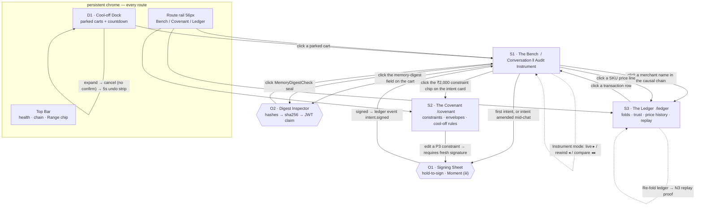

# Covenant — Frontend Screens & Flow Design

Owner: frontend/UX lead · Status: build-ready v1 · Date: 2026-08-31
Implements: ARCHITECTURE.md §5.5 (audit UI), §5.7 (behavioural layer), §5.8 (flywheel), §11 (design system), §14 (demo script)
Audience: the React implementation agent. **Follow this verbatim.** Where you disagree, say so before you build — do not improvise.

---

## 0. Non-negotiables

**Thesis.** The audit trail is the hero. Every pixel serves one sentence: *this system can prove what it believed, why it was entitled to believe it, and what it did about it.* An instrument, not a brochure. If a component would look at home on a SaaS landing page, it is wrong.

**Stack.** Vite + React 18 + TypeScript + Motion One. Nothing else at runtime. No component library, no Tailwind, no router package, no icon package, no charting library, no state library. Hand CSS with §11 tokens as CSS custom properties; CSS Modules for scoping (Vite-native, zero deps).

**Hard rules, enforced in review:**

| # | Rule | Why |
|---|---|---|
| R1 | Max 200 lines per file (ESLint `max-lines`, §12). Applies to `.tsx`, `.ts`, **and** `.module.css`. | Repo-wide standard. |
| R2 | Exactly **one** box-shadow token exists (`--shadow-sheet`) and exactly **one** component may use it (`SigningSheet`). Depth elsewhere is hairlines + paper tints. | Kills the soft-shadow-card tell instantly. |
| R3 | Border radius is `0`, `2px`, or `999px`. Pills (`999px`) are for **actions only**. Chips, panels, cards are 0–2px. | Pill-shaped chips read as marketing badges. |
| R4 | Saffron `#E8740C` never appears in a route. The token exists; it is imported only by `video/TitleCard.tsx` (not mounted in the app) and the README banner. | §11: hero moments only, never on the instrument. |
| R5 | Only two status colours: verified green `#0E7A4D`, blocked crimson `#B3261E`. A third state ("held") is rendered as the **absence** of a stamp plus a mono countdown — no new colour. | §11. |
| R6 | No gradients on any route surface, no glassmorphism, no backdrop-filter, no parallax, no floating blobs, no decorative motion. | §11 signature move 4. |
| R7 | All money arrives as integer paise and is formatted through one pure function. No float arithmetic in the UI, ever. | §A.1 `max_amount` in minor units. |
| R8 | Every element that renders a number that is money carries `font-variant-numeric: tabular-nums lining`. | §11. |
| R9 | Fonts are self-hosted `woff2` in `public/fonts`. No Google Fonts / Fontshare CDN link at runtime. | Judging happens on projector wifi. A font CDN timing out during the video is an unforced loss. |
| R10 | The UI reads the audit trail from the **gateway** (the verifier), never from the agent. Chat is the only thing that talks to `agent-host`. | The instrument never takes the agent's word for anything. This is the trust story, expressed as an origin boundary. |

---

## 1. Screen inventory & navigation flow

### 1.1 The merge decision

The brief listed five candidate screens. Five thin screens lose a judged demo — the presenter burns seconds navigating and the causal story fragments. **Three routes, two overlays, one persistent dock.**

> **DECISION: buyer chat and the audit instrument are one screen (`/`, "The Bench"), not two.** The 0:30–1:30 demo beat is "purchase with audit trail scrolling" — chat and instrument must be co-visible in one frame or that beat doesn't exist. Split-view is the product.

> **DECISION: the cooling-off queue is a persistent dock, not a route.** A parked cart with a live countdown is exactly the thing that must stay ambient while you do something else. Putting it behind navigation hides the one item the user needs one-tap access to, and inverts §5.7's asymmetric-friction principle.

> **DECISION: envelope burn-down appears in two places** — compact bars inside the Instrument (spend against envelope for *this* transaction) and the editable master in `/covenant`. Duplication is correct here: one is evidence, one is configuration.

> **DECISION: covenant setup and the signing ceremony live on `/covenant`, but the signing *sheet* is a shared overlay** reachable from both routes, because intent signing also happens mid-conversation on `/`.

> **DECISION: the attack harness is not triggered from the UI.** `tools/attacks` must stay black-box HTTP (§12 dependency rule), and an attack the presenter *launches from a button in the victim's own dashboard* reads as theatre. The presenter runs `pnpm attack:t1` in a terminal; the UI carries a **Range chip** that lights when an attack-class event lands on the ledger. It feels like an intrusion because structurally it is one.

### 1.2 Inventory

| ID | Route / kind | Name | Contains (merged from brief) | Demo weight |
|---|---|---|---|---|
| **S1** | `/` | **The Bench** | (a) buyer chat + (b) the Audit Instrument, side by side | ~70% of video |
| **S2** | `/covenant` | **The Covenant** | (c) Ulysses contracts: constraints, envelopes, cooling-off rules, signing ceremony | ~10% |
| **S3** | `/ledger` | **The Ledger** | (e) flywheel folds, merchant trust, price history, replay proof, raw event stream | ~15% |
| **D1** | dock (all routes) | **Cool-off Dock** | (d) parked carts, countdown, one-tap cancel | ~5% |
| **O1** | overlay | **Signing Sheet** | intent-signing ceremony / covenant seal moment | Moment (iii) |
| **O2** | overlay | **Digest Inspector** | sorted memory hashes → sha256 → the matching field inside the decoded Cart Mandate JWT | 3:00 beat |
| **C1** | chrome | **Top Bar + Rail** | gateway health, chain integrity, Range chip, route rail | always on |
| — | video asset | `video/TitleCard.tsx` | Bakhshali texture, saffron→indigo, not mounted in the app | 0:00 |

### 1.3 Navigation flow



**Route implementation.** ~40-line hand-rolled router: `history.pushState` + a `popstate` subscription surfaced through `useSyncExternalStore`. Three routes plus `/ledger/sku/:id`. No react-router.

---

## 2. Per-screen specification

Legend for data sources: **`GW`** = gateway-svc (`http://localhost:8787`), **`AH`** = agent-host (`http://localhost:8788`), **`SSE`** = derived from the ledger event stream by the client-side fold (no request of its own).

### 2.0 C1 — Chrome (Top Bar + Route Rail)

```
┌────────────────────────────────────────────────────────────────────────────────────────┐
│ ⬡ Covenant        gateway ● ready      chain ⛓ 1,284 · a91f…4c2e  [verify]      ◌ RANGE │
│   (Fraunces 17)   (Label + dot)        (Plex Mono 11, click=copy)              0 blocked │
└────────────────────────────────────────────────────────────────────────────────────────┘
 48px tall · paper-raised · 1px bottom rule at ink-12 · no shadow
```

| Component | Data source | States | Clickable |
|---|---|---|---|
| `HealthChip` | `GW GET /healthz` + `GET /readyz`, poll 5s | `ready` (ink dot) · `degraded` (`readyz` partial — dot hollow, tooltip lists which of `ledger_open / jwks_loaded / rzp_reachable` failed) · `down` (crimson dot + the whole Instrument enters offline state, §2.1) | tooltip only |
| `ChainChip` | `GW GET /ledger/head` on mount, then `SSE` height increments | `height + head hash (4+4 truncated)` · `verifying` (hash chars cycle for the duration) · `verified · 1,284 events · 38 ms` for 4s after `POST /ledger/verify` | hash → copy full; `[verify]` → `POST /ledger/verify` |
| `RangeChip` | `SSE` on `attack.detected` / `memory.write.rejected` / failing `verdict.emitted` | `0 blocked` (ink-40, hollow ring) · `n blocked` (crimson ring, count in Plex Mono) — arrival flashes bg crimson-12 for 300ms | click → scrolls Instrument to the attack lane and pins the offending txn |
| `RailNav` | route state | 3 items, glyph + Label caption. Active = 2px indigo left rule + ink-90 glyph; inactive ink-40 | routes |

`RangeChip` is `aria-live="assertive"`. `ChainChip` is `aria-live="off"` (it changes constantly).

---

### 2.1 S1 — The Bench (`/`)

The frame that carries the video.

```
┌──┬─────────────────────────────┬──────────────────────────────────────────────────────┐
│  │  TOP BAR (see 2.0)                                                                  │
│  ├─────────────────────────────┼──────────────────────────────────────────────────────┤
│R │ CONVERSATION          420px │ THE AUDIT INSTRUMENT                     fluid, min 640│
│A │                             │ ┌────────┬───────────────────────────────┬──────────┐ │
│I │ ┌─IntentCard──────────────┐ │ │ ATTACK │ CAUSAL CHAIN                  │  KOLAM   │ │
│L │ │ ⬡ signed 14:02:11.402   │ │ │ LANE   │                               │  THREAD  │ │
│  │ │ ₹2,000.00 cap · 3 mrch  │ │ │  96px  │  ① INTENT                     │  132px   │ │
│56│ │ expires 23:59 · P3      │ │ │        │     natural_language_desc     │          │ │
│px│ └─────────────────────────┘ │ │ (empty:│     bounds: cap/merch/sku/exp │    ◦     │ │
│  │                             │ │  a 1px │  ─────────────────────────────│    │     │ │
│  │ agent · 14:02:44            │ │  ink-12│  ② MEMORIES CONSULTED   ×4    │    ◦     │ │
│  │ I found three that fit …    │ │  hair- │     type tier age hash        │    │     │ │
│  │                             │ │  line, │     ▤ constraint P3 ∞  a91f…  │    ⊙     │ │
│  │ ┌─SortKeyBanner───────────┐ │ │  no    │     ▤ fact       P2 2m 7c2d…  │    │     │ │
│  │ │ sorted by total landed  │ │ │  box)  │  ─────────────────────────────│    ◈     │ │
│  │ │ cost, ascending  ▾      │ │ │        │  ③ CART + DIGEST              │    │     │ │
│  │ │ from your P3 preference │ │ │        │     2 items      ₹1,299.00    │    ⬢     │ │
│  │ │ no sponsored placement  │ │ │        │     digest 4f1a…9b02  [◎]     │    │     │ │
│  │ └─────────────────────────┘ │ │        │  ─────────────────────────────│    ●     │ │
│  │ ┌─OptionSet───────────────┐ │ │        │  ④ GATEWAY VERDICTS  64 ms    │    │     │ │
│  │ │ A  ₹1,299  4.2  2d      │ │ │        │     ⬡ ⬡ ⬡ ⬡ ⬡ ⬡              │    ◉     │ │
│  │ │ B  ₹1,349  4.4  1d      │ │ │        │     ⬡ ⬡   (fiduciary)         │          │ │
│  │ │ C  ₹1,410  4.1  3d      │ │ │        │  ─────────────────────────────│          │ │
│  │ └─────────────────────────┘ │ │        │  ⑤ RAZORPAY                   │          │ │
│  │ ┌─CartProposal────────────┐ │ │        │     order_… link_… idem=jti   │          │ │
│  │ │ 2 items      ₹1,299.00  │ │ │        │  ─────────────────────────────│          │ │
│  │ │ justified by 4 memories │ │ │        │  ⑥ OUTCOME  captured 14:03:09 │          │ │
│  │ │ quote sig ✓ 7c2d…       │ │ │        │  ─────────────────────────────│          │ │
│  │ │ price band ▁▂▁▁▇▁▁      │ │ │        │  ENVELOPES  ▓▓▓▓▓░░ groceries │          │ │
│  │ │       [ hold to sign ]  │ │ │        │             ▓▓░░░░░ apparel   │          │ │
│  │ └─────────────────────────┘ │ └────────┴───────────────────────────────┴──────────┘ │
│  │ ─── Composer ─────────────  │ TXN RAIL  ▸live  ◂#a91f 14:03 ✓  ◂#7c2d ✗  ⟲ replay 1×│
│  ├─────────────────────────────┴──────────────────────────────────────────────────────┤
│  │ D1 · COOL-OFF DOCK   1 parked · ₹2,999.00 · releases in 23:41:08   [cancel]   ⌃     │
└──┴────────────────────────────────────────────────────────────────────────────────────┘
```

#### Conversation column (left, 420px, `paper`)

| Component | Data source | States | Clickable |
|---|---|---|---|
| `IntentCard` | `SSE intent.signed` payload; fallback `GW GET /covenant` | **empty**: "No signed intent. The agent cannot propose a cart." + `[ draft an intent ]` · **draft** (unsigned): ink-40 dashed 1px border + banner *"unsigned — human confirmation forced"* (§A.2 invariant, surfaced) · **signed**: solid rule, `⬡` seal glyph, ES256 thumbprint · **expired**: rule goes dotted, expiry timestamp crimson | constraint chips → `/covenant`; thumbprint → copy; `[draft]` → O1 |
| `Message` | `AH SSE /chat/stream` (token-by-token) | streaming (caret) · settled · **system-statement** variant (shield glyph, ink-06 background, used for "I ignored a merchant claim") | links inside |
| `SortKeyBanner` | `AH` message metadata `{sort_key, derived_from_memory_id, sponsored:false}` | always visible above an `OptionSet`; never collapsible | `▾` changes sort key → re-sorts locally **and** `AH POST /chat/sort-key` which ledgers a preference signal |
| `OptionSet` | `AH` message payload `options[]` | 2–5 options. **Identical visual weight** — same fields, same order, same type size, no badge, no highlight, no default selection, no "recommended". Row order is the *only* encoding of rank, and the banner declares why. | each row → sends "tell me about B" |
| `CartProposal` | `AH` payload + `SSE cart.assembled`, `cart.digest.computed` | **proposed** · **signing** (hold in progress) · **verifying** (seal row animates in Instrument) · **held** (cool-off; card greys to ink-55 and moves to D1) · **rejected** (crimson top rule + `ReasonCode` + `to_pass` list from §7) | `[hold to sign]` → O1; `digest` → O2; `price band` sparkline → `/ledger/sku/:id` |
| `Composer` | `AH POST /chat` | idle · sending · **blocked** (gateway down → composer disabled, placeholder "Checkout paused — gateway unreachable", §8) | send |

**Anchoring defence inside `CartProposal`:** a 120×28 `PriceSparkline` with the modal-price band ghosted (ink-12 fill) and any struck-through MRP drawn as a crimson hairline, captioned in Body S: *"₹1,299 for 30 of the last 34 days. Today's '60% off ₹2,999' anchors to a price listed 4 days."* Data: `GW GET /folds/prices/:sku`.

#### Instrument column (right, fluid, min 640px, `paper-sunk` with a 1px ink-12 frame)

Three sub-columns: **attack lane (96px, left gutter)** · **causal chain (fluid)** · **kolam thread (132px, right)**.

The chain is six numbered sections in Display S with Fraunces oldstyle section numerals ①–⑥, separated by full-bleed hairlines. Never collapsible during a live transaction; in rewind mode sections 2 and 5 can collapse.

| Component | Data source | States | Clickable |
|---|---|---|---|
| `Instrument` | mode state (`live` / `rewind` / `compare`) | **empty**: paper with the kolam thread drawn as 3 faint unlinked pulli and the line *"No transaction yet. This panel reconstructs one from the ledger, not from the agent."* · **live** · **rewind** · **compare** (max 2, side by side, chain sections aligned to a shared baseline) · **offline** (gateway down: 1px crimson top rule + *"Instrument offline — no payments are possible."* Content stays visible; this is fail-closed, not an error toast) | mode switch in `TxnRail` |
| `IntentPanel` (§1) | `GW GET /audit/:txn_id` → `.intent` | loading (hairline skeletons, no shimmer) · loaded | thumbprint copy |
| `MemoryRail` (§2) | `/audit/:txn_id` → `.memories[]` | rows: `type · tier · age · content(1 line) · hash`. Sorted by tier desc then age asc. Rejected writes render **greyed with a crimson left barb** and stay in place — the rail shows what was *considered and refused*, which is the whole point | row → expands to full content + `t_valid/t_invalid/t_created/t_expired` (bi-temporal, §A.6); hash → copy |
| `TierChip` | — | `P3` filled ink · `P2` ink outline · `P1` ink-40 outline · `P0` ink-40 outline with 45° hatch fill. **P0 is never crimson by default** — untrusted ≠ hostile. It turns crimson only when a `memory.write.rejected` names it | tooltip: tier definition + source channel |
| `CartPanel` (§3) | `/audit/:txn_id` → `.cart` | items, W3C PaymentRequest total, merchant quote signature ✓/✗, **memory digest** in Plex Mono with an inspect glyph `◎` | digest → **O2 Digest Inspector** |
| `SealRow` (§4) | `SSE verdict.emitted` (live) or `/audit/:txn_id` → `.verdicts[]` | **pending** (6 dotted ink-24 rings) → **stamping** (Moment i) → **settled**. Shows `verified in 64 ms` in Data S beside the row (N1 evidence, on camera) | each seal → panel with `reason_code`, human sentence, and `to_pass` object |
| `RailCalls` (§5) | `/audit/:txn_id` → `.rzp_calls[]` | `order.created` / `link.created` / poll ticks / webhook. Shows `Idempotency-Key = jti` explicitly, and `notes.agent_present: true` (§A.3) | ids → copy |
| `OutcomeStrip` (§6) | `SSE payment.captured|failed` | `pending` (mono countdown of poll attempts, "poll 2 of 3") · `captured` (green rule, amount in Data L) · `failed` · `parked` (§8 retry-then-park) | — |
| `EnvelopeBars` | `GW GET /covenant` → `.envelopes[]` + `SSE` spend events | per-category horizontal bar: solid indigo = captured, 45° hatched indigo = committed-not-captured (cool-off holds), ink-12 = remaining. Amount right-aligned tabular | bar → `/covenant` |
| `AttackLane` | `SSE attack.detected`, `memory.write.rejected`, failing `verdict.emitted` | **empty**: a single 1px ink-12 vertical hairline, no box, no "no attacks" copy — silence is the point · **active**: cards stack newest-top | card → pins the offending memory row / seal |
| `QuarantinedText` | rejected write payload `.content` | renders the poisoned string in Plex Mono 12 under a 45° crimson-08 hatch overlay; `user-select:none`, `tabindex=-1`, `aria-label="quarantined text, shown as evidence"` | **not selectable, not copyable** — readable as evidence, inert as instruction |
| `KolamThread` | `SSE` ordered frames for this txn | §5 | knots → scroll the chain to that event |
| `TxnRail` | `GW GET /transactions?limit=12` | `▸ live` + recent txns (short id, time, ✓/✗). `⟲ replay` re-plays the recorded choreography from real ledger timestamps at 1× / 4× | txn → rewind mode; shift-click → compare; `⟲` → replay |

> **DECISION: ship the replay control.** It re-runs Moments (i) and (ii) from the ledger's actual timestamps, so it is not a fake animation — and it means a muffed take during recording costs 4 seconds instead of a full attack re-run. Demo insurance, honestly built.

---

### 2.2 S2 — The Covenant (`/covenant`)

The Ulysses contracts. Reads as a legal instrument, not a settings page: no toggles-in-rows, no section cards with icons. A document with a seal at the bottom.

```
┌──┬──────────────────────────────────────────────────────────────────────────────────┐
│R │  The Covenant                                            Display XL, Fraunces WONK│
│A │  Bounds you signed. The agent cannot be talked out of them — including by you.    │
│I │  ──────────────────────────────────────────────────────────────────────────────  │
│L │                                                                                   │
│  │  I · CONSTRAINTS                                          all P3 · user-signed    │
│  │  ─────────────────────────────────────────────────────────────────────────────    │
│  │  Never above                                    ₹2,000.00   signed 14:02  ⬡  [·]  │
│  │  No purchases after                                 23:00   signed 14:02  ⬡  [·]  │
│  │  Cool-off above                                 ₹5,000.00   for 24h      ⬡  [·]  │
│  │  No credit above APR                                 18.0%  signed 14:02  ⬡  [·]  │
│  │  Refundability required                               true  signed 14:02  ⬡  [·]  │
│  │  Share anonymised aggregates                         false  signed 14:02  ⬡  [·]  │
│  │  + add a bound                                                                    │
│  │                                                                                   │
│  │  II · ENVELOPES                                        mental accounting, §5.7    │
│  │  ─────────────────────────────────────────────────────────────────────────────    │
│  │  groceries    ▓▓▓▓▓▓▓░░░░  ₹3,400.00 / ₹5,000.00     ₹1,600.00 left               │
│  │  apparel      ▓▓▒▒░░░░░░░  ₹1,299.00 / ₹4,000.00     ₹2,701.00 left  ▒=held       │
│  │  electronics  ░░░░░░░░░░░       ₹0.00 / ₹8,000.00     ₹8,000.00 left              │
│  │                                                                                   │
│  │  III · MERCHANT & SKU SCOPE                            §A.2 allowlists            │
│  │  ─────────────────────────────────────────────────────────────────────────────    │
│  │  merchants[]  acme-grocers · sundar-textiles · nilgiri-foods            + add     │
│  │  skus[]       (unrestricted)                                           + add     │
│  │                                                                                   │
│  │  ─────────────────────────────────────────────────────────────────────────────    │
│  │  2 unsigned amendments.        Amendments take effect only when sealed.           │
│  │                                       ╭──────────╮                                │
│  │                                       │  ROSETTE │  hold to seal                  │
│  │                                       ╰──────────╯                                │
└──┴──────────────────────────────────────────────────────────────────────────────────┘
   max-width 880px, centred. This screen is a document; it does not use the full width.
```

| Component | Data source | States | Clickable |
|---|---|---|---|
| `ConstraintList` / `ConstraintRow` | `GW GET /covenant` → `.constraints[]` | **signed** (⬡ + timestamp) · **amended-unsigned** (value in indigo, `⬡` hollow, row gets 2px indigo left rule, footer count increments) · **expiring** (dotted rule) | value → inline edit (`Field`); `[·]` → revoke (also an amendment, also requires a seal) |
| `EnvelopeEditor` | `GW GET /covenant` → `.envelopes[]` | bar + editable cap. Held (cool-off) portion always hatched, never solid | cap → inline edit |
| `CoolOffRules` | `.cooloff_rules[]` | threshold + duration pairs | inline edit |
| `ScopeLists` | `.merchants[] .skus[]` | chips; `(unrestricted)` in ink-40 italic when empty | `+ add`, `×` remove |
| `AmendmentFooter` | derived | `0 unsigned` → rosette is ink-24, disabled · `n unsigned` → rosette lifts to ink-70, hold enabled | hold-to-seal → **O1** |

> **DECISION: every change here is an *amendment* that is inert until sealed.** Edits do not fire a PATCH. They accumulate client-side and are submitted as one signed Intent Mandate via `GW POST /covenant/sign {intent_mandate_jwt}`. This is what makes a precommitment device cryptographic rather than a form — and it makes the late-night-self story literally true: you can type the change, but you must complete a deliberate hold to make it real.

> **DECISION: optional cool-off on constraint *relaxation*.** If a `cooloff_on_relax` rule exists, an amendment that widens a bound (raises a cap, removes a merchant restriction) is parked in D1 like a cart. Tightening applies immediately. Asymmetric friction, applied to the rules themselves — the strongest expression of §5.7 in the product.

---

### 2.3 S3 — The Ledger (`/ledger`)

The flywheel and the integrity proof. Denser than S1; this screen is allowed to look like a terminal.

```
┌──┬─────────────────────────────────────────────────────────────────────────────────┐
│R │ The Ledger        1,284 events · head a91f…4c2e · 3 folds · last re-fold 41 ms   │
│A │ ─────────────────────────────────────────────────────────────────────────────   │
│I │ ┌ FOLDS (deterministic materialised views) ───────────────────────────────────┐  │
│L │ │ ┌ price history ──────┐ ┌ merchant trust ─────┐ ┌ preference state ───────┐ │  │
│  │ │ │ 34 SKUs · 812 pts   │ │ 3 merchants         │ │ 11 P3 entries          │ │  │
│  │ │ │ bi-temporal ✓       │ │ quote-mismatch 0.4% │ │ regret labels 2        │ │  │
│  │ │ └─────────────────────┘ └─────────────────────┘ └────────────────────────┘ │  │
│  │ └───────────────────────────────────────────────────────────────────────────┘  │
│  │ ┌ MERCHANT TRUST ─────────────────────────┐ ┌ REPLAY PROOF (N3) ────────────┐  │
│  │ │ acme-grocers        94  ▓▓▓▓▓▓▓▓▓░       │ │ live state    9c1e…77ab       │  │
│  │ │   quote mismatch 0/41 · manip 0 · ref 3/3│ │ replayed      9c1e…77ab       │  │
│  │ │ sundar-textiles     71  ▓▓▓▓▓▓▒░░░       │ │ ══════════ identical ═════════ │  │
│  │ │   quote mismatch 2/18 · manip 1 · ref 1/1│ │ 1,284 events re-folded · 41 ms│  │
│  │ │ nilgiri-foods       38  ▓▓▓▒▒▒░░░░  ⚑    │ │        [ re-fold ledger ]     │  │
│  │ │   quote mismatch 1/9 · manip 3 · ref 0/1 │ └───────────────────────────────┘  │
│  │ └──────────────────────────────────────────┘                                    │
│  │ ┌ PRICE HISTORY  sku: sundar-kurta-navy ──────────────────────────────────────┐ │
│  │ │ ₹2,999 ─ ─ ─ ─ ─ ─ ─ ─ ─ ─ ─ ─ ─ ─ ─ ─ ─ ┄┄┄  listed 4 of 34 days (crimson) │ │
│  │ │ ₹1,299 ▁▁▁▁▂▁▁▁▁▁▁▁▂▁▁▁▁▁▁▁▁▁▁▁▁▁▁▁▁▂▁●   modal band ghosted                │ │
│  │ │        t-34d                        today   bi-temporal: what we knew, when │ │
│  │ └─────────────────────────────────────────────────────────────────────────────┘ │
│  │ ┌ EVENT STREAM  (raw, hash-chained — never queried by products) ──────────────┐ │
│  │ │ 1284 14:03:09.881 gateway   payment.captured    txn a91f  ✓  hash 4c2e…9b02 │ │
│  │ │ 1283 14:03:07.114 razorpay  rzp.link.created    txn a91f     hash 9b02…71c4 │ │
│  │ │ 1282 14:03:06.998 gateway   verdict.emitted     txn a91f  ✓  hash 71c4…3fa1 │ │
│  │ └─────────────────────────────────────────────────────────────────────────────┘ │
└──┴─────────────────────────────────────────────────────────────────────────────────┘
```

| Component | Data source | States | Clickable |
|---|---|---|---|
| `FoldGrid` / `FoldTile` | `GW GET /folds/summary` + `SSE fold.materialized` | idle · **recomputing** (Moment: a 1px indigo hairline sweeps L→R across the tile over 220ms, border indigo for 300ms, then back to ink-12; the changed number does a tabular tick) | tile → filters `EventStream` to that fold's inputs |
| `MerchantTrust` | `GW GET /folds/merchants` | score 0–100 in Data L + a **3-segment stacked meter**: ink-70 (honoured) / ink-24 (unknown) / crimson (mismatches + manipulation attempts). No colour ramp, no red-amber-green | merchant → filters stream; `⚑` → attack lane history for that merchant |
| `PriceSparkline` | `GW GET /folds/prices/:sku` | 1px indigo polyline, modal-price band as ink-12 fill, today as a 3px indigo dot, fake-MRP as a crimson 1px dashed rule with an inline caption. No axes, no gridlines, no tooltip chrome — one hover crosshair with a Data S readout | hover crosshair; SKU header → `/ledger/sku/:id` |
| `ReplayProof` | `GW POST /ledger/replay` | idle · running (two hash columns cycle characters) · **identical** (a green 2px rule draws between the columns L→R over 300ms + `n events · m ms`) · **divergent** (crimson rule, first differing event id shown, links to it) | `[ re-fold ledger ]` |
| `EventStream` | `SSE` tail + `GW GET /ledger/events?after=` backfill | virtualised, newest-top, auto-follow with a pause-on-scroll. Row: `id · ts · actor · kind · txn · ✓/✗ · hash` | row → S1 rewind on that txn; hash → copy |

> **DECISION: no recommendation carousel.** §5.8 says explicitly that at demo time we show *the flywheel turning*, not a trained model pretending to be one. A rec carousel would be the single most dishonest pixel in the build. The `/recs` endpoint is represented by one `Panel` showing its MCP tool signature and a live `curl` example — an agent-readable data product, presented as one.

---

### 2.4 D1 — Cool-off Dock (persistent, bottom of every route)

Collapsed 44px bar; expands to a 260px panel. Anchored bottom, spans the content area (not the rail).

```
collapsed:  1 parked · ₹2,999.00 · releases in 23:41:08 · sundar-textiles   [cancel]  ⌃
expanded:
┌──────────────────────────────────────────────────────────────────────────────────┐
│ PARKED BY YOUR COOLING-OFF RULE                              cool-off above ₹5,000│
│ ────────────────────────────────────────────────────────────────────────────────  │
│ ⊙  sundar-kurta-navy ×1              ₹2,999.00     releases 15:03:09    [ cancel ] │
│    held 24h by your cooling-off rule · verified, not executed                     │
│    ⚑ merchant supplied 2 manipulation cues — quarantined  ›                       │
│    ▁▁▁▂▁▁ ₹1,299 for 30 of the last 34 days                                       │
└──────────────────────────────────────────────────────────────────────────────────┘
```

| Component | Data source | States | Clickable |
|---|---|---|---|
| `CoolOffDock` | `GW GET /cooloff` on mount + `SSE cooloff.parked / .cancelled / .released` | **empty**: dock hides entirely (0px) · 1 parked (inline summary) · n parked (`n parked · earliest releases in …`) | header → expand |
| `Countdown` | client, recomputed from an absolute `release_at` every 1000ms via `setInterval` + `Date.now()` | `HH:mm:ss` Data M tabular · under 60s: switches to `mm:ss` and the digits get a 1px indigo underline | — |
| `CoolOffCard` | `/cooloff` items | verified-not-executed · cancelling · cancelled (row collapses over 200ms) | `[cancel]` → `GW POST /cooloff/:id/cancel` |
| `UndoStrip` | client | appears for 5s after a cancel: `Cancelled. ₹2,999.00 returned to apparel. [undo]` | `[undo]` re-parks with the original `release_at` |

> **DECISION: cancel has no confirmation dialog.** §5.7's entire mechanism is asymmetric friction — slow to spend, one tap to stop. A "are you sure?" on the stop path would be the exact dark pattern this product exists to refuse. Safety comes from the 5s undo strip instead.

> **DECISION: countdown recomputes from an absolute timestamp**, never decrements a counter. Background-tab throttling would otherwise drift the number on camera.

---

### 2.5 O1 — Signing Sheet · O2 — Digest Inspector

**O1 `SigningSheet`** — the only component permitted `--shadow-sheet`. 520px wide, centred, `paper-raised`, 2px radius, backdrop `rgba(30,30,30,.18)` (flat colour — no blur). Contents: title (Display L), the covenant text as a stack of constraint lines in Body L with values in Data M, the `natural_language_description` verbatim (§A.2 — explainability for free), then `HoldToSign` with the kolam `Rosette`, then a post-sign thumbprint. Escape / backdrop click aborts; abort is silent (no toast). Choreography in §3.3.

**O2 `DigestInspector`** — right-side sheet, 560px. Three stacked bands:
1. the `n` justifying memory entries, **sorted by hash** (showing the sort, because the digest is `sha256(sorted entry hashes)`), each with type + tier;
2. the concatenation and its `sha256` in Data M, computed **client-side in the browser via `crypto.subtle.digest`** from the displayed hashes;
3. the decoded Cart Mandate JWT header+payload in Plex Mono with the `memory_digest` claim highlighted by a 2px indigo left rule.
When (2) and (3) match, a green hairline draws between them (240ms) with the caption *"recomputed in your browser · identical"*.

> **DECISION: O2 recomputes the digest client-side rather than trusting a gateway boolean.** It costs eight lines of `crypto.subtle` and converts the novelty claim from an assertion into something the judge watches happen in a browser they control. This is the 3:00 demo beat, and it replaces a slide.

---

## 3. The three designed moments

Motion One notes for the implementer: `animate(el, keyframes, options)`; **durations are in seconds**; `stagger(n)` is passed as `delay`. Easings are strings or cubic-bézier arrays. All values below assume `prefers-reduced-motion: no-preference` — the reduced-motion collapse for each is specified at the end of its subsection and is **not optional**.

Named easings (`motion/presets.ts`, mirrored as CSS custom properties in `motion.css`):

```ts
export const EASE = {
  out:   [0.25, 1, 0.5, 1],       // entrances, 0.16–0.22s
  stamp: [0.34, 1.2, 0.64, 1],    // seal press — slight overshoot, settles
  snap:  [0.7, 0, 0.84, 0],       // failure — accelerates into the break
  draw:  [0.16, 0.84, 0.44, 1],   // path draws
} as const;
export const SPRING_RECOIL = { type: 'spring', stiffness: 520, damping: 22, mass: 0.6 } as const;
```

---

### 3.1 Moment (i) — Verdict arrival: six seals stamping

**Trigger:** first `verdict.emitted` frame for the live txn. **Total:** 1.14 s. **Owner:** `SealRow.tsx` + `useStamp.ts`.

Pre-state: six seals present as 44px dotted ink-24 rings, glyph at 22% opacity, label ink-40. This matters — the seals *exist before the verdict*, so the ceremony is a filling-in, not a pop-in.

Per-seal, `i = 0..5`, base delay `i × 0.09 s`:

| t (rel. to that seal) | Element | Property | From → To | Dur | Easing |
|---|---|---|---|---|---|
| 0 | seal group | `transform: scale` | 1.14 → 1 | 0.16 | `stamp` |
| 0 | seal group | `opacity` | 0 → 1 | 0.12 | `out` |
| 0 | ring `<circle>` | `strokeDashoffset` (`pathLength=1`) | 1 → 0 | 0.20 | `draw` |
| 0 | ring `<circle>` | `strokeDasharray` swap dotted→solid | — | at 0.20 | step |
| +0.04 | inner fill `<circle>` | `transform: scale` | 0.6 → 1 | 0.22 | `out` |
| +0.04 | inner fill `<circle>` | `opacity` | 0 → 0.12 | 0.22 | `out` |
| +0.02 | glyph `<g>` | `opacity` | 0.22 → 1 | 0.14 | `out` |
| +0.00 | **`SealRow` container** | `transform: translateY` | 0 → 1px → 0 | 0.09 | `stamp` |
| +0.08 | label | `opacity` / `translateY` | 0→1 / 3px→0 | 0.12 | `out` |
| +0.00 | **kolam thread** | new verdict knot draws | — | 0.42 | `draw` |

The `translateY` bounce on the container is what sells it: the paper takes the hit of each stamp. It must be on the row, never the page.

Colour on settle: pass → ring `--green`, fill `--green` @12%; fail → ring `--crimson`, fill `--crimson` @12% **and** the seal's ring gets a 45° hatch. The label text stays **ink**, never green (see §7.4 — green at Label size fails contrast).

Chain close, after seal 5 lands (t = 0.45 + 0.16 = **0.61 s**):

| t | Element | Property | From → To | Dur | Easing |
|---|---|---|---|---|---|
| 0.63 | chain hairline under the six seals | `strokeDashoffset` | 1 → 0 | 0.24 | `draw` |
| 0.79 | fiduciary seals (`EnvelopeCheck`, `CoolOffCheck`) | scale / opacity | 1.1→1 / 0→1 | 0.16 | `stamp` |
| 0.79 | if cool-off holds → that seal stays **unstamped** with a mono countdown inside its ring, ring 1px ink-40 dashed rotating at 0.25 rpm | `rotate` | 0 → 360 | 240 s linear, `repeat: Infinity` | linear |
| 0.95 | Payment Mandate seal (56px, right of the row) | scale / opacity | 1.25→1 / 0→1 | 0.20 | `stamp` |
| 0.95 | `verified in 64 ms` | `opacity` | 0 → 1 | 0.14 | `out` |
| 1.00 | `OutcomeStrip` reveals | `translateY` 6→0, `opacity` 0→1 | 0.18 | `out` |

**Reduced motion:** all seals settle together — `opacity: [0,1], duration: .1, easing: 'linear'`, no scale, no stagger, no bounce, thread knots appear instantly. The countdown ring does not rotate.

---

### 3.2 Moment (ii) — The T-1 block: the thread snaps crimson at the write gate

**Trigger:** `memory.write.rejected` with `reason_code: MEMORY_TIER_VIOLATION`. **Total:** 1.20 s. **Owner:** `KolamThread.tsx` + `ThreadBreak.tsx` + `AttackLane.tsx`.

This is the 1:30 beat. It must read, at 1× speed and with no narration, as: *something tried to get in, the machine closed, and the user's limit is the thing that held.*

| Frame | t | Element | Property | From → To | Dur | Easing |
|---|---|---|---|---|---|---|
| **0 · arrival** | 0.00 | new `MemoryRow` (P0 fact) | `translateX` / `opacity` | 12px→0 / 0→1 | 0.14 | `out` |
| | 0.00 | its `TierChip` `P0` | — | renders hatched ink-40, **not crimson** | — | — |
| **1 · the gate** | 0.12 | `TierChip` | `box-shadow` spread | 0 → 3px ink-24 → 0 | 0.18 | `out` |
| | 0.12 | gate glyph on the thread (a 10px bar at the gateway lane) | `rotate` | 0° → 90° | 0.14 | `snap` |
| | 0.12 | gate glyph | `stroke` | ink-55 → crimson | 0.14 | `snap` |
| **2 · the flood** | 0.26 | `#thread-crimson` (a duplicate of the settled path, stroke `--crimson`, stacked above) | `clip-path` | `inset(0 0 100% 0)` → `inset(0 0 0% 0)` | 0.20 | `snap` |
| **3 · the break** | 0.40 | thread splits at the gate index `k`: `<g id="above">` / `<g id="below">` | `translateY` | 0 → −3px / 0 → +11px | 0.32 | `SPRING_RECOIL` |
| | 0.40 | 2 fray hairlines per cut end (5px, `rotate ±12°`) | `opacity` / `scaleX` | 0→1 / 0→1 | 0.12 | `out` |
| | 0.44 | `#below` group | `opacity` | 1 → 0.45 | 0.20 | `out` |
| **4 · the evidence** | 0.52 | `QuarantinedText` card in the attack lane | `translateY` / `opacity` | 10px→0 / 0→1 | 0.18 | `out` |
| | 0.56 | hatch overlay on the poisoned string | `opacity` | 0 → 1 | 0.16 | `out` |
| | 0.60 | barb: a hairline from the card toward the thread, **stopping 6px short** | `strokeDashoffset` (`pathLength=1`) | 1 → 0 | 0.16 | `draw` |
| | 0.66 | `ReasonCode` chip `MEMORY_TIER_VIOLATION` | `opacity` | 0 → 1 | 0.12 | `out` |
| **5 · what held** | 0.70 | the P3 `constraint` row's 2px indigo left rule | `scaleY` (origin top) | 0 → 1 | 0.20 | `draw` |
| | 0.74 | `₹2,000.00` on that row | `translateY` | 0 → −2px → 0 | 0.16 | `stamp` |
| | 0.82 | agent's system-statement message in the chat column | `opacity` | 0 → 1 | 0.14 | `out` |
| **6 · the tally** | 0.90 | `RangeChip` | `background-color` | transparent → crimson-12 → transparent | 0.30 | `out` |
| | 0.90 | `RangeChip` count | `translateY` | 0 → −8px (old) / +8px→0 (new) | 0.16 | `out` |

The message at frame 5 is **not** typed: `"A merchant claim conflicted with your ₹2,000 limit — I ignored it."` arrives as a block with a shield glyph. A typewriter here would make an authoritative statement look like the agent thinking it over.

The 6px gap on the barb is the whole image. Draw it, then stop. Do not let it touch.

**Reduced motion:** frames collapse to three steps at 0 / 0.15 / 0.30 s, all `opacity: [0,1], duration: .1`. The break renders as a static 14px gap with fray hairlines already present. The crimson flood is a static fill. No spring, no recoil, no flash.

---

### 3.3 Moment (iii) — Intent signing: the covenant seal

**Trigger:** `[hold to sign]` on `CartProposal`, or `hold to seal` on `/covenant`. **Owner:** `SigningSheet.tsx` + `HoldToSign.tsx` + `Rosette.tsx`.

**Phase A — the sheet (0.42 s)**

| t | Element | Property | From → To | Dur | Easing |
|---|---|---|---|---|---|
| 0.00 | backdrop | `background-color` | `rgba(30,30,30,0)` → `rgba(30,30,30,.18)` | 0.18 | `out` |
| 0.04 | sheet | `translateY` / `opacity` | 24px→0 / 0→1 | 0.22 | `out` |
| 0.14 | constraint lines | `translateY` / `opacity` | 6px→0 / 0→1 | 0.16 each, `delay: stagger(0.045)` | `out` |
| 0.30 | rosette | `opacity` | 0 → 1 (ink @ 40%, path fully undrawn) | 0.16 | `out` |

**Phase B — the hold (600 ms, user-driven)**

> **DECISION: signing is press-and-hold for 600 ms, not a click.** It is the one irreversible act in the product; a hold makes deliberateness physical rather than declarative, and it is the most watchable second in the video. Release before completion aborts and drains the ring in 0.2 s. Keyboard equivalent: `Space` held, same 600 ms, same abort.

| t | Element | Property | From → To | Dur | Easing |
|---|---|---|---|---|---|
| pointerdown | rosette group | `transform: scale` | 1 → 0.94 | 0.09 | `out` |
| pointerdown | progress ring (`pathLength=1`, indigo, 2px) | `strokeDashoffset` | 1 → 0 | **0.60** | `linear` |
| abort | progress ring | `strokeDashoffset` | current → 1 | 0.20 | `out` |
| abort | rosette group | `scale` | 0.94 → 1 | 0.12 | `out` |

Linear on the progress ring is deliberate — an eased progress bar lies about how long is left, which is the wrong thing for a consent affordance to do.

**Phase C — the seal lands (1.0 s)**

| t | Element | Property | From → To | Dur | Easing |
|---|---|---|---|---|---|
| 0.00 | rosette group | `scale` | 0.94 → 1.06 → 1 | 0.26 | `stamp` |
| 0.00 | **rosette path** (one continuous kolam line, §5.5) | `strokeDashoffset` | 1 → 0 | 0.52 | `draw` |
| 0.12 | rosette ink bloom `<path fill>` | `opacity` | 0 → 0.10 (indigo) | 0.30 | `out` |
| 0.18 | sheet | `translateY` | 0 → 2px → 0 | 0.18 | `stamp` |
| 0.26 | 6 radial hairlines (18px, from the rosette edge) | `scaleX` 0→1, `opacity` 0.35→0 | 0.32, `delay: stagger(0.02)` | `out` |
| 0.40 | thumbprint `ES256 · did:key:z6Mk…8Qr` | per-char `opacity` 0→1 | 0.012 × chars, `delay: stagger(0.012)` | `linear` |
| 0.70 | sheet + backdrop | `translateY` 0→−8px, `opacity` 1→0 | 0.20 | `out` |
| 0.78 | **S1 Instrument**: the intent knot + thread segment 0 draw in | `strokeDashoffset` 1→0 | 0.22 | `draw` |

The rosette drawing itself in one unbroken stroke is the thesis rendered as motion: a kolam is drawn without lifting the hand, and so is this chain. The six radial hairlines are the **only** decorative flourish permitted anywhere in the product — §11 allows exactly one rangoli flourish, and this is it. The bloom is **indigo, not saffron** (R4).

**Reduced motion:** sheet fades in (0.12 s, no translate); the hold still takes 600 ms (it is a safety affordance, not decoration) but the ring fills in 4 discrete steps; the rosette appears fully drawn on completion with a 0.1 s opacity fade; no radial hairlines; no thumbprint typewriter.

---

## 4. Component tree, state, and file plan

### 4.1 State management

> **DECISION: SSE from the ledger, with polling as a strictly equivalent fallback, and no state library.** Three reasons, and the first is the real one:
> 1. **The UI's state model should be the system's state model.** §5.8/N2 say derived state is a fold over an append-only log. The client does exactly that: one reducer, `events → view state`. Screen state is not "fetched and cached"; it is folded. Every screen is a projection, which is why S1, S3, and D1 can never disagree.
> 2. **The designed moments need causal latency.** Moment (ii) must land within ~100 ms of the gateway's rejection or it reads as a page refresh instead of an interception. A 500 ms poll destroys the 1:30 beat.
> 3. **It mirrors §5.4's own stance.** Webhooks + polling both ship there; SSE + polling both ship here, sharing one frame shape and one reducer. Neither can stall the demo.

Mechanics:
- `EventSource(GW /ledger/stream)`, `Last-Event-ID` on reconnect, exponential backoff `0.5s → 4s`, **after 3 failed reconnects fall to `GET /ledger/events?after=<lastId>` at 750 ms** and show `polling` in `ChainChip`.
- The reducer is **idempotent on `id`**: `if (frame.id <= state.lastId) return state`. Backfill and stream can overlap freely.
- Exposed through `LedgerProvider` (context) + `useSyncExternalStore` selectors so a chat token stream never re-renders the kolam.
- Chat is separate: `AH /chat/stream` SSE, its own tiny reducer, deliberately **not** in the ledger store (R10 — chat is the agent's word, the ledger is the verifier's record).
- Everything else (`/covenant`, `/cooloff`, `/folds/*`, `/audit/:id`) is a plain `fetch` on mount, invalidated by the event kinds that would change it. ~30 lines of `useResource<T>`; no TanStack.

### 4.2 Event frame contract (the gateway must emit these)

```ts
export type LedgerFrame = {
  id: number;                    // monotonic, gapless
  ts: string;                    // ISO 8601 with ms
  actor: 'user' | 'buyer_agent' | 'merchant_agent' | 'gateway' | 'razorpay' | 'system';
  kind: EventKind;
  txn_id: string | null;
  payload: unknown;              // narrowed by kind at the reducer boundary
  prev_hash: string;
  this_hash: string;
};

export type EventKind =
  | 'intent.drafted'  | 'intent.signed'      | 'intent.amended'
  | 'memory.write.committed' | 'memory.write.rejected' | 'memory.retrieved'
  | 'catalog.quote.received'
  | 'cart.assembled'  | 'cart.digest.computed'
  | 'mandate.issued'  | 'verdict.emitted'
  | 'cooloff.parked'  | 'cooloff.cancelled'  | 'cooloff.released'
  | 'rzp.order.created' | 'rzp.link.created' | 'rzp.polled'
  | 'payment.captured'  | 'payment.failed'
  | 'attack.detected' | 'fold.materialized'  | 'replay.verified';
```

Unknown kinds render as a neutral pulli with the raw kind string in Data S — the instrument never silently drops a ledger event.

### 4.3 Read endpoints the UI needs (addendum to §7)

`POST /verify-cart`, `POST /execute-payment`, `GET /audit/:txn_id`, `POST /memory/*` already exist. The UI additionally requires, all `GET` unless noted, all on gateway-svc:

```
/healthz · /readyz
/ledger/stream                 SSE, Last-Event-ID honoured
/ledger/events?after=&limit=   polling fallback, identical frame shape
/ledger/head                   { height, head_hash, verified_at }
POST /ledger/verify            { ok, height, ms }
POST /ledger/replay            { ok, live_state_hash, replayed_state_hash, events, ms, first_divergent_id? }
/transactions?limit=&state=    rail index
/covenant                      { constraints[], envelopes[], cooloff_rules[], merchants[], skus[] }
POST /covenant/sign            { intent_mandate_jwt } -> commit
/cooloff                       [{ id, txn_id, amount_paise, release_at, merchant, cues[] }]
POST /cooloff/:id/cancel       + POST /cooloff/:id/restore  (5s undo)
/folds/summary · /folds/merchants · /folds/prices/:sku
/memory?action_class=&limit=
```

Agent-host: `POST /chat`, `GET /chat/stream` (SSE), `POST /chat/sort-key`.

### 4.4 File plan (`apps/audit-ui/src/`, every file ≤ 200 lines)

```
main.tsx                      · App.tsx (route shell, ~60)
router/useRoute.ts (~40)

styles/  tokens.css (~130) · base.css (~110) · motion.css (~40) · print.css (~30)

ledger/  types.ts (~120)  transport.ts (~120)  reducer.ts (~190)
         selectors.ts (~90)  LedgerProvider.tsx (~150)  useLedger.ts (~70)
api/     gateway.ts (~130)  agent.ts (~90)  useResource.ts (~40)

chrome/  TopBar.tsx · RailNav.tsx · HealthChip.tsx · ChainChip.tsx · RangeChip.tsx

screens/ Bench.tsx (~120) · Covenant.tsx (~130) · Ledger.tsx (~130)

conversation/ Conversation.tsx (~120) · Message.tsx (~90) · SystemStatement.tsx (~60)
              SortKeyBanner.tsx (~80) · OptionSet.tsx (~130) · OptionRow.tsx (~90)
              CartProposal.tsx (~150) · Composer.tsx (~90) · IntentCard.tsx (~110)

instrument/ Instrument.tsx (~120) · CausalChain.tsx (~140) · ChainSection.tsx (~60)
            IntentPanel.tsx (~90) · MemoryRail.tsx (~150) · MemoryRow.tsx (~120)
            CartPanel.tsx (~110) · SealRow.tsx (~120) · Seal.tsx (~110)
            SealGlyphs.tsx (~180) · RailCalls.tsx (~120) · OutcomeStrip.tsx (~90)
            AttackLane.tsx (~130) · AttackCard.tsx (~110) · QuarantinedText.tsx (~70)
            EnvelopeBars.tsx (~120) · TxnRail.tsx (~110) · DigestInspector.tsx (~160)

kolam/   thread.ts (~170) · KolamThread.tsx (~150) · Knot.tsx (~120)
         ThreadBreak.tsx (~90) · Rosette.tsx (~110) · rosette-path.ts (~60)

covenant/ ConstraintList.tsx (~110) · ConstraintRow.tsx (~120) · EnvelopeEditor.tsx (~120)
          CoolOffRules.tsx (~90) · ScopeLists.tsx (~90) · AmendmentFooter.tsx (~70)
          SigningSheet.tsx (~160) · HoldToSign.tsx (~120)

cooloff/  CoolOffDock.tsx (~140) · CoolOffCard.tsx (~110) · UndoStrip.tsx (~60)

flywheel/ FoldGrid.tsx (~100) · FoldTile.tsx (~90) · MerchantTrust.tsx (~120)
          PriceSparkline.tsx (~130) · ReplayProof.tsx (~110) · EventStream.tsx (~120)
          RecsPanel.tsx (~70)

primitives/ Money.tsx (~50) · money.ts (~40) · Hash.tsx (~60) · Chip.tsx (~50)
            TierChip.tsx (~60) · ReasonCode.tsx (~60) · Countdown.tsx (~70)
            Panel.tsx (~50) · Field.tsx (~90) · Rule.tsx (~25) · Meter.tsx (~70)
            Glyph.tsx (~140) · Timestamp.tsx (~50) · Skeleton.tsx (~40)

motion/  presets.ts (~80) · useStamp.ts (~90) · useThreadGrowth.ts (~110)
         useReducedMotion.ts (~30) · useReplay.ts (~120)

video/   TitleCard.tsx (~120)   ← not mounted in the app; the only saffron importer
```

Each `*.tsx` with non-trivial styling has a co-located `*.module.css`, also ≤ 200 lines.

**Shared components** (used by ≥ 2 screens): everything in `primitives/`, `motion/`, `kolam/`, plus `Seal`, `TierChip`, `SigningSheet`, `PriceSparkline`, `EnvelopeBars`, `Countdown`.

### 4.5 Props sketch (the load-bearing ones)

```ts
// instrument/Seal.tsx
type SealProps = {
  check: 'intent_bounds'|'nonce'|'uri_pin'|'risk_data'|'memory_digest'|'quote_match'
       | 'envelope'|'cooloff';
  state: 'pending' | 'passed' | 'failed' | 'held';
  reasonCode?: string;
  humanSentence?: string;
  toPass?: Record<string, string | number>;   // §7 x402-style self-correction object
  heldUntil?: string;                          // ISO — renders the countdown ring
  size?: 44 | 56;                              // 56 = payment mandate seal only
  stampDelayMs?: number;                       // set by SealRow; 0 in rewind/reduced motion
  onInspect?: () => void;
};

// kolam/KolamThread.tsx
type KolamThreadProps = {
  events: ThreadEvent[];                       // ordered, already filtered to this txn
  breakAtIndex?: number;                       // fatal verdict / rejected write
  width?: number;                              // default 132
  onKnotClick?: (eventId: number) => void;
  animate?: boolean;                           // false in rewind unless replaying
};
type ThreadEvent = {
  id: number;
  kind: EventKind;
  lane: 'agent' | 'gateway' | 'rail';
  knot: 'pulli'|'seal'|'lozenge'|'disc'|'open'|'tick'|'unknown';
  status: 'neutral' | 'pass' | 'fail';
  label?: string;
};

// instrument/MemoryRow.tsx
type MemoryRowProps = {
  entry: {
    id: string; type: 'constraint'|'preference'|'fact'|'episode'|'procedure';
    tier: 'P3'|'P2'|'P1'|'P0'; content: string; hash: string;
    source_channel: string;
    t_valid: string; t_invalid: string|null; t_created: string; t_expired: string|null;
  };
  outcome: 'committed' | 'rejected' | 'retrieved';
  rejectionReason?: string;
  held?: boolean;          // renders the indigo left rule (Moment ii, frame 5)
  expanded: boolean;
  onToggle: () => void;
};

// conversation/OptionSet.tsx
type OptionSetProps = {
  options: Array<{ id: string; sku: string; title: string; pricePaise: number;
                   rating: number; deliveryDays: number; merchant: string }>;
  sortKey: string;                 // declared, never implicit
  sortDerivedFrom: { memoryId: string; tier: 'P3'; label: string };
  onSortKeyChange: (k: string) => void;
  onAsk: (optionId: string) => void;
};
// Invariant enforced in the component, not by convention:
// no `recommended`, `sponsored`, `badge`, or `highlighted` prop exists.
```

---

## 5. The kolam ledger line, buildable

`kolam/thread.ts` — pure functions, no React, fully unit-testable (Vitest table tests, same as the `VerdictCheck` classes).

### 5.1 Geometry constants

```ts
export const PITCH   = 44;  // vertical distance between pulli centres (multiple of 4 → 8px rhythm)
export const KNOT_R  =  9;  // loop radius around each pulli
export const LANE_W  = 26;  // horizontal offset per lane
export const LANES = { agent: -1, gateway: 0, rail: 1 } as const;   // the attack gutter is NOT a lane
export const BREAK_GAP = 14;
```

The **attack lane is deliberately not a thread lane.** The thread never enters it. A blocked attempt is drawn as a barb *from* the gutter that stops 6px short of the thread. Nothing hostile is ever part of the weave — that is the architecture, stated as geometry.

### 5.2 The continuous thread

A sikku kolam is one line that loops around every dot without lifting. Each event is a pulli; the thread wraps it with a **240° arc**, alternating which side it bulges to, which produces the woven serpentine rather than a flowchart rail.

For event `i` at anchor `A = (x, y)` where `x = x0 + LANES[lane] * LANE_W`, `y = y0 + i * PITCH`, and weave side `s = i % 2 === 0 ? 1 : -1`:

```
entry  E = ( x − s·0.5·R ,  y − 0.866·R )     // 240° / 300° on the circle (y-down)
exit   X = ( x − s·0.5·R ,  y + 0.866·R )     // 120° /  60°
arc    A R R 0 1 <sweep>  X.x X.y             // large-arc-flag = 1 (the 240° way)
                                              // sweep = 1 when s = +1 (bulges right)
                                              // sweep = 0 when s = −1 (bulges left)
```

The connector from `X_i` to `E_{i+1}` is a cubic with vertical handles, so a lane change becomes a smooth S with no extra cases:

```
h = (PITCH − 1.732·R) / 2                     // = (44 − 15.59)/2 ≈ 14.2 with R = 9
C  X_i.x (X_i.y + h)   E_{i+1}.x (E_{i+1}.y − h)   E_{i+1}.x E_{i+1}.y
```

```ts
export function buildThread(events: ThreadEvent[], x0: number, y0: number): string {
  if (events.length === 0) return '';
  const h = (PITCH - 1.732 * KNOT_R) / 2;
  let d = '';
  let prevX: Pt | null = null;
  for (let i = 0; i < events.length; i++) {
    const x = x0 + LANES[events[i].lane] * LANE_W;
    const y = y0 + i * PITCH;
    const s = i % 2 === 0 ? 1 : -1;
    const E = { x: x - s * 0.5 * KNOT_R, y: y - 0.866 * KNOT_R };
    const X = { x: x - s * 0.5 * KNOT_R, y: y + 0.866 * KNOT_R };
    d += prevX === null
      ? `M ${E.x} ${E.y}`
      : ` C ${prevX.x} ${prevX.y + h} ${E.x} ${E.y - h} ${E.x} ${E.y}`;
    d += ` A ${KNOT_R} ${KNOT_R} 0 1 ${s > 0 ? 1 : 0} ${X.x} ${X.y}`;
    prevX = X;
  }
  return d;
}
```

**Key invariant, and the reason this is cheap:** segment `i`'s geometry depends only on events `≤ i`. The path string is *append-only, exactly like the ledger it draws.* So we never rebuild it.

Stroke: 1.5px, `--ink` at 70%, `stroke-linecap: round`, `fill: none`, `vector-effect: non-scaling-stroke`.

### 5.3 Knots per event kind

Drawn **on top of** the thread at the pulli centre, `Knot.tsx`, all 1.25px stroke, `currentColor`:

| Event kind | Knot | Geometry |
|---|---|---|
| `memory.write.committed`, `memory.retrieved` | **pulli** | `<circle r=4>` stroke ink-55, no fill |
| `memory.write.rejected` | **struck pulli** | same circle, stroke `--crimson`, `stroke-dasharray="2 2"`, plus the gutter barb |
| `intent.signed`, `mandate.issued` | **seal knot** | two concentric arcs 2px apart around the loop — visually "signed"; stroke `--indigo` |
| `verdict.emitted` (pass) | **lozenge** | 5px square rotated 45°, filled `--green` |
| `verdict.emitted` (fail) | **lozenge** | same, filled `--crimson`; triggers the break |
| `cart.assembled`, `cart.digest.computed` | **hex** | 6px regular hexagon, stroke ink-70 |
| `rzp.order.created`, `rzp.link.created`, `rzp.polled` | **disc** | `<circle r=5>` filled `--indigo` @ 70% |
| `payment.captured` | **discs** | disc + a concentric 8px ring, both `--indigo` |
| `payment.failed` | **hollow disc** | `r=5` stroke `--crimson`, no fill |
| `cooloff.parked` | **open loop** | 300° arc, `r=6`, ink-55, with the countdown in Data S to the right |
| `fold.materialized`, `replay.verified` | **tick** | 6px hairline perpendicular to the thread, ink-24 — these are frequent and must stay quiet |
| unknown | **dot** | `r=2` ink-40 + raw kind string in Data S |

Labels sit to the **left** of the thread in Label style, ink-55, at the pulli's baseline. Only 4 kinds get a permanent label (`intent.signed`, `verdict.emitted`, `payment.captured|failed`, `cooloff.parked`); the rest label on hover.

### 5.4 Growth

Two `<path>` elements: `#thread-settled` (events `0..n−2`) and `#thread-live` (the last segment).

On append:
1. Compute the new segment substring only (never re-run `buildThread` over the whole list).
2. Move the old `#thread-live` string onto `#thread-settled` (string concat on a ref).
3. Set `#thread-live` `d` to the new segment, with **`pathLength={1}`**, `strokeDasharray="1"`, `strokeDashoffset="1"`.
4. `animate(livePath, { strokeDashoffset: [1, 0] }, { duration: 0.42, easing: EASE.draw })`.
5. Its knot draws at `+0.24 s`: `{ opacity: [0,1], transform: ['scale(0.7)','scale(1)'] }, { duration: 0.16, easing: EASE.stamp }`.
6. Auto-scroll: if the head is within 120px of the viewport bottom, `scrollTo` smooth; otherwise show a `↓ 3 new` affordance rather than yanking the presenter's view.

`pathLength={1}` means **no `getTotalLength()` call anywhere** — no layout thrash, and the draw duration is uniform regardless of segment length, which is what you want visually.

### 5.5 The break

On the first `verdict.emitted{pass:false}` or `memory.write.rejected` at index `k`:

1. Render `#thread-crimson` — a duplicate of the settled path with `stroke: var(--crimson)`, stacked above, clipped by `clip-path: inset(0 0 100% 0)`. Animate the inset to `inset(0 0 0% 0)` over 0.20 s `EASE.snap`. The flood travels *downward from the gate*, which is the direction the poison was travelling.
2. Split into `<g id="above">` (events `0..k`) and `<g id="below">` (events `k+1..`), the latter translated `+BREAK_GAP` in y.
3. Recoil the two groups apart with `SPRING_RECOIL` (`−3px` / `+11px`).
4. Draw 2 fray hairlines per cut end: 5px, `rotate(±12°)` from the tangent, `--crimson`, opacity 0→1 over 0.12 s.
5. `#below` drops to `opacity: 0.45` — the branch is severed and dead.
6. The **next non-attack event starts a fresh thread head** offset `BREAK_GAP` below, with a new `M`. The chain continued; the poisoned branch did not. Two `<path>` elements now exist where there was one — which is exactly, and literally, what a broken chain is.

### 5.6 The rosette (covenant seal)

`kolam/rosette-path.ts` — an 88px sikku kolam derived from a **3×3 pulli grid**, generated by the same primitives:

```ts
// 9 pulli on a 3x3 grid, pitch 22px, traversed in a boustrophedon order so the
// resulting single path closes on itself: (0,0)(1,0)(2,0)(2,1)(1,1)(0,1)(0,2)(1,2)(2,2)
// then a closing cubic from the last exit back to the first entry.
export const ROSETTE_ORDER = [[0,0],[1,0],[2,0],[2,1],[1,1],[0,1],[0,2],[1,2],[2,2]];
export function buildRosette(cx: number, cy: number, pitch = 22, r = 8): string { /* … + ' Z' */ }
```

One path, one `stroke-dashoffset` animation, no lifting of the hand — the same rule as the ledger thread and the same rule as a real kolam. Verify by eye that it closes; if the boustrophedon order leaves a visible seam, rotate the start index rather than adding a second path. **A second `<path>` in the rosette is a bug, not a workaround.**

---

## 6. Type & spacing system

### 6.1 Faces

Self-hosted `woff2`, `font-display: swap`, `<link rel=preload>` on Fraunces-var and GeneralSans-Regular only.

| Role | Family | Notes |
|---|---|---|
| Display | **Fraunces** variable | `font-variation-settings: 'SOFT' 0, 'WONK' <0|1>, 'opsz' <px>`. **WONK 1 only on Display XL** — one place the serif shows personality. |
| Body | **General Sans** (Fontshare) | 400 / 500 / 600. Never Inter, Space Grotesk, Plus Jakarta, Geist. |
| Data | **IBM Plex Mono** | 400 / 450 / 500. Hashes, nonces, amounts, timestamps, JWTs. |
| Bilingual accent | **Anek Devanagari** | Loaded only if a Devanagari string is present (`unicode-range` subset). |

### 6.2 Type scale

| Token | Family | Size / Line | Weight | Tracking | Used for |
|---|---|---|---|---|---|
| `--t-display-xl` | Fraunces | 44 / 48 | 500, WONK 1, opsz 72 | −0.02em | one per screen, the screen title |
| `--t-display-l` | Fraunces | 30 / 36 | 500, opsz 36 | −0.015em | sheet titles, panel titles |
| `--t-display-s` | Fraunces | 20 / 26 | 550, opsz 24 | −0.01em | chain section heads, section numerals |
| `--t-body-l` | General Sans | 16 / 24 | 400 | 0 | chat messages, covenant text |
| `--t-body-m` | General Sans | 14 / 20 | 400 | 0 | default UI text |
| `--t-body-s` | General Sans | 13 / 18 | 450 | 0 | dense rows, captions |
| `--t-label` | General Sans | 11 / 12 | 600 | +0.08em, uppercase | column heads, chips, seal labels |
| `--t-data-l` | IBM Plex Mono | 20 / 24 | 500, tabular | 0 | the headline amount, trust score |
| `--t-data-m` | IBM Plex Mono | 13 / 18 | 450, tabular | 0 | amounts in tables, countdowns |
| `--t-data-s` | IBM Plex Mono | 11 / 14 | 400, tabular | +0.02em | hashes, nonces, timestamps, JWT bodies |

Max measure for prose: **68ch**. Chat messages: 58ch.

### 6.3 Spacing scale (4px base, 8px vertical rhythm)

```
--sp-px 1  --sp-1 2  --sp-2 4  --sp-3 6  --sp-4 8  --sp-5 12  --sp-6 16
--sp-7 20  --sp-8 24  --sp-9 32  --sp-10 40  --sp-11 56  --sp-12 72  --sp-13 96
```

Fixed dimensions: rail 56 · top bar 48 · conversation 420 · attack gutter 96 · kolam column 132 · dock collapsed 44 / expanded 260 · instrument min-width 640 · seal 44 (payment seal 56) · rosette 88 · table row 32 · **kolam PITCH 44** (rhythm-aligned).

Panel padding `--sp-6` (16) · section gap `--sp-9` (32) · row gap `--sp-4` (8) · chain section separation `--sp-8` (24) with a full-bleed hairline at the midpoint.

### 6.4 Audit-table treatment

The audit tables are the product. They get exact rules, not preferences.

- **Every numeric cell:** `font-variant-numeric: tabular-nums lining; font-feature-settings: 'tnum' 1, 'lnum' 1;`
- **Money:** right-aligned. `₹` glued to the digits (no space), same weight and size as the digits, in a fixed-width leading sub-column so the ₹ symbols form a vertical rule down the table. Always 2 decimals. **Indian digit grouping** via `Intl.NumberFormat('en-IN', {style:'currency', currency:'INR', minimumFractionDigits:2})` — `₹1,23,456.00`, not `₹123,456.00`. Western grouping in an Indian fintech is a tell.
- **Input unit:** integer paise everywhere; one pure function `paise(n: number): string`. No floats (R7).
- **Hashes:** Data S, ink-62, truncated `first4…last4`, `white-space: nowrap`, fixed 88px column, full value in `title` + click-to-copy (copy flashes the cell bg ink-06 for 200 ms). Hashes never wrap and never ellipsise with CSS — the truncation is semantic (head+tail), because a head-only hash is useless for comparison.
- **Timestamps:** Data S, right-aligned, `HH:mm:ss.SSS`. Millisecond precision is not decoration on an audit instrument — it is what lets a viewer see that the gateway answered in 64 ms. Full ISO on hover. Relative time (`2m ago`) only in `TxnRail` and `MemoryRail.age`.
- **Alignment:** text left · tier chip in a 34px fixed centre column · numbers and timestamps right · hashes left in their fixed column.
- **Rules, not fills:** 1px `ink-12` between rows, 1px `ink-24` under the header. **No zebra striping** — zebra is a brochure move; tabular alignment plus hairlines carry the eye, and stripes fight the paper.
- **Header:** `--t-label`, ink-55. Sticky within scrolling panels.
- **Row height 32px**, hover `background: ink-06` (no transform, no shadow, no border change).
- **Empty cell:** an en-dash in ink-24, never blank — a blank cell in an audit table is ambiguous between "zero" and "unknown".

### 6.5 Colour tokens (`styles/tokens.css`)

```css
:root {
  --paper:#FAF7F2; --paper-sunk:#F4F0E9; --paper-raised:#FFFDFA;
  --ink:#1E1E1E;
  --ink-90:color-mix(in oklab,var(--ink) 90%,transparent);
  --ink-70:color-mix(in oklab,var(--ink) 70%,transparent);
  --ink-62:color-mix(in oklab,var(--ink) 62%,transparent);
  --ink-55:color-mix(in oklab,var(--ink) 55%,transparent);
  --ink-40:color-mix(in oklab,var(--ink) 40%,transparent);
  --ink-24:color-mix(in oklab,var(--ink) 24%,transparent);
  --ink-12:color-mix(in oklab,var(--ink) 12%,transparent);
  --ink-06:color-mix(in oklab,var(--ink)  6%,transparent);

  --indigo:#232196;  --indigo-24:color-mix(in oklab,var(--indigo) 24%,transparent);
                     --indigo-12:color-mix(in oklab,var(--indigo) 12%,transparent);
  --green:#0E7A4D;   --green-12:color-mix(in oklab,var(--green) 12%,transparent);
  --crimson:#B3261E; --crimson-24:color-mix(in oklab,var(--crimson) 24%,transparent);
                     --crimson-12:color-mix(in oklab,var(--crimson) 12%,transparent);
                     --crimson-08:color-mix(in oklab,var(--crimson)  8%,transparent);

  --saffron:#E8740C;               /* R4 — video title card + README only */

  --rule:1px solid var(--ink-12);
  --rule-strong:1px solid var(--ink-24);
  --r-0:0; --r-1:2px; --r-full:999px;
  --shadow-sheet:0 1px 0 var(--ink-12), 0 24px 48px -32px rgba(30,30,30,.28); /* R2 */
  --hatch: repeating-linear-gradient(45deg, currentColor 0 1px, transparent 1px 5px);
}
```

`--hatch` on `currentColor` is how P0 chips, held envelope segments, quarantined text, and failed seal rings are all textured from one declaration.

---

## 7. Responsive, theme, accessibility

### 7.1 Breakpoints (desktop-first — this is judged on a laptop and a projector)

Design target **1440 × 900**; must be verified at **1280 × 800** (the realistic projector) and **1920 × 1080** (the recording).

| Width | Behaviour |
|---|---|
| ≥ 1600 | Instrument gains a second envelope column; chain sections get `--sp-9` separation. |
| 1440–1599 | **Reference layout.** rail 56 · conversation 420 · instrument fluid. |
| 1280–1439 | Conversation → 380. `MemoryRail` drops its `content` preview column (hash + tier + type + age remain). Chain section separation → `--sp-8`. |
| 1024–1279 | `EnvelopeBars` move below `OutcomeStrip`. Attack gutter → 72px, `QuarantinedText` clamps to 3 lines with an expand. Kolam `LANE_W` → 18. |
| 768–1023 | Two columns become a **tab pair** (`Talk` / `Instrument`) with a shared 40px tab strip. Dock pins to the bottom of the viewport. Kolam collapses to a single lane (`LANE_W` → 0), weave preserved. |
| < 768 | Single column, `Talk` default. Instrument becomes a stacked accordion of the six chain sections. Kolam runs single-lane with **weave disabled** (`s = 1` always) and knots only. Attack lane becomes inline cards between sections. `/ledger`'s fold grid stacks; `EventStream` drops the actor column. |

Nothing is *removed* on small screens — the causal chain is the product, so it degrades in density, never in completeness.

### 7.2 Print (`styles/print.css`, ~30 lines)

> **DECISION: ship a print stylesheet.** "The audit trail is evidence" is only true if you can hand someone the evidence. It costs 30 lines: one txn per page, thread rendered in black at 1px, seals as outlined glyphs with their reason codes spelled out, hashes in full (no truncation), attack lane inlined, chrome hidden, a footer with `head_hash` + print time. A judge printing a transaction is the cheapest possible flex.

### 7.3 Theme

Light is primary and is what the video shows. Dark ships as a **token swap only** — it costs nothing because every colour in the system is a custom property and every SVG stroke is `currentColor` or `var()`.

```css
[data-theme="dark"] {
  --paper:#161512; --paper-sunk:#111010; --paper-raised:#1D1B18;
  --ink:#F2EEE7;
  --indigo:#6C6AE0;   /* #232196 fails contrast on dark ground */
  --green:#3FBF83; --crimson:#E8695F;
}
```

Two adjustments, both in `tokens.css` under the same selector: seal ink-bloom opacities go 12% → 16%, and the kolam stroke goes ink-70 → ink-62 (light strokes on dark bloom optically). `data-theme` lives on `<html>`, default `light`, remembered in `localStorage`, `prefers-color-scheme` respected only when nothing is stored. **Dark is not used in the video** — it is there so a judge who flips it doesn't find a broken screen.

### 7.4 Accessibility

- **Contrast catch, non-obvious and load-bearing:** `--green #0E7A4D` on `--paper` is ≈ 5.2:1 — fine for 14px+, **fails AA for 11px Label text.** Therefore **seal labels are always ink, never green.** Green appears only as the seal ring, the seal fill, and status words at ≥ 13px. Crimson (≈ 6.4:1) passes at Label size but follows the same rule for symmetry. Status is never encoded by colour alone: pass/fail also differ by ring style (solid vs hatched) and by knot shape on the thread.
- Seals: `role="img"` + `aria-label="Memory digest check: passed"`. `SealRow` is `role="list"`.
- Live regions: `AttackLane` `aria-live="assertive"`; conversation `aria-live="polite"`; `ChainChip` `aria-live="off"`.
- `QuarantinedText`: `aria-label="quarantined text, shown as evidence"`, `tabindex="-1"`, `user-select:none`. Screen readers announce the wrapper label, then the content — never treated as an instruction to anything.
- Focus: 2px `--indigo` outline, `outline-offset: 2px`, never removed. `HoldToSign` is `Space`-holdable with the same 600 ms and the same abort.
- `prefers-reduced-motion` collapses are specified per moment in §3 and are required, not nice-to-have.
- Every knot on the kolam thread is reachable by keyboard as a `<button>` inside the SVG's focus order, labelled with its kind + timestamp. The thread is a real navigation control, not a decoration.

---

## 8. Demo-script alignment (§14)

| Time | §14 beat | Screen | State | Designed moment / mechanic |
|---|---|---|---|---|
| 0:00–0:30 | Problem statement | `video/TitleCard` (not a route) | Bakhshali texture, saffron→indigo — **the only saffron in the project** | static |
| 0:28 | cut to product | **S1 Bench** | empty: no signed intent, kolam as 3 unlinked pulli, attack lane silent | — |
| 0:30–0:40 | user states intent | S1 · Conversation | `IntentCard` draft (dashed, "unsigned — human confirmation forced") | — |
| 0:38–0:44 | **the covenant seal** | S1 + **O1 Signing Sheet** | hold-to-sign 600 ms → rosette draws itself | **Moment (iii)** |
| 0:44–0:56 | agent negotiates | S1 | `MemoryRail` fills with P2 quotes + P3 constraints; thread grows knot by knot | thread growth §5.4 |
| 0:52–1:02 | options shown | S1 · `SortKeyBanner` + `OptionSet` | *"sorted by total landed cost, ascending · from your P3 preference · no sponsored placement"* — §5.7 neutral presentation, on screen, in one sentence | — |
| 1:02–1:10 | cart proposed | S1 · `CartProposal` + Instrument §3 | digest `4f1a…9b02` visible; anchoring sparkline: *"₹1,299 for 30 of the last 34 days"* | — |
| 1:10–1:22 | **verdicts** | S1 · `SealRow` | six seals stamp; `verified in 64 ms` (N1, on camera) | **Moment (i)** |
| 1:22–1:30 | payment | S1 · §5 §6 | `Idempotency-Key = jti`, `notes.agent_present: true`, `payment.captured` green | — |
| 1:30–1:42 | attack launched (terminal) | S1 | `RangeChip` still `0 blocked`; nothing yet | — |
| 1:42–1:52 | **T-1 blocked** | S1 · thread + attack lane | thread snaps crimson at the write gate; quarantined text lands under hatch; barb stops 6px short; `MEMORY_TIER_VIOLATION` | **Moment (ii)** |
| 1:52–2:05 | graceful message | S1 · Conversation | *"A merchant claim conflicted with your ₹2,000 limit — I ignored it."* + the P3 row's indigo rule | Moment (ii) frame 5 |
| 2:05–2:16 | the constraint that held | **S2 Covenant** | `₹2,000.00` signed at 14:02; envelope bars; *"the agent cannot be talked out of them — including by you"* | — |
| 2:16–2:30 | **behavioural protection** (§5.7 demo beat) | S1 + **D1 dock** | ₹2,999 cart parked; countdown ticking; quarantined *"only 2 left!!"* cue listed; **one-tap cancel, no confirm dialog**, undo strip | — |
| 2:30–2:45 | replay blocked (T-31) | S1 · **compare mode** | two txns side by side; `NonceCheck` crimson, `NONCE_BURNED`, thread broken at seal 2 | Moment (i) in fail variant |
| 2:45–3:00 | downgrade blocked (T-27) | S1 · compare mode | `UriPinCheck` crimson, `URI_DOWNGRADE`, fail-closed sentence + `to_pass` object | — |
| 3:00–3:35 | **PTLM: tiers + digest** | **O2 Digest Inspector** | sorted entry hashes → **sha256 recomputed live in the browser** → the matching `memory_digest` claim in the decoded Cart Mandate JWT | *the slide is the product* |
| 3:35–4:00 | tiers in motion | S3 + S1 `MemoryRail` | P3/P2/P1/P0 chips; the P0 hatch; read-gate action classes | — |
| 4:00–4:25 | architecture diagram | static asset (§5.1 mermaid, re-tokened) | — | — |
| 4:25–4:40 | limitations + **integrity proof** | **S3 · ReplayProof** | `[re-fold ledger]` → 1,284 events → identical state hash in 41 ms (N3, live) | green rule draws between the hash columns |
| 4:40–4:55 | Razorpay-shaped | S3 · `RecsPanel` + `FoldGrid` | folds materialising live; `/recs` MCP tool signature; merchant trust scores | fold recompute sweep |
| 4:55–5:00 | close | S1 | last frame: the kolam thread completing into the covenant rosette | — |

**Presenter's kit, build these:** (1) `⟲ replay 1× / 4×` on `TxnRail` re-runs Moments (i) and (ii) from real ledger timestamps — a fluffed take costs 4 seconds, not a re-run of the attack harness; (2) compare mode holds the 2:30–3:00 beat in one frame; (3) a `?seed=demo` query param loads a pre-seeded ledger so the empty state is only ever shown on purpose.

---

## 9. Build order for the implementation agent

1. `styles/tokens.css` + `base.css` + `primitives/` (`Money`, `Hash`, `Chip`, `TierChip`, `Timestamp`, `Panel`, `Rule`). Nothing renders until money and hashes render correctly.
2. `ledger/` (types → transport → reducer → provider) against a **recorded JSON fixture** of ~120 frames. The whole UI must be buildable before the gateway's stream exists.
3. `kolam/thread.ts` + Vitest table tests on the path string (assert segment count, arc flags, append-only invariant). **Test the geometry before drawing it.**
4. `instrument/` — chain sections, `SealRow`, `Seal`, `SealGlyphs`, `MemoryRail`, `KolamThread`.
5. **Moment (i).** Ship it before anything else animates; it sets the motion vocabulary.
6. `conversation/` + `chrome/`. S1 is now complete → this is the demo's spine.
7. **Moment (ii)** + `AttackLane` + `ThreadBreak`.
8. `covenant/` + `SigningSheet` + **Moment (iii)**.
9. `cooloff/` dock.
10. `flywheel/` + S3 + `DigestInspector`.
11. Responsive passes at 1280 and 768; `print.css`; dark token block; reduced-motion audit of all three moments.

If the 48-hour clock collapses, the §13 cut-line applies here as: drop S3's `RecsPanel` → drop dark theme → drop print → drop compare mode. **Never** the three moments, never the kolam, never the Digest Inspector.

---

## 10. Decision log

| # | Decision | One-line why |
|---|---|---|
| D1 | Chat + audit instrument are one screen (S1 "The Bench") | The 0:30 beat requires both in one frame. |
| D2 | Cooling-off is a persistent dock, not a route | A live countdown you have to navigate to is a countdown you don't see. |
| D3 | Envelope bars appear in both S1 and S2 | One is evidence, one is configuration; both are needed. |
| D4 | Attacks are launched from the terminal, not the UI | §12 forbids `tools/attacks` importing internals, and a self-attack button reads as theatre. |
| D5 | SSE from the ledger, polling fallback, one reducer, no state library | The UI's state model *is* the system's state model: derived state is a fold. |
| D6 | Six core seals stamp; `EnvelopeCheck`/`CoolOffCheck` are a second fiduciary row | Six is the §12-O set and the §11 glyph set; the fiduciary pair gates *for* the user, not against an attacker. |
| D7 | "Held" is the absence of a stamp + a countdown ring, not a third colour | Preserves the two-status-colour rule. |
| D8 | Signing is a 600 ms press-and-hold, linear progress | The one irreversible act deserves physical deliberateness; linear because a progress affordance must not lie. |
| D9 | Covenant edits are inert amendments until sealed | Makes the precommitment device cryptographic instead of a form. |
| D10 | Optional cool-off on constraint *relaxation*; tightening is instant | Asymmetric friction applied to the rules themselves — §5.7 at full strength. |
| D11 | Cancel has no confirm dialog; a 5s undo strip instead | A confirm on the stop path is the exact dark pattern this product refuses. |
| D12 | Digest Inspector recomputes sha256 client-side via `crypto.subtle` | Turns the novelty claim into something the judge watches happen in their own browser; replaces a slide. |
| D13 | No recommendation carousel on S3 | §5.8 says show the flywheel turning, not a model pretending to exist. |
| D14 | Attack lane is a gutter the thread never enters; barbs stop 6px short | Nothing hostile is part of the weave — architecture as geometry. |
| D15 | Kolam knot = 240° arc, alternating weave side, cubic connectors | Produces a real sikku kolam rather than a flowchart rail; the path is append-only like the ledger. |
| D16 | `pathLength={1}` for every draw animation | No `getTotalLength()`, no layout thrash, uniform draw duration. |
| D17 | The break creates a second `<path>`; the poisoned branch dead-ends at 45% opacity | A broken chain, rendered literally. |
| D18 | Indian digit grouping via `Intl.NumberFormat('en-IN')` | ₹1,23,456.00. Western grouping in an Indian fintech is a tell. |
| D19 | Seal labels are ink, never green | `#0E7A4D` on paper fails AA at 11px Label size. |
| D20 | Exactly one shadow token, used by exactly one component | Kills the soft-shadow-card look at the token level. |
| D21 | Fonts self-hosted, no CDN at runtime | A font CDN timing out on projector wifi is an unforced loss. |
| D22 | Ship the `⟲ replay` control (real ledger timestamps) | A fluffed take costs 4 seconds instead of re-running the attack harness. |
| D23 | Ship `print.css` | "The audit trail is evidence" is only true if you can hand someone the evidence. |
| D24 | Dark theme as a token swap only; not used in the video | Costs ~20 lines because every colour is a custom property. |
| D25 | Saffron confined to `video/TitleCard.tsx` and the README | §11's letter: hero moments only, never the instrument. |
